# Evaluating Query and Storage Strategies for RDF Archives 

Editor(s): Axel-Cyrille Ngonga Ngomo, Institute for Applied Informatics, Leipzig, Germany; Irini Fundulaki, ICS-FORTH, Heraklion, Greece; Anastasia Krithara, National Center for Scientific Research "Demokritos", Athens, Greece<br>Solicited review(s): Nick Bassiliades, Aristotle University of Thessaloniki, Greece; David Corsar, University of Aberdeen, Scotland; Xin Wang, University of Southampton, United Kingdom; one anonymous reviewer

Javier D. Fernández ${ }^{\mathrm{a}, \mathrm{c}, \mathrm{a}}$ Jürgen Umbrich ${ }^{\mathrm{a}}$ Axel Polleres ${ }^{\mathrm{a}, \mathrm{c}, \mathrm{d}}$ Magnus Knuth ${ }^{\text {b }}$<br>${ }^{a}$ Vienna University of Economics and Business, Vienna, Austria<br>Email: [javier.fernandez,juergen.umbrich,axel.polleres]@wu.ac.at<br>${ }^{\mathrm{b}}$ AKSW/KILT, Leipzig University, Leipzig, Germany<br>Email: knuth@informatik.uni-leipzig.de<br>${ }^{\text {c }}$ Complexity Science Hub Vienna, Austria<br>${ }^{\mathrm{d}}$ Stanford University


#### Abstract

There is an emerging demand on efficiently archiving and (temporal) querying different versions of evolving semantic Web data. As novel archiving systems are starting to address this challenge, foundations/standards for benchmarking RDF archives are needed to evaluate its storage space efficiency and the performance of different retrieval operations. To this end, we provide theoretical foundations on the design of data and queries to evaluate emerging RDF archiving systems. Then, we instantiate these foundations along a concrete set of queries on the basis of a real-world evolving datasets. Finally, we perform an extensive empirical evaluation of current archiving techniques and querying strategies, which is meant to serve as a baseline of future developments on querying archives of evolving RDF data.


Keywords: RDF archiving, Semantic Data Versioning, Evolving Web data, SPARQL Benchmark

## 1. Introduction

Nowadays, RDF data is ubiquitous. In less than a decade, and thanks to active projects such as the Linked Open Data (LOD) [4] effort or schema.org, researchers and practitioners have built a continuously growing interconnected Web of Data. In parallel, a novel generation of semantically enhanced applications leverage this infrastructure to build services which can answer questions not possible before (thanks to the availability of SPARQL [21] which enables structured queries over this data). As previously reported $[42,23]$, this published data is continuously

[^0]undergoing changes (on a data and schema level). These changes naturally happen without a centralized monitoring nor pre-defined policy, following the scalefree nature of the Web. Applications and businesses leveraging the availability of certain data over time, and seeking to track data changes or conduct studies on the evolution of data, thus need to build their own infrastructures to preserve and query data over time. Moreover, at the schema level, evolving vocabularies complicate re-use as inconsistencies may be introduced between data relying on a previous version of the ontology.

Thus, archiving policies of Linked Open Data (LOD) collections emerges as a novel - and open - challenge aimed at assuring quality and traceability of Semantic Web data over time. While shar-


[^0]:    *Corresponding author. E-mail: javier.fernandez@wu.ac.at.

ing the same overall objectives with traditional Web archives, such as the Internet Archive, ${ }^{1}$ archives for the Web of Data should additionally offer capabilities for time-traversing structured queries. Recently, initial works on RDF archiving policies/strategies [14,46] are starting to offer such time-based capabilities, such as knowing whether a dataset or a particular entity has changed, which is neither natively supported by SPARQL nor by any of the existing temporal extensions of SPARQL [40,16,35,48].

This paper discusses the emerging problem of evaluating the efficiency of the required retrieval demands in RDF archives. To the best of our knowledge, few and very initial works have been proposed to systematically benchmark RDF archives. EvoGen [27] is a recent suite that extends the traditional LUBM benchmark [19] to provide a dataset generator for versioned RDF data. However, the system is limited to a unique dataset and very constrained synthetic data. The recent $\mathrm{HOBBIT}^{2} \mathrm{H} 2020 \mathrm{EU}$ project on benchmarking Big Linked Data is starting to face similar challenges [34]. Existing RDF versioning and archiving solutions focus so far on providing feasible proposals for partial coverage of possible use case demands. Somewhat related, but not covering the specifics of (temporal) querying over archives, existing RDF/SPARQL benchmarks focus on static $[1,5,38]$, federated [30] or streaming data [10] in centralized or distributed repositories: they do not cover the particularities of RDF archiving, where querying entity changes across time is a crucial aspect.

In order to fill this gap, our main contributions are:
(i) We analyse current RDF archiving proposals and provide theoretical foundations on the design of benchmark data and specific queries for RDF archiving systems;
(ii) We provide a concrete instantiation of such queries using AnQL [48], a query language for annotated RDF data.
(iii) we present a prototypical BEnchmark of RDF ARchives (referred to as BEAR), a test suite composed of three real-world datasets from the Dynamic Linked Data Observatory [23] (referred to as BEAR-A), DBpedia Live [22] (BEAR-B) and the European Open Data portal ${ }^{3}$ (BEAR-C). We describe queries with varying complexity, covering a broad range of archiving use cases;

[^0](iv) we implement RDF archiving systems on different RDF stores and archiving strategies, and we evaluate them, together with other existing archiving systems in the literature, using BEAR. This evaluation is aimed at establishing an (extensible) baseline and illustrate our foundations.
The paper is organized as follows. First, Section 2 reviews current RDF archiving proposals. We establish the theoretical foundations in Section 3, formalizing the key features to characterize data and queries to evaluate RDF archives. Section 4 instantiates these guidelines and presents the proposed BEAR test suite. In Section 5, we detail the implemented RDF archives and we evaluate BEAR with different archiving systems. Finally, we conclude and point out future work in Section 6. Appendixes A, B and C provide further details on the BEAR-A, BEAR-B and BEAR-C test suite respectively.

## 2. Preliminaries

We briefly summarise the necessary findings of our previous survey on current archiving techniques for dynamic Linked Open Data [14]. The use case is depicted in Figure 1, showing an evolving RDF graph with three versions $V_{1}, V_{2}$ and $V_{3}$ : the initial version $V_{1}$ models two students ex:S1 and ex:S2 of a course ex:C1, whose professor is ex:P1. In $V_{2}$, the ex:S2 student disappeared in favour of a new student, ex:S3. Finally, the former professor ex:P1 leaves the course to a new professor ex:P2, and the former student ex:S2 reappears also as a professor.

### 2.1. Retrieval Functionality

Given the relative novelty of archiving and querying evolving semantic Web data, retrieval needs are neither fully described nor broadly implemented in practical implementations (described below). Table 1 shows a first classification $[14,39]$ that distinguishes six different types of retrieval needs, mainly regarding the query type (materialisation or structured queries) and the main focus (version/delta) of the query.
Version materialisation is a basic demand in which a full version is retrieved. In fact, this is the most common feature provided by revision control systems and other large scale archives, such as current Web archiv-


[^0]:    ${ }^{1}$ http://archive.org/.
    ${ }^{2}$ http://project-hobbit.eu/.
    ${ }^{3}$ http://data.europa.eu/

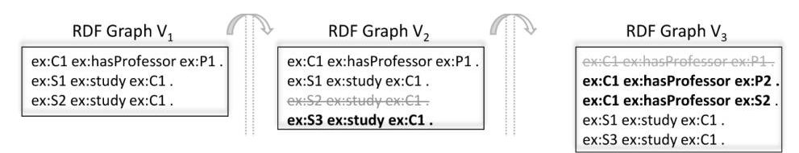

Fig. 1. Example of RDF graph versions.

| Type <br> Freqn | Materialisation |  | Structured Queries <br> Cross time |
| :--: | :--: | :--: | :--: |
| Version | Version Materialisation -get snapshot at time $t_{i}$ | Single-version structured queries -lectures given by certain teacher at time $t_{i}$ | Cross-version structured queries -subjects who have played the role of student and teacher of the same course |
| Delta | Delta Materialisation -get delta at time $t_{i}$ | Single-delta structured queries -students leaving a course between two consecutive snapshots, i.e. between $t_{i-1}, t_{i}$ | Cross-delta structured queries -largest variation of students in the history of the archive |

Table 1
Classification and examples of retrieval needs.
ing that mostly dereferences URLs across a given time point. ${ }^{4}$
Single-version structured queries are queries which are performed on a specific version. One could expect to exploit current state-of-the-art query resolution in RDF management systems, with the additional difficulty of maintaining and switching between all versions.
Cross-version structured queries, also called timetraversal queries, must be satisfied across different versions, hence they introduce novel complexities for query optimization.
Delta materialisation retrieves the differences (deltas) between two or more given versions. This functionality is largely related to RDF authoring and other operations from revision control systems (merge, conflict resolution, etc.).
Single-delta structured queries and cross-delta structured queries are the counterparts of the aforementioned version-focused queries, but they must be satisfied on change instances of the dataset.

### 2.2. Archiving Policies and Retrieval Process

Main efforts addressing the challenge of RDF archiving fall in one of the following three storage strategies [14]: independent copies (IC), change-based $(C B)$ and timestamp-based $(T B)$ approaches.
Independent Copies (IC) [25,33] is a basic policy that manages each version as a different, isolated dataset.

[^0]It is, however, expected that IC faces scalability problems as static information is duplicated across the versions. Besides simple retrieval operations such as version materialisation, other operations require nonnegligible processing efforts. A potential retrieval mediator should be placed on top of the versions, with the challenging tasks of (i) computing deltas at query time to satisfy delta-focused queries, (ii) loading/accessing the appropriate version/s and solve the structured queries, and (iii) performing both previous tasks for the case of structured queries dealing with deltas.
Change-based approach (CB) [45,12,47] partially addresses the previous scalability issue by computing and storing the differences (deltas) between versions. For the sake of simplicity, in this paper we focus on low-level deltas (added or deleted triples).

A query mediator for this policy manages a materialised version and the subsequent deltas. Thus, CB requires additional computational costs for delta propagation which affects version-focused retrieving operations. Although an alternative policy could always keep a materialisation of the current version and store reverse deltas with respect to this latter [39], such deltas still need to be propagated to access previous versions.

Timestamp-based approach (TB) [8,20,48] can be seen as a particular case of time modelling in RDF, where each triple is annotated with its temporal validity. Likewise, in RDF archiving, each triple locally holds the timestamp of the version. In order to save space avoiding repetitions, compression techniques can be used to minimize the space overheads, e.g. us-


[^0]:    ${ }^{4}$ See the Internet Archive effort, http://archive.org/web/.

ing self-indexes, such as in v-RDFCSA [8], or delta compression in B+Trees [46].
Hybrid-based approaches (HB) [39,32,46] combine previous policies to inspect other space/performance tradeoffs. On the one hand, Dong-Hyuk et al. [12] and the TailR [29] archiving system adopt a hybrid IC/CB approach (referred to as $\mathrm{HB}^{I C / C B}$ hereinafter), which can be complemented with a theoretical cost model [39] to decide when a fresh materialised version (IC) should be computed. These costs highly depend on the difficulties of constructing and reconstructing versions and deltas, which may depend on multiple and variable factors. On the other hand, R43ples [17] and other practical approaches $[32,43,46]$ follow a TB/CB approach (referred to as $\mathrm{HB}^{T B / C B}$ hereinafter) in which triples can be time-annotated only when they are added or deleted (if present). In these practical approaches, versions/deltas are often managed under named/virtual graphs, so that the retrieval mediator can rely on existing solutions providing named/virtual graphs. Except for delta materialisation, all retrieval demands can be satisfied with some extra efforts given that (i) version materialisation requires to rebuild the delta similarly to CB , and (ii) structured queries may need to skip irrelevant triples [32].

Finally, [41] builds a partial order index keeping a hierarchical track of changes. This proposal, though, is a limited variation of delta computation and it is only tested with datasets having some thousand triples.

## 3. Evaluation of RDF Archives: Challenges and Guidelines

Previous considerations on RDF archiving policies and retrieval functionality set the basis of future directions on evaluating the efficiency of RDF archives. The design of a benchmark for RDF archives should meet three requirements:

- The benchmark should be archiving-policy agnostic both in the dataset design/generation and the selection of queries to do a fair comparison of different archiving policies.
- Early benchmarks should mainly focus on simpler queries against an increasing number of snapshots and introduce complex querying once the policies and systems are better understood.
- While new retrieval features must be incorporated to benchmark archives, one should consider lessons learnt in previous recommendations
on benchmarking RDF data management systems [1].
Although many benchmarks are defined for RDF stores $[5,1]$ (see the Linked Data Benchmark Council project [7] for a general overview) and related areas such as relational databases (e.g. the well-known TPC $^{5}$ and recent TPC-H and TPC-C extensions to add temporal aspects to queries [24]) and graph databases [11], to the best of our knowledge, none of them are designed to address these particular considerations in RDF archiving. The preliminary EvoGen [27] data generator is one of the first attempts in this regards, based on extending the Lehigh University Benchmark (LUBM) [19] with evolution patterns. However, the work is focused on the creation of such synthetic evolving RDF data, and the functionality is restricted to the LUBM scenario. Nonetheless, most of the wellestablished benchmarks share important and general principles. We briefly recall here the four most important criteria when designing a domain-specific benchmark [18], which are also considered in our approach: Relevancy (to measure the performance when performing typical operations of the problem domain, i.e. archiving retrieval features), portability (easy to implement on different systems and architectures, i.e. RDF archiving policies), scalability (apply to small and large computer configurations, which should be extended in our case also to data size and number of versions), and simplicity (to evaluate a set of easy-tounderstand and extensible retrieval features).

We next formalize the most important features to characterize data and queries to evaluate RDF archives. These will be instantiated in the next section to provide a concrete experimental testbed.

### 3.1. Dataset Configuration

We first provide semantics for RDF archives and adapt the notion of temporal RDF graphs by Gutierrez et al. [20]. In this paper, we make a syntactic-sugar modification to put the focus on version labels instead of temporal labels. Note, that time labels are a more general concept that could lead to time-specific operators (intersect, overlaps, etc.), which is complementary -and not mandatory- to RDF archives. Let $\mathcal{N}$ be a finite set of version labels in which a total order is defined.

[^0]
[^0]:    ${ }^{5}$ http://www.tpc.org/.

Definition 1 (RDF Archive) $A \quad$ version-annotated triple is an RDF triple $(s, p, o)$ with a label $i \in \mathcal{N}$ representing the version in which this triple holds, denoted by the notation $(s, p, o):[i]$. An RDF archive graph $\mathcal{A}$ is a set of version-annotated triples.

Definition 2 (RDF Version) An RDF version of an RDF archive $\mathcal{A}$ at snapshot $i$ is the RDF graph $\mathcal{A}(i)=$ $\{(s, p, o) \mid(s, p, o):[i] \in \mathcal{A}\}$. We use the notation $V_{i}$ to refer to the RDF version $\mathcal{A}(i)$.

As basis for comparing different archiving policies, we introduce four main features to describe the dataset configuration, namely data dynamicity, data static core, total version-oblivious triples and RDF vocabulary.
Data dynamicity. This feature measures the number of changes between versions, considering these differences at the level of triples (low-level deltas [47]). Thus, it is mainly described by the change ratio and the data growth between versions. We note that there are various definitions of change and growth metrics conceivable, and we consider our framework extensible in this respect with other, additional metrics. At the moment, we consider the following definitions of change ratio, insertion ratio, deletion ratio and data growth:

Definition 3 (change ratio) Given two versions $V_{i}$ and $V_{j}$, with $i<j$, let $\Delta_{i, j}^{+}$and $\Delta_{i, j}^{-}$two sets respectively denoting the triples added and deleted between these versions, i.e. $\Delta_{i, j}^{+}=V_{j} \backslash V_{i}$ and $\Delta_{i, j}^{-}=V_{i} \backslash V_{j}$. The change ratio between two versions denoted by $\delta_{i, j}$, is defined by

$$
\delta_{i, j}=\frac{\left|\Delta_{i, j}^{+}\right| \cdot\left|\Delta_{i, j}^{-}\right|}{\left|V_{i}\right| \cdot\left|V_{j}\right|}
$$

That is, the change ratio between two versions should express the ratio of all triples in $V_{i} \cup V_{j}$ that have changed, i.e., that have been either inserted or deleted. In contrast, the insertion and deletion ratios provide further details on the proportion of inserted and add triple wrt. the original version:

Definition 4 (insertion ratio, deletion ratio) The insertion $\delta_{i, j}^{+}=\frac{\left|\Delta_{i, j}^{+}\right|}{\left|V_{i}\right|}$ and deletion $\delta_{i, j}^{-}=\frac{\left|\Delta_{i, j}^{-}\right|}{\left|V_{i}\right|}$ denote the ratio of "new" or "removed" triples with respect to the original version.

Finally, the data growth rate compares the number of triples between two versions:

Definition 5 (data growth) Given two versions $V_{i}$ and $V_{j}$, having $\left|V_{i}\right|$ and $\left|V_{j}\right|$ different triples respectively, the data growth of $V_{j}$ with respect to $V_{i}$, denoted by, $\operatorname{growth}\left(V_{i}, V_{j}\right)$, is defined by

$$
\operatorname{growth}\left(V_{i}, V_{j}\right)=\frac{\left|V_{j}\right|}{\left|V_{i}\right|}
$$

In archiving evaluations, one should provide details on three related aspects, $\delta_{i, j}, \delta_{i, j}^{+}$and $\delta_{i, j}^{-}$, as well as the complementary version data growth, for all pairs of consecutive versions. Additionally, one important aspect of measurement could be the rate of changed triples accumulated overall across nonconsecutive versions. That is, as opposed to the (absolute) metrics defined so far, which compare between the original and the final version only, here we want to also be able to take all intermediate changes into account. To this end, we can also define an accumulated change rate $\delta_{i, j}^{*}$ between two (not necessarily consecutive) versions as follows:
Definition 6 The accumulated change ratio $\delta_{i, j}^{*}$ between two versions $V_{i}, V_{j}$ with $j=i+h$, with $h>0$, is defined as

$$
\delta_{i, j}^{*}=\frac{\sum_{k=i}^{j} \delta_{k, k+1}}{h}
$$

The rationale here is that $\delta_{i, j}^{*}$ should be 1 iff all triples changed in each version (even if eventually the changes are reverted and $V_{i}=V_{j}$ ), 0 if $V_{i}=V_{k}$ for each $i \leq k \leq j$, and non- 0 otherwise, i.e. measuring the accumulation of changes over time.

Note that most archiving policies are affected by the frequency and also the type of changes, that is both absolute change metrics and accumulated change rates play a role. For instance, IC policy duplicates the static information between two consecutive versions $V_{i}$ and $V_{j}$, whereas the size of $V_{j}$ increases with the added information $\left(\delta_{i, j}^{+}\right)$and decreases with the number of deletions $\left(\delta_{i, j}^{-}\right)$, given that the latter are not represented. In contrast, CB and TB approaches store all changes, hence they are affected by the general dynamicity $\left(\delta_{i, j}\right)$.
Data static core. It measures the triples that are available in all versions:

Definition 7 (Static core) For an RDF archive $\mathcal{A}$, the static core $\mathcal{C}_{\mathcal{A}}=\{(s, p, o) \mid \forall i \in \mathcal{N},(s, p, o):[i] \in$ $\mathcal{A}\}$.

This feature is particularly important for those archiving policies that, whether implicitly or explicitly, represent such static core. In a change-based approach, the static core is not represented explicitly, but it inherently conforms the triples that are not duplicated in the versions, which is an advantage against other policies such as IC. It is worth mentioning that the static core can be easily computed taking the first version and applying all the subsequent deletions.
Total version-oblivious triples. This computes the total number of different triples in an RDF archive independently of the timestamp. Formally speaking:

Definition 8 (Version-oblivious triples) For an RDF archive $\mathcal{A}$, the version-oblivious triples $\mathcal{O}_{\mathcal{A}}=$ $\{(s, p, o) \mid \exists i \in \mathcal{N},(s, p, o):[i] \in \mathcal{A}\}$.

This feature serves two main purposes. First, it points to the diverse set of triples managed by the archive. Note that an archive could be composed of few triples that are frequently added or deleted. This could be the case of data denoting the presence or absence of certain information, e.g. a particular case of RDF streaming. Then, the total version-oblivious triples are in fact the set of triples annotated by temporal RDF [20] and other representations based on annotation (e.g. AnQL [48]), where different annotations for the same triple are merged in an annotation set (often resulting in an interval or a set of intervals).
RDF vocabulary. In general, we cover under this feature the main aspects regarding the different subjects $\left(S_{A}\right)$, predicates $\left(P_{A}\right)$, and objects $\left(O_{A}\right)$ in the RDF archive $\mathcal{A}$. Namely, we put the focus on the RDF vocabulary per version and delta and the vocabulary set dynamicity, defined as follows:

Definition 9 (RDF vocabulary per version) For an $R D F$ archive $\mathcal{A}$, the vocabulary per version is the set of subjects $\left(S_{V_{i}}\right)$, predicates $\left(P_{V_{i}}\right)$ and objects $\left(O_{V_{i}}\right)$ for each version $V_{i}$ in the RDF archive $\mathcal{A}$.

Definition 10 (RDF vocabulary per delta) For an $R D F$ archive $\mathcal{A}$, the vocabulary per delta is the set of subjects $\left(S_{\Delta_{i j}^{+}}\right.$and $\left.S_{\Delta_{i j}^{-}}\right)$, predicates $\left(P_{\Delta_{i j}^{+}}\right.$and $\left.P_{\Delta_{i j}^{-}}\right)$ and objects $\left(O_{\Delta_{i j}^{+}}\right.$and $\left.O_{\Delta_{i j}^{-}}\right)$for all consecutive (i.e., $j=i+1) V_{i}$ and $V_{j}$ in $\mathcal{A}$.

## Definition 11 (RDF vocabulary set dynamicity)

The dynamicity of a vocabulary set $K$, being $K$ one of $\{S, P, O\}$, over two versions $V_{i}$ and $V_{j}$, with $i<j$, denoted by $v d y n\left(K, V_{i}, V_{j}\right)$ is defined by

$$
\operatorname{vdyn}\left(K, V_{i}, V_{j}\right)=\frac{\left|\left(K_{V_{i}} \backslash K_{V_{j}}\right) \cup\left(K_{V_{j}} \backslash K_{V_{i}}\right)\right|}{\left|K_{V_{i}} \cup K_{V_{j}}\right|}
$$

Likewise, the vocabulary set dynamicity for insertions and deletions is defined by $v d y n^{+}\left(K, V_{i}, V_{j}\right)=$ $\frac{\left|K_{V_{j}} \backslash K_{V_{i}}\right|}{\left|K_{V_{i}} \cup K_{V_{j}}\right|}$ and $v d y n^{-}\left(K, V_{i}, V_{j}\right)=\frac{\left|K_{V_{i}} \backslash K_{V_{j}}\right|}{\left|K_{V_{i}} \cup K_{V_{j}}\right|}$ respectively.

The evolution (cardinality and dynamicity) of the vocabulary is specially relevant in RDF archiving, since traditional RDF management systems use dictionaries (mappings between terms and integer IDs) to efficiently manage RDF graphs. Finally, whereas additional graph-based features (e.g. in-out-degree, clustering coefficient, presence of cliques, etc.) are interesting and complementary to our work, our proposed properties are feasible (efficient to compute and analyse) and grounded in state-of-the-art of archiving policies.

### 3.2. Design of Benchmark Queries

There is neither a standard language to query RDF archives, nor an agreed way for the more general problem of querying temporal graphs. Nonetheless, most of the proposals (such as T-SPARQL [16], stSPARQL [3], SPARQL-ST [35] and the most recent SPARQLTL [15]) are based on SPARQL modifications.

In this scenario, previous experiences on benchmarking SPARQL resolution in RDF stores show that benchmark queries should report on the query type, result size, graph pattern shape, and query atom selectivity [37]. Conversely, for RDF archiving, one should put the focus on data dynamicity, without forgetting the strong impact played by query selectivity in most RDF triple stores and query planning strategies [1].

Let us briefly recall and adapt definitions of query cardinality and selectivity [2,1] to RDF archives. Given a SPARQL query $Q$, where we restrict to SPARQL Basic Graph Patterns $\left(B G P s^{\mathrm{R}}\right)$ hereafter, the evaluation of $Q$ over a general RDF graph $\mathcal{G}$ results in a bag of solution mappings $[[Q]]_{G}$, where $\Omega$ denotes its underlying set. The function $\operatorname{card}_{[Q]_{G}}$ maps each mapping $\mu \in \Omega$ to its cardinality in $[[Q]]_{G}$. Then, for comparison purposes, we introduce three main features, namely archive-driven result cardinality and selectivity, version-driven result cardinality and selectivity, and version-driven result dynamicity, defined as follows.

[^0]
[^0]:    ${ }^{R}$ Sets of triple patterns, potentially including a FILTER condition, in which all triple patterns must match.

## Definition 12 (Archive-driven result cardinality)

The archive-driven result cardinality of $Q$ over the RDF archive $\mathcal{A}$, is defined by

$$
\operatorname{CARD}(Q, \mathcal{A})=\sum_{\mu \in \Omega} \operatorname{card}_{\|Q\|_{\Lambda}}(\mu)
$$

In turn, the archive-driven query selectivity accounts how selective is the query, and it is defined by $\operatorname{SEL}(Q, \mathcal{A})=|\Omega| /|\mathcal{A}|$.

## Definition 13 (Version-driven result cardinality)

The version-driven result cardinality of $Q$ over a version $V_{i}$, is defined by

$$
\operatorname{CARD}\left(Q, V_{i}\right)=\sum_{\mu \in \Omega_{i}} \operatorname{card}_{\|Q\|_{V_{i}}}(\mu)
$$

where $\Omega_{i}$ denotes the underlying set of the bag $\left[\left[\left[Q_{]}\right]_{V_{i}}\right.$. Then, the version-driven query selectivity is defined by $\operatorname{SEL}\left(Q, V_{i}\right)=\left|\Omega_{i}\right| /\left|V_{i}\right|$.

Definition 14 (Version-driven result dynamicity)
The version-driven result dynamicity of the query $Q$ over two versions $V_{i}$ and $V_{j}$, with $i<j$, denoted by $\operatorname{dyn}\left(Q, V_{i}, V_{j}\right)$ is defined by

$$
\operatorname{dyn}\left(Q, V_{i}, V_{j}\right)=\frac{\left\|\Omega_{i} \backslash \Omega_{j}\right\|_{V_{i}}\left(\Omega_{j} \backslash \Omega_{i}\right)\left|\Omega_{i} \backslash \Omega_{j}\right|}{\left|\Omega_{i} \backslash \Omega_{j}\right|}
$$

Likewise, we define the version-driven result insertion $\operatorname{dyn}^{+}\left(Q, V_{i}, V_{j}\right)=\frac{\left|\Omega_{i} \backslash \Omega_{j}\right|}{\left|\Omega_{i} \backslash \Omega_{j}\right|}$ and deletion $\operatorname{dyn}^{-}\left(Q, V_{i}, V_{j}\right)=\frac{\left|\Omega_{i} \backslash \Omega_{j}\right|}{\left|\Omega_{i} \backslash \Omega_{j}\right|}$ dynamicity.

The archive-driven result cardinality is reported as a feature directly inherited from traditional SPARQL querying, as it disregards the versions and evaluates the query over the set of triples present in the RDF archive. Although this feature could be only of peripheral interest, the knowledge of this feature can help in the interpretation of version-agnostic retrieval purposes (e.g. ASK queries).

As stated, result cardinality and query selectivity are main influencing factors for the query performance, and should be considered in the benchmark design and also known for the result analysis. In RDF archiving, both processes require particular care, given that the results of a query can highly vary in different versions. Knowing the version-driven result cardinality and selectivity helps to interpret the behaviour and performance of a query across the archive. For instance, selecting only queries with the same cardinality and selectivity across all version should guarantee that the index performance is always the same and as such, potential retrieval time differences can be attributed to the archiving policy. Finally, the version-driven result dy-
namicity does not just focus on the number of results, but how these are distributed in the archive timeline.

In the following, we introduce five foundational query atoms to cover the broad spectrum of emerging retrieval demands in RDF archiving. Rather than providing a complete catalog, our main aim is to reflect basic retrieval features on RDF archives, which can be combined to serve more complex queries. We elaborate these atoms on the basis of related literature, with special attention to the needs of the well-established Memento Framework [9], which can provide access to prior states of RDF resources using datetime negotiation in HTTP.
Version materialisation, $\operatorname{Mat}\left(Q, V_{i}\right)$ : it provides the SPARQL query resolution of the query $Q$ at the given version $V_{i}$. Formally, $\operatorname{Mat}\left(Q, V_{i}\right)=[[Q]_{V_{i}}$.

Within the Memento Framework, this operation is needed to provide mementos (URI-M) that encapsulate a prior state of the original resource (URI-R).
Delta materialisation, $\operatorname{Diff}\left(Q, V_{i}, V_{j}\right)$ : it provides the different results of the query $Q$ between the given $V_{i}$ and $V_{j}$ versions. Formally, let us consider that the output is a pair of mapping sets, corresponding to the results that are present in $V_{i}$ but not in $V_{j}$, that is $\left(\Omega_{i} \backslash \Omega_{j}\right)$, and viceversa, i.e. $\left(\Omega_{j} \backslash \Omega_{i}\right)$.

A particular case of delta materialisation is to retrieve all the differences between $V_{i}$ and $V_{j}$, which corresponds to the aforementioned $\Delta_{i, j}^{*}$ and $\Delta_{i, j}^{-}$.
Version Query, $\operatorname{Ver}(Q)$ : it provides the results of the query $Q$ annotated with the version label in which each of them holds. In other words, it facilitates the $[[Q]]_{V_{i}}$ solution for those $V_{i}$ that contribute with results.
Cross-version join, $\operatorname{Join}\left(Q_{1}, V_{i}, Q_{2}, V_{j}\right)$ : it serves the join between the results of $Q_{1}$ in $V_{i}$, and $Q_{2}$ in $V_{j}$. Intuitively, it is similar to $\operatorname{Mat}\left(Q_{1}, V_{i}\right) \bowtie \operatorname{Mat}\left(Q_{2}, V_{j}\right)$.
Change materialisation, $\operatorname{Change}(Q)$ : it provides those consecutive versions in which the given query $Q$ produces different results. Formally, $\operatorname{Change}(Q)$ reports the labels $i, j$ (referring to the versions $V_{i}$ and $V_{j}$ ) $\Leftrightarrow \operatorname{Diff}\left(Q, V_{i}, V_{j}\right) \neq \emptyset, j=i+1$.

Within the Memento Framework, change materialisation is needed to provide timemap information to compile the list of all mementos (URI-T) for the original resource, i.e. the basis of datetime negotiation handled by the timegate (URI-G).

These query features can be instantiated in domainspecific query languages (e.g. DIACHRON QL [28]) and existing temporal extensions of SPARQL (e.g. TSPARQL [16], stSPARQL [3], SPARQL-ST [35], and

SPARQ-LTL [15]). We include below an instantiation of these five queries in AnQL [48], as well as a discussion of how these AnQL queries could be evaluated over off-the-shelf RDF stores using "pure" SPARQL. However, since such an approach would typically render rather inefficient SPARQL queries, in the following sections, we focus on tailored implementations using optimized storage techniques to serve these features.

### 3.3. Instantiation in a Concrete Query Language: AnQL

In order to "ground" the five concrete query cases outlined above, we herein propose the syntactic abstraction of AnQL [48], a query language that provides some syntactic sugar for (time-)annotated RDF data and queries on top of SPARQL. This abstraction helps us - as a tradeoff between concrete instantiation in SPARQL as a query language and implementation issues underneath - to illustrate differences between IC, CB and TB as storage strategies from the viewpoint of an off-the shelf RDF store.

AnQL is a query language defined as a - relatively straightforward - extension of SPARQL, where a SPARQL triple pattern $t$ is allowed to be annotated with a (temporal ${ }^{7}$ ) label $l$ as an annotated triple pattern of the form $t: l$. In our case, we assume for simplicity that the domain of annotations are simply (consecutive) version numbers, i.e. : s : p : o : $\left\{v_{i}\right\}$ and : s : p : o : $\left\{v_{i}, v_{j}\right\}$, resp., would indicate that the triple pattern : s : p : o is valid in version $v_{i}$ or, resp., between versions $v_{i}, v_{j} \in \mathcal{N}$, where s.t. $v_{i} \leq v_{j}$.

Moreover, for simplicity, we extend an AnQL BAP (basic annotated pattern), that is, a SPARQL Basic graph pattern (BGP) which may contain such annotated triple patterns as follows: Let $P$ be a SPARQL graph pattern, then we write $P: l$ as a syntactic short cut for an annotated pattern such that each triple pattern $t \in P$ is replaced by $t: l$.

Using this notation, we can "instantiate" the queries from above as follows in AnQL.

- $\operatorname{Mat}\left(Q, v_{i}\right)$ :

```
SELECT *
WHERE {
    \(Q:\left\{v_{i}\right\}\)
```

${ }^{7}$ Note that in [48] we also discuss various other annotation domains.

```
- Diff \(\left(\left(Q, v_{i}, v_{j}\right)\right.\) :
```

```
SELECT *
WHERE {
    { ( ( ( ( ( \(v_{i} \mid\) ) MINUS ( \(Q:\left\{v_{j}\right\}\right\}\)
        BIND \(\left(v_{i}\right.\) AS IV )
    }
    UNION
    { ( ( ( ( ( \(v_{i} \mid\) ) MINUS ( \(Q:\left\{v_{i}\right\}\right\}\)
        BIND \(\left(v_{j}\right.\) AS IV )
    }
}
```

Here, the newly bound variable IV is used to show which solutions appear only in version IV but not in the other version, which is a simple way to describe the changeset [26].

- $\operatorname{Ver}(Q)$ :

```
SELECT *
WHERE {
    \(Q: 7 V\)
}
```

- $\operatorname{Join}\left(Q_{1}, v_{i}, Q_{2}, v_{j}\right)$ :

```
SELECT *
WHERE {
    ( \(Q_{1}:\left\{v_{i}\right\}\)
    \(\left(Q_{2}:\left\{v_{j}\right\}\right.\)
}
```

- Change $(Q)$ :

```
SELECT 7V1 7V2
WHERE {
    ( (Q : 7V1) MINUS (Q : 7V2))
    FILTER( 7V2=7V1+1 )
}
```

Based on these queries, a naive implementation of IC, TB and CB on top of an off-the-shelf triple store could now look as follows:

### 3.3.1. IC.

All triples of each instance/version would be stored in named graphs with the version name being the graph name and respective metadata about the version number on the default graph. That is, a triple \{: s : p : o\} in version $v_{i}$ would result in the respective graph being stored in the named graph :version_v1 along with a triple (:version_v1 :version_number $v_{i}$ ) in the default graph.

Then, each annotated pattern $P: l$ in the AnQL queries above could be translated into a native SPARQL graph pattern as:

GRAPH 7G1 [ P ] [7G1 :version_number $I$ ]

### 3.3.2. TB.

All triples appearing in any instance/version could be stored as a single reified triple, with additional meta-information in which version the triple is true in disjoint from-to ranges to indicate the version ranges when a particular triple was true. That is, a triple (:s : $p: 0$ ) which was true in versions $v_{i}$ until $v_{j}$ coud be represented as follows:

```
! :subj \(s\); :pred \(p\); :obj \(o\) ;
:valid [:start \(v_{i}\); :end \(v_{j}]]\).
```

Note that this representation allows for a compact representation of several disjoint (maximal) validity intervals of the same triple, thus causing less overhead than the graph-based representation discussed for IC. The translation for annotated query patterns $P: I$ in the AnQL syntax could proceed by replacing each triple pattern $t=(s p o)$ in $P$ as follows, where ?t_start and ?t_end are fresh variables unique per $t$ :

```
! :subj \(s\); :pred \(p\); :obj \(o\) ;
:valid [:start ?t_start ; :end ?t_end ]].
FILTER( \(l>=\) ?t_start \& \& \(l<=\) ?t_end)
```

Unfortunately, this "recipe" does not work for $\operatorname{Ver}(Q)$ and $\operatorname{Change}(Q)$, since it would result in $l$ being an unbound variable in the FILTER expression. Thus we provide separate translations for $\operatorname{Ver}(Q)$ and Change $(Q)$, where both would use the same replacement, but without the FILTER expression per triple pattern.

As for $\operatorname{Ver}(Q)$, the overall result only holds in case the intersection of all [?t_start $_{i}$, ?t_end $_{i}$ ] intervals is non-empty for any binding returned for the resp. BGP $Q=\left\{t_{1}, \ldots, t_{n}\right\}$. So, an overall FILTER, which checks this condition needs to be added for the whole BGP $Q$. To this end, we first translate each triple pattern $t_{i}=\left(s_{i} p_{i} o_{i}\right)$ with $1 \leq i \leq n$ in $Q$ separately as before, to the following pattern (without the single FILTER per triple):

```
! :subj \(s_{i}\); :pred \(p_{i}\); :obj \(o_{i}\);
:valid [:start ?t_start; ; :end ?t_end; ]].
```

Let us call the BGP translated this way $Q^{\prime}$; then $\operatorname{Ver}(Q)$ could be realized with the following combination of BIND and FILTER clauses: ${ }^{8}$

[^0]SELECT ?t_start ?t_end WHERE $\{$
$Q^{\prime}$
BIND (max ( ?t_start; , ... , ?t_start, : AS ?t_s)
BIND (min ( ?t_end; , ... , ?t_end, : AS ?t_s)
FILTER ( ?t_s <= ?t_e)
\}

Analogously, Change $(Q)$ could in turn (in a naive implementation just demonstrating expressive feasibility) re-use this implementation of $\operatorname{Ver}(Q)$ to determine between which exact versions the result has actually changed: in fact that is the case, exactly before and after the ?t_start and ?t_end labels returned by $\operatorname{Ver}(Q)$. That is, using $\operatorname{Ver}(Q)$ as a subquery you could formulate Change $(Q)$ as follows:

```
SELECT DISTINCT ?before ?after
WHERE {
    ( Ver(Q)
        BIND (?t_s-1 AS ?before)
        BIND (?t_s AS ?after)
    }
UNION
    {
        Ver(Q)
        BIND (?t_s AS ?before)
        BIND (?t_e+1 AS ?after)
    }
}
```

Note that this works because $\operatorname{Ver}(Q)$ just returns the (maximum) intervals where query $Q$ returned the same results. Therefore, each time before or after such an interval, some change in the result of $Q$ must have occurred. Note further that we need the UNION of start nd end of these intervals, since $\operatorname{Ver}(Q)$ might actually leave gaps, i.e. there might be intervals in between where there are no results fo $Q$ at all.

Finally, let us note that the implementation sketched here only works for $Q$ being a BGP (as we originally assumed). As for more complex patterns such as OPTIONAL, MINUS, NOT EXISTS or patterns involving complex FILTERS or even aggregations, a simple translation like the one sketched here would not return correct results in the general case.

[^1]
[^0]:    ${ }^{8}$ Note that, unfortunately, strictly speaking the function $\min ($ ) and $\max ($ ) used here exist in SPARQL only as aggregates for subqueries

[^1]:    and not as functions over value lists, but for instance an expression BIND (min $\left(x_{1}, \ldots x_{n}\right) \quad \mathrm{AS} \quad \mathrm{7X}$ ) can be easily emulated using a combination of IF and BIND, as follows:

    BIND ( IF ( $\left.x_{1}<x_{2}, x_{1}, x_{2}\right)$ AS $7 \mathrm{X}_{2}$ )
    BIND ( IF ( $7 \mathrm{X}_{2}<x_{3}, 7 \mathrm{X}_{2}, x_{3}$ ) AS $7 \mathrm{X}_{3}$ )
    ...
    BIND ( IF ( $7 X_{n-1}<x_{n}, 7 X_{n-1}, x_{n}$ ) AS 7X)

### 3.3.3. $C B$.

We emphasize that a change-based storage of RDF triples has no trivial implementation in an off-the shelf RDF store. Again, change -deltas (triple additions and deletions between versions could be stored in separate graphs, starting with an original graph :version_v0_add and separate graphs labelled, e.g. :version_v1_add and : version_v1_del per new version, plus again metadata triples in the default graph, e.g.:

```
:version_v1_add :version_number v1 ;
    a :Addition.
:version_v1_del :version_number v1 ;
    a:Deletion.
```

Then the validity of a triple pattern $t$ in a particular version $v_{t}$ can be checked as follows, intuitively testing whether the triple has been added in a prior version and not been removed since:

```
{ GRAPH 7GAdd ( t )
    {
        7GAdd :version_number 7va;
            a :Addition.
        FILTER: 7va \(>=v_{t}\)
    } FILTER NOT EXISTS {
        GRAPH 7GDel ( \(t\) )
        (7GDel:version_number 7vd; a :Deletion.
            FILTER: 7vd >=7va && 7vd<= v1 )
        }
    }
}
```

The translation of whole AnQL queries in the case of CB is therefore, by no means trivial, as this covers only single triple patterns. Whereas we do not provide the full translation for CB here, we hope that the sketch here, along with the translations for IC and TB above, have served to illustrate that an implementation of RDF archives and queries in off-the-shelf RDF stores and using SPARQL is a non-trivial exercise - even the translated patterns for CB and IC sketched above would likely not scale to large archives of dynamic RDF data and complex queries. Therefore, in our current evaluation (Section 5), we focus on tailored implementations using efficient, optimized storage techniques to implement these features, using rather simple triple pattern queries and joins of triple patterns, as opposed to full SPARQL BGPs.

## 4. BEAR: A Test Suite for RDF Archiving

This section presents BEAR, a prototypical (and extensible) test suite to demonstrate the new capabili-
ties in benchmarking the efficiency of RDF archives using our foundations, and to highlight current challenges and potential improvements in RDF archiving. BEAR comprises three main datasets, namely BEARA, BEAR-B, and BEAR-C, each having different characteristics. We first detail the dataset descriptions and the query set covering basic retrieval needs for each of these datasets in Sections 4.1-4.3. In the next section (5) we will evaluate BEAR on different archiving systems. The complete test suite (data corpus, queries, archiving system source codes, evaluation and additional results) is available at the BEAR repository ${ }^{9}$.

### 4.1. BEAR-A: Dynamic Linked Data

The first benchmark we consider provides a realistic scenario on queries about the evolution of Linked Data in practice.

### 4.1.1. Dataset Description

We build our RDF archive on the data hosted by the Dynamic Linked Data Observatory ${ }^{10}$, monitoring more than 650 different domains across time and serving weekly crawls of these domains. BEAR data are composed of the first 58 weekly snapshots, i.e. 58 versions, from this corpus. Each original week consists of triples annotated with their RDF document provenance, in N-Quads format. In this paper we focus on archiving of a single RDF graph, so that we remove the context information and manage the resultant set of triples, disregarding duplicates. The extension to multiple graph archiving can be seen as future work. In addition, we replaced Blank Nodes with Skolem IRIs ${ }^{11}$ (with a prefix http://example.org/bnode/) in order to simplify the computation of diffs.

We report the data configuration features (cf. Section 3) that are relevant for our purposes. Table 2 lists basic statistics of our dataset, further detailed in Figure 2, which shows the figures per version and the vocabulary evolution. Data growth behaviour (dynamicity) can be identified at a glance: although the number of statement in the last version $\left(\left|V_{5 T}\right|\right)$ is more than double the initial size $\left(\left|V_{0}\right|\right)$, the mean version data growth (growth) between versions is almost marginal $(101 \%)$.

A closer look to Figure 2 (a) allows to identify that the latest versions are highly contributing to this in-

[^0]
[^0]:    ${ }^{9}$ https://aic.ai.wu.ac.at/qadlod/bear.
    ${ }^{10}$ http://www.deri.org/dyldo/.
    ${ }^{11}$ https://www.w3.org/TR/rdf11-concepts/\#section-skolemization

| versions | $\left|V_{0}\right|$ | $\left|V_{37}\right|$ | growin | $\bar{\delta}$ | $\bar{\delta}^{-}$ | $\bar{\delta}^{+}$ | $\mathcal{C}_{\mathcal{A}}$ | $\mathcal{O}_{\mathcal{A}}$ |
| :--: | :--: | :--: | :--: | :--: | :--: | :--: | :--: |
| 58 | 30m | 66m | $101 \%$ | $31 \%$ | $32 \%$ | $27 \%$ | 3.5 m |

Table 2
BEAR-A Dataset configuration
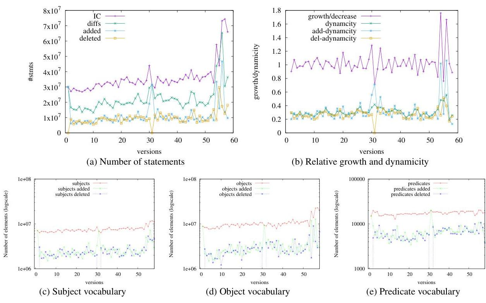

Fig. 2. Dataset description.
crease. Similarly, the version change ratios ${ }^{12}$ in Table 2 $\left(\bar{\delta}, \bar{\delta}^{-}\right.$and $\bar{\delta}^{+}$) point to the concrete adds and delete operations. Thus, one can see that a mean of $31 \%$ of the data change between two versions and that each new version deletes a mean of $27 \%$ of the previous triples, and adds $32 \%$. Nonetheless, Figure 2 (b) points to particular corner cases (in spite of a common stability), such as $V_{31}$ in which no deletes are present, as well as it highlights the noticeable dynamicity in the last versions.

Conversely, the number of version-oblivious triples $\left(\mathcal{O}_{\mathcal{A}}\right), 376 m$, points to a relatively low number of different triples in all the history if we compare this against the number of versions and the size of each version. This fact is in line with the $\bar{\delta}$ dynamicity values, stating that a mean of $31 \%$ of the data change between

[^0]two versions. The same reasoning applies for the remarkably small static core $\left(\mathcal{C}_{\mathcal{A}}\right), 3.5 m$.

Finally, Figures 2 (c-e) show the RDF vocabulary (different subjects, predicates and objects) per version and per delta (adds and deletes). As can be seen, the number of different subjects and predicates remains stable except for the noticeable increase in the latests versions, as already identified in the number of statements per versions. However, the number of added and deleted subjects and objects fluctuates greatly and remain high (one order of magnitude of the total number of elements, except for the aforementioned $V_{31}$ in which no deletes are present). In turn, the number or predicates are proportionally smaller, but it presents a similar behaviour.

### 4.1.2. Test Queries

BEAR-A provides triple pattern queries $Q$ to test each of the five atomic operations defined in our foundations (Section 3). Note that, although such queries


[^0]:    ${ }^{12}$ Note that $\bar{\delta}=\delta_{1, \mathrm{a}}^{*}$, so we use them interchangeably.

do not cover the full spectrum of SPARQL queries, triple patterns (i) constitute the basis for more complex queries, (ii) are the main operation served by lightweight clients such as the Linked Data Fragments [44] proposal, and (iii) they are the required operation to retrieve prior states of a resource in the Memento Framework. For simplicity, we present here atomic lookup queries $Q$ in the form (S??), (?P?), and (??O), which are then extended to the rest of triple patterns (SP?), (S?O), (?PO), and (SPO) ${ }^{13}$. For instance, Listing 1 shows an example of a materialization of a basic predicate lookup query in version 3.

Listing 1 Materialization of a (?P?) triple pattern in version 3.
PREFIX dc: <http://purl.org/dc/elements/1.1/>
SELECT : WHERE \{
?n dc:language ?p : 3 \}

As for the generation of queries, we randomly select such triple patterns from the 58 versions of the Dynamic Linked Data Observatory. In order to provide comparable results, we consider entirely dynamic queries, meaning that the results always differ between consecutive versions. In other words, for each of our selected queries $Q$, and all the versions $V_{i}$ and $V_{j}$ ( $i<j$ ), we assure that $d y n\left(Q, V_{i}, V_{j}\right)>0$. To do so, we first extract subjects, predicates and objects that appear in all $\Delta_{i, j}$.

Then, we follow the foundations and try to minimise the influence of the result cardinality on the query performance. For this purpose, we sample queries which return, for all versions, result sets of similar size, that is, $\operatorname{CARD}\left(Q, V_{i}\right) \approx \operatorname{CARD}\left(Q, V_{j}\right)$ for all queries and versions. We introduce here the notation of a $\epsilon$ stable query, that is, a query for which the min and max result cardinality over all versions do not vary by more than a factor of $1 \pm \epsilon$ from the mean cardinality, i.e., $\max _{\forall i \in \mathcal{N}} \operatorname{CARD}\left(Q, V_{i}\right) \leq(1+\epsilon)$. $\sum_{\forall i \in \mathcal{N}} \frac{\text { CARD }\left(Q, V_{i}\right)}{\left|N^{\prime}\right|}$ and $\min _{\forall i \in \mathcal{N}} \operatorname{CARD}\left(Q, V_{i}\right) \geq(1-$ $\epsilon) \cdot \frac{\sum_{\forall i \in \mathcal{N}} \operatorname{CARD}\left(Q, V_{i}\right)}{\left|N^{\prime}\right|}$.

Thus, the previous selected dynamic queries are effectively run over each version in order to collect the result cardinality. Next, we split subject, objects and predicate queries producing low $\left(Q_{k}^{S}, Q_{k}^{P}, Q_{k}^{Q}\right)$ and high $\left(Q_{H}^{S}, Q_{H}^{P}, Q_{H}^{Q}\right)$ cardinalities. Finally, we filter these sets to sample at most 50 subject, predicate and

[^0]Table 3
Overview of BEAR-A lookup queries
object queries which can be considered $\epsilon$-stable for a given $\epsilon$. Table 3 shows the selected query sets with their epsilon value, mean cardinality and mean dynamicity. Although, in general, one could expect to have queries with a low $\epsilon$ (i.e. cardinalities are equivalent between versions), we test higher $\epsilon$ values in objects and predicates in order to have queries with higher cardinalities. Even with this relaxed restriction, the number of predicate queries that fulfil the requirements is just 6 and 10 for low and high cardinalities respectively.

Section 5 provides an evaluation of (i) version materialisation, (ii) delta materialisation and (iii) version queries for these lookup queries under different state-of-the-art archiving policies. Appendix A extends the lookup queries to triple patterns (SP?), (S?O) and (?PO). We additionally sample 50 (SPO) queries from the static core.

### 4.2. BEAR-B: DBpedia Live

Our next benchmark, rather than looking at arbitrary Linked Data, is focung on the evolution of DBpedia, which directly reflect Wikipedia edits, where we can expect quite different change/evolution characteristics.

### 4.2.1. Dataset Description

The BEAR-B dataset has been compiled from DBpedia Live changesets ${ }^{14}$ over the course of three months (August to October 2015). DBpedia Live [22] records all updates to Wikipedia articles and hence re-extracts and instantly updates the respective DBpedia Live resource descriptions. The BEAR-B contains the resource descriptions of the 100 most volatile resources along with their updates. The most volatile resource (dbr:Deaths_in_2015) changes 1,305 times, the least volatile resource contained in the dataset

[^1]
[^0]:    ${ }^{13}$ The triple pattern (???) retrieves all the information, so no sampling technique is required.

[^1]:    ${ }^{14} \mathrm{http}: / /$ live.dbpedia.org/changesets/

| granularity | versions | $\left\|V_{0}\right\|$ | $\left\|V_{\text {isos }}\right\|$ | $\overline{\text { genotk }}$ | $\bar{\beta}$ | $\overline{\beta^{*}}$ | $\overline{\beta^{*}}$ | $\mathcal{C}_{A}$ | $\mathcal{O}_{A}$ |
| :-- | :--: | :--: | :--: | :--: | :--: | :--: | :--: | :--: | :--: |
| instant | 21,046 | 33,502 | 43,907 | $100.001 \%$ | $0.011 \%$ | $0.007 \%$ | $0.004 \%$ | 32,094 | 234,588 |
| hour | 1,299 | 33,502 | 43,907 | $100.090 \%$ | $0.304 \%$ | $0.197 \%$ | $0.107 \%$ | 32,303 | 178,618 |
| day | 89 | 33,502 | 43,907 | $100.744 \%$ | $1.778 \%$ | $1.252 \%$ | $0.526 \%$ | 32,448 | 83,134 |

Table 4
BEAR-B Dataset configuration
(dbr:Once_Upon_a_Time_(season_5)) changes 263 times.

As dataset updates in DBpedia Live occur instantly, for every single update the dataset shifts to a new version. In practice, one would possibly aggregate such updates in order to have less dataset modifications. Therefore, we also aggregated these updates on an hourly and daily level. Hence, we get three time granularities from the changesets for the very same dataset: instant (21,046 versions), hour (1,299 versions), and day ( 89 versions).

Detailed characteristics of the dataset granularities are listed in Table 4. The dataset grows almost continuously from 33,502 triples to 43,907 triples. Since the time granularities differ in the number of intermediate versions, they show different change characteristics: a longer update cycle also results in more extensive updates between versions, the average version change ratio increases from very small portions of $0.011 \%$ for instant updates to $1.8 \%$ at the daily level. It can also be seen that the aggregation of updates leads to omission of changes: whereas the instant updates handle 234,588 version-oblivious triples, the daily aggregates only have 83,134 (hourly: 178,618), i. e. a reasonable number of triples exists only for a short period of time before they get deleted again. Likewise, from the different sizes of the static core, we see that triples which have been deleted at some point are re-inserted after a short period of time (in the case of DBpedia Live this may happen when changes made to a Wikipedia article are reverted shortly after).

### 4.2.2. Test Queries

BEAR-B allows one to use the same sampling methodology as BEAR-A to retrieve dynamic queries. Nonetheless, we exploit the real-world usage of DBpedia to provide realistic queries. Thus, we extract the 200 most frequent triple patterns from the DBpedia query set of Linked SPARQL Queries dataset (LSQ) [36] and filter those that produce results in our BEARB corpus. We then obtain a batch of 62 lookup queries, mixing (?P?) and (?PO) queries, evaluated in Section 5. The full batch has a $\overline{C A R D}=80$ in BEAR-B-day and BEAR-B-hour, and $\overline{C A R D}=54$ in BEAR-B-instant. Fi-
nally, we build 20 join cases using the selected triple patterns, such as the join in Listing 2. Further statistics on each query are available at the BEAR repository.

Listing 2 Example of a join query in BEAR-B
PREFIX dbp: <http://dbpedia.org/property/>
PREFIX dbo: <http://dbpedia.org/ontology/>
\{
?film dbo:director ?director .
?director dbp:name ?name .
\}

### 4.3. BEAR-C: Open Data portals

The third dataset is taken from the Open Data Portal Watch project, a framework that monitors over 260 Open Data portals in a weekly basis and performs a quality assessment. The framework harvests the dataset descriptions in the portals and converts them to their DCAT representation. We refer to [31] for more details.

### 4.3.1. Dataset Description

For BEAR-C, we decided to take the datasets descriptions of the European Open Data portal ${ }^{15}$ for 32 weeks, or 32 snapshots respectively. Table 5 and Figure 3 show the main characteristics of the dataset. Each snapshot consists of roughly 500 m triples with a very limited growth as most of the updates are modifications on the metadata, i.e. adds and deletes report similar figures as shown in Figure 3 (a-b). Note also that this dynamicity is also reflected in the subject and object vocabulary (Figures 3 (c-d)), whereas the metadata is always described with the same predicate vocabulary (Figure 3 (e)), in spite of a minor modification in version 24 and 25. An excerpt of the RDF data is shown in Listing 7 (Appendix C). Note that, as in BEAR-A, we also replaced Blank Nodes with Skolem IRIs.

[^0]
[^0]:    ${ }^{15}$ http://data.europa.eu/euodp/en/data/

| granularity | versions | $\left|V_{0}\right|$ | $\left|V_{\text {bot }}\right|$ | growth | $\bar{\delta}$ | $\bar{\delta}^{\sim}$ | $\bar{\delta}^{\star}$ | $\mathcal{C}_{A}$ | $\mathcal{O}_{A}$ |
| :--: | :--: | :--: | :--: | :--: | :--: | :--: | :--: | :--: |
| portal | 32 | 485,179 | 563,738 | 100.478\% | 67.617\% | 33.671\% | 33.946\% | 178,484 | 9,403,540 |

Table 5
BEAR-C Dataset configuration
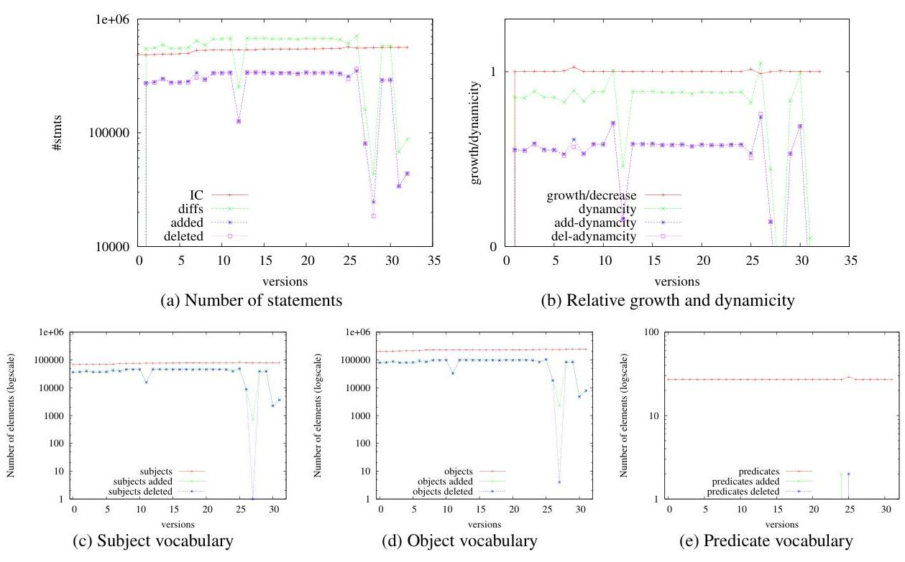

Fig. 3. Dataset description.

### 4.3.2. Test Queries

Selected triple patterns in BEAR-A cover queries whose dynamicity is well-defined, hence it allows for a fine-grained evaluation of different archiving strategies (and particular systems). In turn, BEARB adopts a realistic approach and gather real-word queries from DBpedia. Thus, we provide complex queries for BEAR-C that, although they cannot be resolved in current archiving strategies in a straightforward and optimized way (as discussed in Section 3.3 for the CB approach), they could help to foster the development and benchmarking of novel strategies and query resolution optimizations in archiving scenarios.

With the help of Open Data experts, we created 10 queries that retrieve different information from datasets and files (referred to as distributions, where each dataset refers to one or more distributions) in the European Open Data portal. For instance, Q1 in Listing 3 retrieves all the datasets and their file URLs. Appendix C includes the full list of queries.

```
PRRFIX dcat: <http://www.w3.org/ns/dcat#>
{
    ?dataset rdf:type dcat:Dataset .
    ?dataset dcat:distribution ?distribution .
    ?distribution dcat:accessURL TURL .
}
```

Note that queries are provided as group graph pattern, such that they can be integrated in the AnQL notation ${ }^{16}$ (see Section 3.3).

## 5. Evaluation of RDF archiving systems

We illustrate the use of our foundations to evaluate RDF archiving systems. To do so, we built two RDF archiving systems using the Jena's TDB store ${ }^{17}$ (referred to as Jena hereinafter) and HDT [13], con-

[^0]
[^0]:    ${ }^{16}$ BEAR-C queries intentionally included UNION and OPTIONAL to extend the application beyond Basic Graph Patterns.
    ${ }^{17}$ https://jena.apache.org/documentation/tdb/, v3.2.0.

sidering different state-of-the-art archiving policies (IC, CB, TB and hybrid approaches $\mathrm{HB}^{I C / C B}$ and $\mathrm{HB}^{T B / C B}$ ). Then, we use our prototypical BEAR to evaluate the influence of the concrete store and policy.

Note that we considered these particular open RDF stores given that they are (i) easy to extend in order to implement the suggested archiving strategies, (ii) representative in the community and (iii) useful for potential archiving adopters. Jena is widely used in the community and can be considered as the defacto standard implementation of most W3C efforts in RDF querying (SPARQL) and reasoning. In turn, HDT is a compressed store that considerably reduces space requirements of state-of-the-art stores (e.g. Virtuoso), hence it perfectly fits space efficiency requirements for archives. Furthermore, HDT is the underlying store of potential archiving adopters such as the crawling system LOD Laundromat ${ }^{18}$, which generates new versions in each crawling process ${ }^{19}$.

We implemented the different policies in Jena as follows. For the IC policy (referred to as Jena-IC), we index each version in an independent TDB instance. Likewise, for the CB policy (Jena-CB), we create an index for each added and deleted statements, again for each version and using an independent TDB store. In the TB policy (Jena-TB), we indexed all triples in one single TDB instance, using named graphs to indicate the versions of each triple. Listing 4 shows an example (in TriG notation [6]) with a triple (_:Jon foaf:name "Doe") in versions 1 and 2 and a triple (:Jon foaf:email "j@ example.org") in versions 1 and 3. The graph http://example.org/versions lists the concrete version label of each named graph.

Then, we implemented the hybrid $\mathrm{HB}^{T B / C B}$ approach (Jena- $\mathrm{HB}^{T B / C B}$ ) following the approach of [43, 17] and indexed all deltas using two named graphs per version (adds and deletes) in one single TDB instance. Last, we implemented the $\mathrm{HB}^{I C / C B}$ approach (Jena$\mathrm{HB}^{I C / C B}$ ), then the system can manage a set of IC and CB stores for the same dataset.

We follow the same strategy to develop the IC and CB strategies in HDT [13] (referred to as HDT-IC, HDT-CB and HDT-HB ${ }^{I C / C B}$ ), which provides a compressed representation and indexing of RDF. The TB and $\mathrm{HB}^{T B / C B}$ policies cannot be implemented as cur-

[^0]Listing 4 Example of realization of a TB approach.
@prefix foaf: [http://xmlns.com/foaf/0.1/](http://xmlns.com/foaf/0.1/) . @prefix owl: [http://www.w3.org/2002/07/owl\#](http://www.w3.org/2002/07/owl%5C#) . @prefix ex: [http://example.org/](http://example.org/) . es:version_1_2
\{
__:Jon foaf:name "Doe" .
\}
es:version_1_3
\{
__:Jon foaf:email "j@example.org" .
\}
es:versions
\{
ex:version_1_2 owl:versionInfo 1, 2 . ex:version_1_3 owl:versionInfo 1, 3 .
\}
rent HDT implementations ${ }^{20}$ do not support quads, hence triples cannot be annotated with the version.

In addition, we compare these systems with three state-of-the-art RDF archiving systems: R43ples [17] (v. 0.8.7 ${ }^{21}$ ), which follows a hybrid TB/CB approach that stores deltas ${ }^{22}$ in named graphs on top of Jena, vRDFCSA [8] (v. 2016 and the vpt sampling=64 as default configuration), a pure TB strategy that makes use of compression notions similarly to HDT, and TailR [29] (v. Dec-2016 ${ }^{23}$ ), which archives Linked Data descriptions (RDF triples of a given subject) using a hybrid IC/CB approach and implements the Memento protocol.

Tests were performed on a computer with 2 x Intel Xeon E5-2650v2 @ 2.6 GHz (16 cores), RAM 171 GB, 4 HDDs in RAID 5 config. (2.7 TB netto storage), Ubuntu 14.04.5 LTS running on a VM with QEMU/KVM hypervisor. We report elapsed times in a warm scenario, given that all systems are based on disk except for HDT and v-RDFCSA, which perform on memory.

### 5.1. RDF Storage Space Results

Table 6 shows the required on-disk space for the raw data of the corpus, the GNU diff of such data, and the space required by the Jena and HDT ${ }^{24}$ archiving systems under the different implemented policies. We also include the space requirements of the existing vRDFCSA, R43ples and TailR systems, whose archiv-

[^1]
[^0]:    ${ }^{18} \mathrm{http}: / /$ lodlaundromat.org/.
    ${ }^{19}$ LOD Laundromat only serves the last crawled version of a dataset.

[^1]:    ${ }^{20}$ We use the HDT C++ libraries at http://www.rdfhdt.org/.
    ${ }^{21}$ https://github.com/plt-tud/r43ples
    ${ }^{22}$ R43ples stores the recent version fully materialized, and previous versions can be queried by applying deltas in a reverse way.
    ${ }^{23}$ https://github.com/SemanticMultimedia/llr
    ${ }^{24}$ We include the space overheads of the provided HDT indexes to solve all lookups.

| Dataset | RAW DATA <br> (gzip) | $\begin{gathered} \text { DIFF DATA } \\ \text { (gzip) } \end{gathered}$ | JENA TDB <br> $\mathbf{C B}$ | TB | HDT <br> $\mathbf{C B}$ | CB | $\begin{gathered} \text { V-RDFCSA } \\ \text { (TB) } \end{gathered}$ | $\begin{gathered} \text { RA3PLES } \\ \left(\mathbf{H B}^{T R / C B}\right) \end{gathered}$ | $\begin{gathered} \text { TAILR } \\ \left(\mathbf{H B}^{I C / C B}\right) \end{gathered}$ |
| :--: | :--: | :--: | :--: | :--: | :--: | :--: | :--: | :--: | :--: | :--: |
| BEAR-A | 23 GB | 14 GB | 230 GB | 138 GB | 83 GB | 48 GB | 28 GB | 7.0 GB | NA | NA |
| BEAR-B-instant | 12 GB | 0.16 GB | 158 GB | 7.4 GB | - | 63 GB | 0.33 GB | NA | 0.42 GB | 0.28 GB |
| BEAR-B-hour | 475 MB | 10 MB | 6238 MB | 479 MB | 3679 MB | 2229 MB | 35 MB | 36 MB | 149 MB | 19 MB |
| BEAR-B-day | 37 MB | 1 MB | 421 MB | 44 MB | 24 MB | 149 MB | 7 MB | 5 MB | 63 MB | 9 MB |
| BEAR-C | 243 MB | 205 MB | 2151 MB | 2271 MB | 2012 MB | 421 MB | 439 MB | 313 MB | 8339 MB | 1607 MB |

Table 6
Space of the different archiving systems and policies.

| Dataset | $\mathbf{I C}$ | CB | JENA TDB <br> $\mathbf{H B}_{2}^{I C / C B}$ | $\begin{gathered} \text { HB } \\ \mathbf{H B}_{H}^{I C / C B} \end{gathered}$ | $\begin{gathered} \text { HB } \\ \mathbf{H B}_{H}^{I C / C B} \end{gathered}$ | $\begin{gathered} \text { I } \\ \mathbf{H B}^{T R / C B} \end{gathered}$ | $\mathbf{C B}$ | HDT <br> $\mathbf{C B}$ | HB <br> $\mathbf{H B}_{H}^{I C / C B}$ | $\begin{gathered} \text { HB } \\ \mathbf{H B}_{H}^{I C / C B} \end{gathered}$ | $\begin{gathered} \text { HB } \\ \mathbf{H B}_{H}^{I C / C B} \end{gathered}$ |
| :--: | :--: | :--: | :--: | :--: | :--: | :--: | :--: | :--: | :--: | :--: | :--: |
| BEAR-A | 230 GB | 138 GB | 163 GB | 152 GB | 143 GB | 353 GB | 48 GB | 28 GB | 34 GB | 31 GB | 29 GB |
| BEAR-B-instant | 158 GB | 7.4 GB | 9.7 GB | 7.7 GB | 7.4 GB | 0.10 GB | 63 GB | 0.33 GB | 1.4 GB | 0.46 GB | 0.36 GB |
| BEAR-B-hour | 6238 MB | 479 MB | 662 MB | 563 MB | 529 MB | 54 MB | 2229 MB | 35 MB | 103 MB | 69 MB | 52 MB |
| BEAR-B-day | 421 MB | 44 MB | 137 MB | 90 MB | 65 MB | 23 MB | 149 MB | 7 MB | 43 MB | 25 MB | 15 MB |
| BEAR-C | 2151 MB | 2271 MB | 2356 MB | 2286 MB | 2310 MB | 3735 MB | 421 MB | 439 MB | 458 MB | 444 MB | 448 MB |

Table 7
Space of Jena and HDT Hybrid-Based approaches (HB).
ing policies ( $\mathrm{TB}, \mathrm{HB}^{T R / C B}$ and $\mathrm{HB}^{I C / C B}$ respectively) are predefined and inherent to each system.

Several comments are in order. As expected, the diff data take much less space than the raw gzipped data, and the space savings are highly affected by the dynamicity of the data. For example, Both BEAR-A and BEAR-C are highly dynamic ( $\delta=31 \%$ and $\delta=67 \%$, respectively) and the diff data saves 40 and $15 \%$ of the space respectively (i.e. the more changes, the less space savings in the diff). In contrast, changes between versions are more limited in the aggregation of days, hours and instants in BEAR-B (with $\delta<2 \%$ in all cases), hence the diff data only take $3 \%, 2 \%$ and $1 \%$ of the original size respectively.

A comparison of these figures against the size of the different systems and policies allows for describing their inherent overheads. First, Jena-CB and HDTCB highly reduce the space needs of their IC counterparts, following the same tendency as the diff, i.e., CB policies achieve better space results in less dynamic (i.e. small $\delta$ ) datasets. For instance, in BEAR-B-day, Jena-CB only takes $10 \%$ the space of IC, and only $5 \%$ in BEAR-B-instant. The only exception is BEARC where data are so dynamic that the additional index overhead in CB (for adds and deletes) produces slightly bigger sizes than IC, both in Jena and HDT. Interestingly, R43ples shows a similar behaviour given its $\mathrm{HB}^{T R / C B}$ policy, which only stores changing triples in add and delete named graphs. Thus, R43ples effectively manage dataset with low dynamicity (i.e. small
$\delta$ ) such as BEAR-B, but is is highly penalized in others such as BEAR-C. In fact, R43ples was unable to load the bigger BEAR-A dataset and cannot be included in the analysis.

TailR shares similar remarks: for those indexed datasets, TailR shows very competitive performance in space in datasets with low dynamicity, given that it makes use of a $\mathrm{HB}^{I C / C B}$ policy. In fact, it achieves better results than HDT in BEAR-B-hour and instant. Also, note that TailR groups all the triples of a given subject (following a Linked Data philosophy), hence it particularly excels in BEAR-B, with few different subjects. In contrast, TailR reports poor performance in BEAR-C, where the dataset is more dynamic.

In turn, the IC policy is highly affected by the number of versions. In BEAR-A and BEAR-C, both comprising a reasonable number of versions (less than 60), the IC policy indexing in Jena requires roughly ten times more space than the raw data, mainly due to the data decompression and the built-in Jena indexes. In turn, the compact HDT indexes in the IC policy just double the size of the gzipped raw data, serving the required retrieval operations in such compressed space. In contrast, in BEAR-B Jena-IC and HDT-IC are both penalized by the increasing number of versions. For instance, in BEAR-B instant, Jena-IC takes 13 times the space of the raw gzipped data, while HDT requires 5 times such space. It is worth noting that both Jena and HDT have structures with a minimum fixed size, then the IC strategy has a fixed minimum increase dis-

regarding the small size of each version, such as in BEAR-B-instant.

Finally, the TB policy in Jena and v-RDFCSA reports overall good space figures, as it stores each triple once (i.e. the final size depends on the versionoblivious triples $\mathcal{O}_{A}$ ), using the named graph to denote the versions as previous explained (see example in Listing 4). In fact, v-RDFCSA reports the best space results in all datasets (except for a small difference in BEAR-B-hour). However, note that TB approaches introduce overheads at increasing number of versions, as the forth named-graph component must be also indexed to speed up queries. In fact, Jena-TB shows poor performance in BEAR-B- hour, with 1,299 versions, and both Jena-TB and v-RDFCSA even failed to load BEAR-B-instant, with 21046 versions. Thus, the notation for graphs and versions in TB can present scalability challenges at larger number of versions (even if each of them is of a limited size). This limitation is partially overcome by the hybrid $\mathrm{HB}^{T B / C B}$ policies, such as the one implemented in R43ples.

Table 7 shows the space for the selected hybrid approaches in HDT and Jena, i.e., $\mathrm{HB}_{S}^{I C / C B}$ in HDT and Jena, and $\mathrm{HB}^{T B / C B}$ in Jena. For the first one, we evaluated three different archives, with a small (S), medium (M) and large (L) gap between ICs: $\mathrm{HB}_{S}^{I C / C B}, \mathrm{HB}_{M}^{I C / C B}$ and $\mathrm{HB}_{L}^{I C / C B}$ stand for a policy in which an IC version is stored after 4,8 and 16 CB versions respectively. For the case of BEAR-B-hour, we use a gap of 32, 64 and 128 versions, and for BEAR-B-instant we use 64, 512 and 2048 versions respectively.

Results firstly show that Jena- $\mathrm{HB}^{T B / C B}$ keeps the aforementioned remarks for R43ples, as it also uses named graphs to store the delta in each version, hence it effectively manage dataset with low dynamicity such as BEAR-B. In this particular case, it outperforms all Jena approaches, and it even improves HDT in BEAR-B-instant (due to the aforementioned fixed minimum size per index in HDT). In contrast, $\mathrm{HB}^{T B / C B}$ shows the worst results in highly dynamic datasets such as BEAR-A and BEAR-C. Note that, although CB and TB policies manage the same delta sets, TB uses a unique Jena instance and stores named graph for the triples, so additional "context" indexes are required.

Finally, the $\mathrm{HB}_{S}^{I C / C B}$ policies behave as expected, i.e., the shorter is the gap (e.g. in $\mathrm{HB}_{S}^{I C / C B}$ ), the more IC copies are present and thus the size is similar than the pure IC strategy, and the larger is the gap, more CB copies are present (e.g in $\mathrm{HB}_{L}^{I C / C B}$ ), and the closer is the final size to the pure CB approach.

These initial results confirm current RDF archiving scalability problems at large scale, where specific RDF compression techniques such as HDT and RDFCSA emerge as an ideal solution [14]. For example, JenaIC requires overall almost 4 times the size of HDT-IC, whereas Jena-CB takes more than 10 times the space required by HDT-CB. Results also point to the influence of the number of versions and the dynamicity of the dataset, considered in our $\delta$ metrics, in the selection of the proper strategy (as well as an input for hybrid approaches in order to decide when and how to materialize a version).

### 5.2. Retrieval Performance

From our foundations, we consider the five aforementioned query atoms: (i) version materialisation, (ii) delta materialisation , (iii) version queries, (iv) crossversion joins and (v) change materialisation. As stated, we focus on evaluating the well-described triple patterns in the selected BEAR-A queries (see Section 4.1.2) and the real-world patterns in BEAR-B queries (see Section 4.2.2). In both cases, each triple pattern act as the target query $Q$ in the version materialisation, delta materialisation, version queries and change materialisation. The evaluation of cross-version joins makes use of the joins defined for BEAR-B.

In general, our evaluation confirmed our assumptions about the characteristics of the policies (see Section 2), but also pointed out differences between the archiving systems. The IC, TB and CB/TB policies show a very constant behaviour in all our tests, while the retrieval times of the CB and IC/CB policies increase if more deltas have to be queried. Next, we present and discuss selected plots for each query operation. For the sake of clarity, we present below only the results for the subject lookup queries (with high number of results) in BEAR-A, and the selected queries in BEAR-B-hour. Results for the rest of queries show a very similar tendency, and are presented in Appendix A (for BEAR-A) and Appendix B (for BEAR-B).
Version materialisation. Figure 4 reports, for each version, the average query time (in ms and logarithmic sale in Y axis) over all queries in the selected query set. Figures 4 (a-c) show the results for subject lookup queries in BEAR-A, for v-RDFCSA, R43ples and the pure IC, CB and TB approaches in Jena and HDT (Figure 4a), hybrid approaches in HDT (Figure 4b) and hybrid approaches in Jena (Figure 4c). Likewise, Figures 4 (d-f) focus on BEAR-B-hour. Note

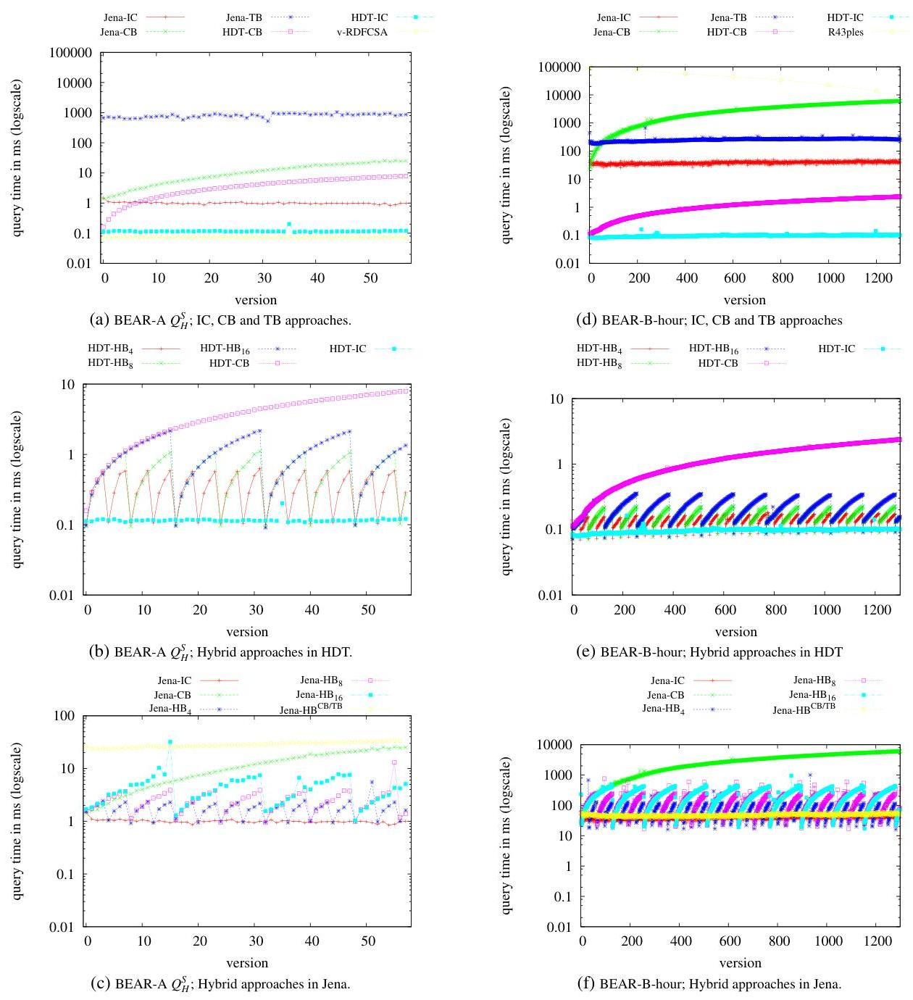

Fig. 4. Query times for Mat queries.
that the v-RDFCSA system currently only supports subject and object lookups [8] and TailR only resolves subject lookups. In order to provide additional evaluation for these systems, we extend the BEAR-B queries to measure subject lookup (presented below). In turn R43ples and TailR are reported for BEAR-B, as we failed to load BEAR-A. Also, it is worth mentioning
that R43ples is accessed via a SPARQL interface with an extended syntax to support versioning (called revisions in R43ples). Although the interface is queried locally, the SPARQL protocol might introduce a minimum overhead which is not considered in other systems (Jena, HDT and v-RDFCSA) that provide a direct API to the versioned triple store.

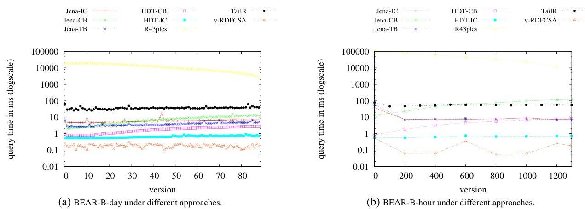

Fig. 5. BEAR-B $Q^{2}$ Mat queries.

First, we can observe from Figure 4 (a) that vRDFCSA, which implements a TB policy, outperforms any of the other systems, remaining close to HDT with an IC policy. In practice, v-RDFCSA makes use of fast and self-compresses indexes to represent both the triples and their annotated versions, hence it speeds up materialisation queries irrespective of the concrete retrieved version. Appendix A shows that HDT is slightly faster than v-RDFCSA in object lookups, although it remains competitive in any case. In turn, as shown in Figure 4 (d), R43ples is significantly slower than any of the other systems, in particular when initial versions are demanded, making its use impractical with a large number of versions. In fact, given its delays, we report only sampled versions ( 0,200 , $400, \ldots, 1200,1298$ ) in order to show the tendency of its performance. Note that R43ples materializes the latest version, and previous versions can be queried by applying the deltas in reverse order. Thus, R43ples performs faster at more recent versions as it requires less materializations of deltas, while it quickly degrades at older versions. Nonetheless, R43ples allows for materializing some intermediate versions (at the cost of increasing the size of the archive), which can emulate an hybrid IC/CB system. Further inspection on this tradeoff is devoted to future work.

In turn, Figures 4 (a) and (d) show that the HDT archiving system generally outperforms Jena. In turn, in both systems, the IC policy provides the best and most constant retrieval time. In contrast, the CB policy shows a clear trend that the query performance decreases if we query a higher version since more deltas have to be queried and the adds and delete information processed. The degradation of the performance highly depends on the system and the type of query. For in-
stance, HDT-CB seems to degrade faster in BEAR-A than Jena-CB but, conversely, the performance degradation is more skewed in Jena-CB in BEAR-B-hour (Figure 4 d ), due to the large number of versions. In turn, the TB policy in Jena performs worse than IC, as TB has to query a single but potentially large dataset (and Jena indexes are not as optimized as in v-RDFCSA). This causes the remarkable poor performance of Jena-TB in BEAR-A (cf. Figure 4 (a)), where the volume of data is high. In contrast, Jena-TB can outperform Jena-CB in BEAR-B when the number of versions is large.

Then, Figures 4 (b) and (e) show the behaviour of hybrid IC/CB approaches in HDT for the selected BEAR-A and BEAR-B datasets respectively. As expected, the performance degrades as soon as the archive has to query the CB copies, while it drops to the IC time when the fully materialized version is available.

Figures 4 (c) and (f) present the hybrid IC/CB approaches in Jena, which share a similar behaviour as discussed above, and compare the hybrid TB/CB approach. For this latter, it is interesting to note that it first retrieve all results matching the query, ordered by named graphs (adds and deletes per version [43,17]), and then process the graphs in order to apply the changes. Nonetheless, this latter is negligible with respect to the first operation (in particular in large datasets), hence the time is almost stable at incremental number of versions. As such, the performance is always worse than IC, but it can highly improve CB in the presence or a large number of versions, such as BEAR-B (cf. Figure 4 (f)).

Finally, in order to test the performance of TailR (and v-RDFCSA), with limited subject lookup re-

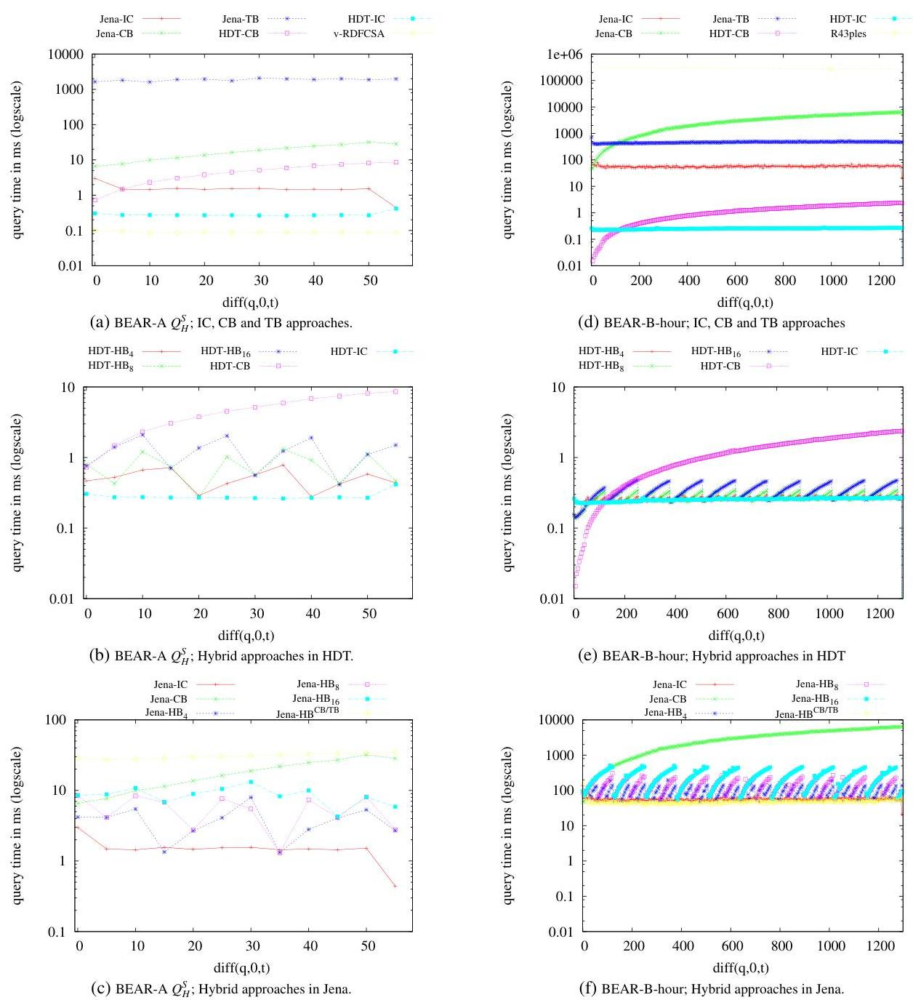

Fig. 6. Query times for $D i f f$ queries with increasing intervals.
trieval, we extend the real-world BEAR-B queries and we consider lookups of its 100 different subjects, named $Q^{S}$. Figure 5 (a) reports the average time per Mat query (for such subjects) in BEAR-B-day. Figure 5 (b) shows the same value for BEAR-B-hour, but taking some representative versions in order to show the tendency of the performance. Results show that TailR
is competitive with the HDT and Jena archiving systems, specially in BEAR-B with a large number of versions and low dynamicity $(\delta)$. Although it can be one level of magnitude slower than an HDT approach, the performance of TailR remains below 100 ms in any case. Results of Mat queries in both datasets also show that v-RDFCSA is again the fastest approach, also

scaling to the large number of versions managed in BEAR-B-hour.

Delta materialisation queries. We performed diffs between the initial version and increasing intervals of 5 versions, i.e., $\operatorname{diff}\left(Q, V_{0}, V_{i}\right)$ for i in $\{5,10,15, \cdots, n\}$. Figure 6 shows again the plots for selected query sets in BEAR-A (a-c) and BEAR-B (df), while additional results can be found in Appendixes A and B.

As expected, the TB policy in v-RDFCSA and Jena behaves similarly than the Mat case given that TB always inspects the full store. Thus, v-RDFCSA is again the fastest system for its currently supported queries, i.e., restricted to subject and object lookups. Then, R43triples is also the slower approach in BEAR-B, shown in Figure 6 (d), even if it stores the deltas in named graph, given that the system first materializes the versions, and then it performs the diff similarly to the AnQL syntax for $\operatorname{diff}\left(Q, v_{i}, v_{j}\right)$ in Section 3.3. Jena and HDT report the expected constant retrieval performance of the IC policy (cf. Figure 6 (a) and (d)), which always needs to query only two version to compute the delta in-memory. In contrast, the query time increases for the CB policy if the intervals of the deltas are increasing, given that more deltas have to be inspected. Thus, the CB policy is always slower than IC at increasing versions. Interestingly, HDT outperforms Jena under the same policy (IC or CB), i.e. HDT implements the policy more efficiently. However, an IC policy in Jena can be faster than a CB policy in HDT. For instance, Jena-IC outperforms HDT-CB after the 5th version in BEAR-A (Figure 6 (a)).
Last, the hybrid approaches reported in Figures 4 (bf) show a similar behaviour than in mat queries. The only consideration is that the performance of IC/TB highly depends on the particular two versions in the diff, and they report the expected IC or CB times depending on which of the versions is already materialized (IC).

Version queries. Table 8 reports the average query time over each $\operatorname{ver}(Q)$ query. Similarly to the previous operations, we summarize our findings by presenting the results for subject lookup queries (with high number of results) in BEAR-A, and queries in BEAR-Bhour, while Appendixes A and B show all results.

As can be seen, v-RDFCSA is again the fastest approach in BEAR-A (1-2 order of magnitude faster), while the HDT archiving system clearly outperforms Jena in all scenarios, taking advantages of its efficient indexing. Nonetheless, the policies plays an important
role: As opposed to the previous Mat and Diff operations, Jena-CB outperforms Jena-IC in these version queries, being even more noticeable in BEAR-B with a large number of versions. The explanation of such behaviour is that, in version queries, all versions have to be queried, hence the query of a version $V_{i}$ in CB can leverage the already materialized version for the previous version $V_{i-1}$ (note that, in contrast, the IC approach has to perform two queries over the full $V_{i-i}$ and $V_{i}$ versions). For the same reason, HDT-CB outperforms HDT-IC in BEAR-B. The only exception in BEAR-A, where the efficiency of indexes in HDT (in a case with few but very large versions) still predominates over the aforementioned gain in CB. In turn, all the $\mathrm{HB}_{S}^{T C / C B}$ policies follow the same behaviour, with a compromise between the CB benefit and the number of IC versions.

Note that R43ples shows poor performance in $\operatorname{ver}(Q)$ queries as the current system forces to specify a revision via a REVISION( $i$ ) keyword (i.e. performing the query at the given version $i$ ), hence all versions (called revisions) have to be materialized at query time. Thus, queries in BEAR-B-hour were stopped after a timeout of 6 hours. As shown in Appendix B, R43ples managed to complete these queries in BEAR-B-day (with smaller number of versions), taking an average of 20 minutes, which is in any case inefficiency compared to any other approach.

Finally, it is worth mentioning that the Jena$\mathrm{HB}_{S}^{T B / C B}$ approach emerges as the fastest approach for version queries, as it only requires a query over the full store and then it splits the results by version. In contrast, the pure Jena-TB approach is seriously compromised by the fact that it needs to query and iterate through all the occurrences on the results in all graphs (which is potentially large given the Jena indexes).

## Cross-version join queries.

We make use of the joins defined in BEAR-B to test the performance of the systems that support crossversion joins, namely HDT and Jena under different archiving policies, and RDF43ples. In order to construct the cross-version join, we split the joins in two triple patterns, $t p_{1}$ and $t p_{2}$, matching the first one in the initial version and the second one at increasing intervals of 5 versions, i.e., join $\left(t p_{1}, V_{0}, t p_{2}, V_{i}\right)$ for i in $\{5,10,15, \cdots, n-5, n\}$. Listing 5 depicts an example of such join using the AnQL notation.

| Query set | JENA TDB |  |  |  |  |  | HDT |  |  |  |  | V-RDFCSA | R43pLes |
| :--: | :--: | :--: | :--: | :--: | :--: | :--: | :--: | :--: | :--: | :--: | :--: | :--: | :--: |
|  | IC | CB | TB | $\begin{gathered} \text { HB } \\ \mathrm{HB}_{4}^{1 C C B} \end{gathered}$ | $\begin{gathered} \text { HB }_{4}^{1 C C B} \end{gathered}$ | $\mathrm{HB}_{4}^{1 C C B}$ | $\mathrm{HB}^{T R C B}$ |  | CB | $\begin{gathered} \text { HB } \\ \mathrm{HB}_{4}^{1 C C B} \end{gathered}$ | $\begin{gathered} \text { HB }_{4}^{1 C C B} \end{gathered}$ |  |  |  |
| BEAR-A $Q_{M}^{2}$ | 101 | 72 | 56693 | 76 | 75 | 89 | 44 | 4.98 | 7.98 | 10.94 | 13.59 | 18.32 | 0.49 | NA |
| BEAR-B-hour | 1189 | 120 | 6473 | 147 | 138 | 132 | 24 | 111.61 | 2.49 | 18.60 | 17.26 | 20.45 | NA | $>21600000$ |

Table 8
Average query time (in ms) for $\operatorname{ver}(\mathrm{Q})$ queries
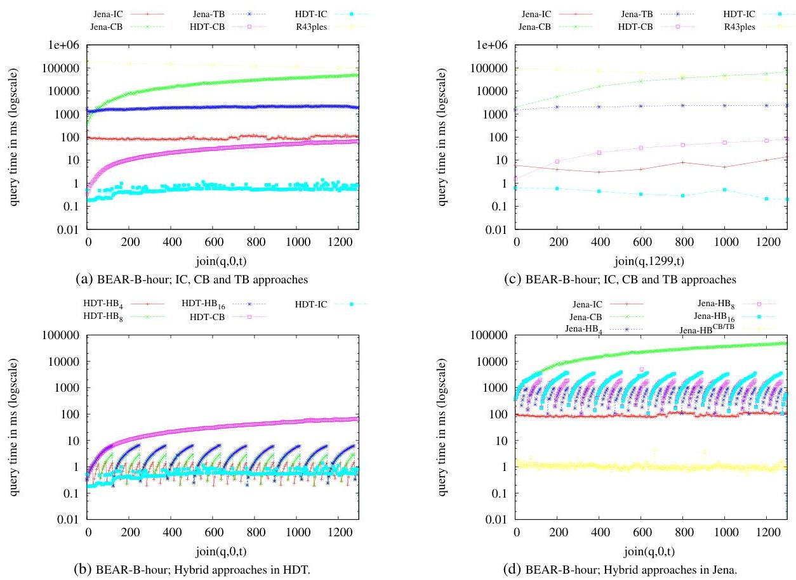

Fig. 7. Query times for join queries with increasing intervals.

Listing 5 Example of a cross-version join query in BEAR-B
PREFIX dbp: <http://dbpedia.org/projects/>
PREFIX dbo: <http://dbpedia.org/ontology/>
\{
?film dbo:director ?director : $\left[\mathrm{v}_{\mathrm{B}}\right]$.
?director dbp:name ?name : $\left[\mathrm{v}_{\mathrm{i}}\right]$.
\}

Figure 7 (a) shows the plots for the selected joins in BEAR-B-hour for all supported systems, whereas Figure 7 (b) and (d) reports the HDT and Jena hybrid approaches, respectively. The figures show similar tendency as Mat queries, where HDT remains the fastest approach, building on top of fast triple pat-
tern resolution. In turn, R43ples and CB approaches pay the price of materializing the deltas. As expected, given the reverse delta approach, R43ples improves with more recent versions. Finally, in order to test R43ples in the most favourable condition, we perform and additional test in BEAR-Bhour, where one triple pattern is fixed to the latest version. Thus, we measure join $\left(t p_{1}, V_{n}, t p_{2}, V_{i}\right)$ i in $\{0,200,400, \cdots, 1200,1298\}$, shown in Figure 7 (c). Results point out that, even in a favourable case, R43ples is still penalized (in particular with older ver-

sions) and can only compete with a Jena-CB policy.

## Change materialisation queries.

Finally, we evaluate the performance of change $(Q)$ queries in all systems except for v-RDFCSA and TailR, which do not support this type of query. As we explained, change $(Q)$ queries can be implemented using $\operatorname{diff}(Q)$ queries for each version, but we decide here to look at specific, tailored optimizations for change $(Q)$ queries. Thus, in R43ples and Jena using a hybrid TBCB approach, we translate these queries to make intensive use of the added and deleted named graphs, hence change queries are speed up by avoiding materialization. Listing 6 shows an example of a query in R43ples that efficiently inspects changes in film directors. To do so, we resolve the given triple pattern in all added and deleted graphs (i.e. deltagraph in the example), whose metadata is stored in a particular revision graph (http://example.org/r43ples-revisions).

Listing 6 Example of a change query in R43ples

```
PREFIX rmo: <http://aatid.et.tu-dresden.de/rmo#>
PREFIX dbo: <http://dbpedia.org/ontology/>
SELECT ?revNumber
WHERE {
    GRAPH <http://example.org/r43ples-revisions> {
        ?r rmo:revisionNumber ?revNumber .
        ?r ?predDelta ?deltagraph .
        ?r rmo:revisionOf <http://example.org> .
        FILTER (?predDelta*rmo:deltaAdded || ?predDelta
            =rmo:deltaRemoved)
    }
    GRAPH ?deltagraph {
        ?film dbo:director ?director .
    }
}
```

In turn, in all HDT and Jena cases, we optimize the resolution by marking a change between two versions as soon as we find the first different result between two versions, hence we avoid a full inspection of the $\Delta^{+}$ and $\Delta^{-}$sets. In HDT, the resolution can be improved as soon as we find discrepancies in the RDF vocabulary (see Definition 9 in our metrics).

Table 9 reports the average query time over each change $(Q)$ query, for subject lookup queries (with high number of results) in BEAR-A, and queries in BEAR-B-hour. Appendixes A and B show all results. As in $\operatorname{Ver}(Q)$ queries, results show that the CB approach generally outperforms IC, given that changes can be quickly detected in CB by inspecting the added and deleted sets. Interestingly, the hybrid IC/CB approaches, in particular in Jena, pay the price of materializing some versions. In particular, when inspecting
changes between versions $\mathrm{V}_{i}$ and $\mathrm{V}_{i+1}$, if version $\mathrm{V}_{i}$ is stored as a delta and $\mathrm{V}_{i+1}$ is a fully materialized version, then $\mathrm{V}_{i}$ has to be fully materialized in order to inspect the differences. In turn, the Jena-TB approach is again compromised as it needs to iterate trough all the occurrences. Finally, it is worth mentioning that the aforementioned TBCB optimizations improve the performance significantly: Jena- $\mathrm{HB}_{5}^{T B / C B}$ outperforms all strategies in Jena, and R43ples is much more competitive in comparison with other query atoms such as version materialisation.

## 6. Conclusions and Future Work

RDF archiving is still in an early stage of research. Novel solutions have to face the additional challenge of comparing the performance against other archiving policies or storage schemes, as there is not a standard way of defining neither a specific data corpus for RDF archiving nor relevant retrieval functionalities. To this end, we have provided foundations to guide future evaluation of RDF archives. First, we formalized dynamic notions of archives, allowing to effectively describe the data corpus. Then, we described the main retrieval facilities involved in RDF archiving, and have provided guidelines on the selection of relevant and comparable queries. We provide a concrete instantiation of archiving queries using AnQL [48] and instantiate our foundations in a prototypical benchmark suit, BEAR, composed of three real-world and welldescribed data corpus and query testbeds. Finally, we have implemented state-of-the-art archiving policies using independent copies (IC), change-based (CB), timestamp (TB) and hybrid (HB) approaches in two stores (Jena TDB and HDT). We use BEAR to evaluate our implementations as well as existing state-of-the-art archiving systems (v-RDFCSA, TailR, R43ples). Results clearly confirm challenges (in terms of scalability) and strengths of current archiving approaches, and highlight the influence of the number of versions and the dynamicity of the dataset in order to select the right strategy (as well as an input for hybrid approaches in order to decide when and how to materialize a version), guiding future developments. In particular, in terms of space, CB, TB and hybrid policies (such as TB/CB in R43ples and IC/CB in TailR) achieve better results than IC in less dynamic datasets, but they are penalized in highly dynamic datasets due to index overheads. In this case, the TB policy reports overall good space figures but it can be penalized at increasing number of

| Query set | JENA TDB |  |  |  |  |  |  |  | HDT |  |  |  | R43PLES |
| :--: | :--: | :--: | :--: | :--: | :--: | :--: | :--: | :--: | :--: | :--: | :--: | :--: | :--: |
|  | IC | CB | TB | $\mathrm{HB}_{4}^{\mathrm{IC} C B}$ | $\mathrm{HB}_{16}^{\mathrm{IC} C B}$ | $\mathrm{HB}_{17}^{\mathrm{IC} C B}$ | $\mathrm{HB}^{\mathrm{TP} / C B}$ | IC | CB | $\mathrm{HB}_{4}^{\mathrm{IC} C B}$ | $\mathrm{HB}_{16}^{\mathrm{IC} C B}$ | $\mathrm{HB}_{17}^{\mathrm{IC} C B}$ | $\mathrm{HB}^{\mathrm{TP} / C B}$ |
| BEAR-A $Q_{M}^{T}$ | 151 | 143 | 63543 | 212 | 307 | 730 | 49 | 24.15 | 6.93 | 41.33 | 29.66 | 22.80 | NA |
| BEAR-B-hour | 1690 | 196 | 12295 | 4569 | 7182 | 13546 | 88 | 1876.81 | 3.73 | 127.32 | 104.61 | 95.29 | 487 |

Table 9
Average query time (in ms) for change(Q) queries
versions. Regarding query resolution performance, the evaluated archiving policies excel at different operations but, in general, the IC, TB and CB/TB policies show a very constant behaviour, while CB and IC/CB policies degrade if more deltas have to be queried. Results also show that specific functional RDF compression techniques such as HDT and RDFCSA emerge as promising solutions for RDF archiving in terms of space requirements and query performance.

We currently focus on exploiting the presented benchmark to build a customizable generator of evolving synthetic RDF data which can preserve userdefined characteristics while scaling to any dataset size and number of versions. We also work on extending the benchmark for multiple versioned graphs in a federated scenario.

## Acknowledgements

Funded by Austrian Science Fund (FWF): M1720G11, European Union's Horizon 2020 research and innovation programme under grant 731601 (SPECIAL), MINECO-AEI/FEDER-UE ETOME-RDFD3: TIN2015-69951-R, by Austrian Research Promotion Agency (FFG): grant no. 849982 (ADEQUATe) and grant 861213 (CitySpin), and the German Government, Federal Ministry of Education and Research under the project number 03WKCJ4D. Javier D. Fernández was funded by WU post-doc research contracts, and Axel Polleres was supported by the "Distinguished Visiting Austrian Chair" program as a visiting professor hosted at The Europe Center and the Center for Biomedical Research (BMIR) at Stanford University. Special thanks to Sebastian Neumaier for his support with the Open Data Portal Watch.

## References

[1] G. Aluç, O. Hartig, M. T. Özsu, and K. Daudjee. Diversified Stress Testing of RDF data management systems. In Proc. of ISWC, pages 197-212, 2014.
[2] M. Arenas, C. Gutierrez, and J. Pérez. On the Semantics of SPARQL. Semantic Web Information Management, pages 281-307, 2009.
[3] K. Bereta, P. Smeros, and M. Koubarakis. Representation and Querying of Valid Time of Triples in Linked Geospatial Data. In Proc. of ESWC, pages 259-274. 2013.
[4] C. Bizer, T. Heath, and T. Berners-Lee. Linked Data - The Story So Far. Int. J. Semantic Web Inf. Syst, 5:1-22, 2009.
[5] C. Bizer and A Schultz. The Berlin SPARQL benchmark. Int. J. Semantic Web Inf. Syst, 5(2):1-24, 2009.
[6] Chris Bizer and Richard Cyganiak. Rdf 1.1 trig. W3C recommendation, 110, 2014.
[7] Peter Boncz, Irini Fundulaki, Andrey Gubichev, Josep LarribaPey, and Thomas Neumann. The linked data benchmark council project. Datenbank-Spektrum, 13(2):121-129, 2013.
[8] Ana Cerdeira-Pena, Antonio Farina, Javier D Fernández, and Miguel A Martınez-Prieto. Self-indexing rdf archives. In Proc. of DCC, 2016.
[9] Herbert Van de Sompel, Robert Sanderson, Michael L. Nelson, Lyudmila Balakireva, Harihar Shankar, and Scott Ainsworth. An HTTP-Based Versioning Mechanism for Linked Data. In Proc. of LDOW, 2010.
[10] D. Dell'Aglio, J.P. Calbimonte, M. Balduini, O. Corcho, and E. Della Valle. On Correctness in RDF Stream Processor Benchmarking. In Proc. of ISWC, pages 326-342, 2013.
[11] David Dominguez-Sal, Norbert Martínez-Bazan, Victor Muntes-Mulero, Pere Baleta, and Josep Lluis Larriba-Pey. A discussion on the design of graph database benchmarks. In Performance Evaluation, Measurement and Characterization of Complex Systems, pages 25-40. Springer, 2010.
[12] I. Dong-Hyuk, L. Sang-Won, and K. Hyoung-Joo. A Version Management Framework for RDF Triple Stores. Int. J. Softw. Eng. Know., 22(1):85-106, 2012.
[13] J. D. Fernández, M. A. Martínez-Prieto, C. Gutiérrez, A. Polleres, and M. Arias. Binary RDF Representation for Publication and Exchange (HDT). JWS, 19:22-41, 2013.
[14] J. D. Fernández, A. Polleres, and J. Umbricht. Towards Efficient Archiving of Dynamic Linked Open Data. In Proc. of DIACHRON, 2015.
[15] Valeria Fionda, Melisachew Wudage Chekol, and Giuseppe Pirrò. Gize: A time warp in the web of data. In Proc. of ISWC, 2016.
[16] F. Grandi. T-SPARQL: A TSQL2-like Temporal Query Language for RDF. In Proc. of ADBIS, pages 21-30. 2010.
[17] M. Graube, S. Hensel, and L. Urbas. R43ples: Revisions for triples. In Proc. of $L D Q$, volume CEUR-WS 1215, paper 3, 2014.
[18] J. Gray. Benchmark handbook: for database and transaction processing systems. Morgan Kaufmann Publishers Inc., 1992.
[19] Yaanbo Guo, Zhengxiang Pan, and Jeff Heflin. Lubm: A benchmark for owl knowledge base systems. Web Seman-

tics: Science, Services and Agents on the World Wide Web, 3(2):158-182, 2005.
[20] C. Gutierrez, C.A. Hurtado, and A. Vaisman. Introducing Time into RDF. IEEE T. Knowl. Data En., 19(2):207-218, 2007.
[21] S. Harris and A. Seaborne. SPARQL 1.1 Query Language. W3C Recom. 2013.
[22] Sebastian Hellmann, Claus Stadler, Jens Lehmann, and Sören Auer. DBpedia Live extraction. In On the Move to Meaningful Internet Systems: OTM 2009, volume 5871, pages 1209-1223. Springer, 2009.
[23] T. Käfer, A. Abdelrahman, J. Umbrich, P. O'Byrne, and A. Hogan. Observing Linked Data Dynamics. In Proc. of ESWC, pages 213-227. 2013.
[24] Martin Kaufmann, Donald Kossmann, Norman May, and Andreas Tonder. Benchmarking databases with history support. Technical report, Eidgenössische Technische Hochschule Zürich, 2013.
[25] M. Klein, D. Fensel, A. Kiryakov, and D. Ognyanov. Ontology versioning and change detection on the web. In Proc. of EKAW, pages 197-212. 2002.
[26] Magnus Knuth, Dinesh Reddy, Anastasia Dimou, Sahar Vahdati, and George Kastrinakis. Towards linked data update notifications reviewing and generalizing the SparqIPuSH approach. In Proceedings of the Workshop on Negative or Inconclusive Results in Semantic Web (NoISE2015), Portoroz, Slovenia, June 2015.
[27] Marios Meimaris and George Papastefanatos. The evogen benchmark suite for evolving rdf data. In Proc. of MEPDaW, volume CEUR 1585, pages 20-35, 2016.
[28] Marios Meimaris, George Papastefanatos, Stratis Viglas, Yannis Stavrakas, and Christos Pateritsas. A query language for multi-version data web archives. Technical report, Institute for the Management of Information Systems, Greece, 2015.
[29] Paul Meinhardt, Magnus Knuth, and Harald Sack. Taitr: a platform for preserving history on the web of data. In Proc. of SEMANTICS, pages 57-64. ACM, 2015.
[30] G. Montoya, M.E. Vidal, O. Corcho, E. Ruckhaus, and C. Buil Aranda. Benchmarking Federated SPARQL Query Engines: Are Existing Testbeds Enough? In Proc. of ISWC, pages 313-324, 2012.
[31] S. Neumaier, J. Umbrich, and A. Polleres. Automated quality assessment of metadata across open data portals. ACM Journal of Data and Information Quality (JDIQ), 2016. fourthcoming.
[32] T. Neumann and G. Weikum. x-RDF-3X: Fast querying, high update rates, and consistency for RDF databases. Proc. of VLDB Endowment, 3(1-2):256-263, 2010.
[33] N. F. Noy and M. A. Musen. Ontology Versioning in an Ontology Management Framework. IEEE Intelligent Systems, 19(4):6-13, 2004.
[34] Vassilis Papakonstantinou, Giorgos Flouris, Irini Fundulaki, Kostas Stefanidis, and Giannis Roussakis. Versioning for linked data: Archiving systems and benchmarks. In Proc. of BLINK, volume CEUR 1700, 2016.
[35] M. Perry, P. Jain, and A. P. Sheth. SPARQL-ST: Extending SPARQL to Support Spatiotemporal Queries. Geospatial Semantics and the Semantic Web, 12:61-86, 2011.
[36] Muhammad Saleem, Muhammad Intizar Ali, Aidan Hogan, Qaiser Mehmood, and Axel-Cyrille Ngonga Ngomo. LSQ: The Linked SPARQL Queries Dataset. In The Semantic Web ISWC 2015. Springer, 2015.
[37] Muhammad Saleem, Qaiser Mehmood, and AxelCyrille Ngonga Ngomo. FEASIBLE: A Feature-Based SPARQL Benchmark Generation Framework. In Proc. of ISWC, pages 52-69. 2015.
[38] M. Schmidt, T. Hornung, G. Lausen, and C. Pinkel. SP2Bench: a SPARQL performance benchmark. In Proc. of ICDE, pages 222-233, 2009.
[39] K. Stefanidis, I. Chrysakis, and G. Flouris. On Designing Archiving Policies for Evolving RDF Datasets on the Web. In Proc. of ER, pages 43-56. 2014.
[40] J. Tappolet and A. Bernstein. Applied Temporal RDF: Efficient Temporal Querying of RDF Data with SPARQL. In Proc. of ESWC, pages 308-322. 2009.
[41] Y. Tzitzikas, Y. Theoharis, and D. Andreou. On Storage Policies for Semantic Web Repositories That Support Versioning. In Proc. of ESWC, pages 705-719. 2008.
[42] J. Umbrich, M. Hausenblas, A. Hogan, A. Polleres, and S. Decker. Towards Dataset Dynamics: Change Frequency of Linked Open Data Sources. In Proc. of LDOW, 2010.
[43] M. Vander Sander, P. Colpaert, R. Verborgh, S. Coppens, E. Mannens, and R. Van de Walle. R\&Wbase: Git for triples. In Proc. of LDOW, 2013.
[44] R. Verborgh, O. Hartig, B. De Meester, G. Haesendonck, L. De Vocht, M. Vander Sande, R. Cyganiak, P. Colpaert, E. Mannens, and R. Van de Walle. Querying Datasets on the Web with High Availability. In Proc. of ISWC, pages 180-196, 2014.
[45] M. Volkel, W. Winkler, Y. Sure, S.R. Kruk, and M. Synak. Semversion: A versioning system for RDF and ontologies. In Proc. of ESWC, 2005.
[46] Shi Gao Jiaqi Gu Carlo Zaniolo. Rdf-tx: A fast, user-friendly system for querying the history of rdf knowledge bases. In Proc. of EDBT, 2016.
[47] D. Zeginis, Y. Tzitzikas, and V. Christophides. On Computing Deltas of RDF/S Knowledge Bases. ACM Transactions on the Web (TWER), 5(3):14, 2011.
[48] A. Zimmermann, N. Lopes, A. Polleres, and U. Straccia. A General Framework for Representing, Reasoning and Querying with Annotated Semantic Web Data. JWS, 12:72-95, 2012.

# Appendix 

## A. BEAR-A Performance Results

This appendix comprises the performance results for all subject, predicate and object lookups (S??, ?P? and ??O respectively) in BEAR-A (see Section 4.1 for a description of the corpus), and the corresponding triple patterns (SP?), (S?O), (?PO) and (SPO). Figures 8\&9 show the results for Mat queries with pure IC, CB and TB approaches in HDT and Jena. Figures 10\&11 compare such results with hybrid IC/CB approaches with HDT, whereas Figures 12\&13 perform the comparison with IC/CB and TB/CB approaches. Diff queries are presented in Figures 14-19. Finally, Tables 10\&11 report the results for the Ver query, and Tables 12\&13 show the Change queries.
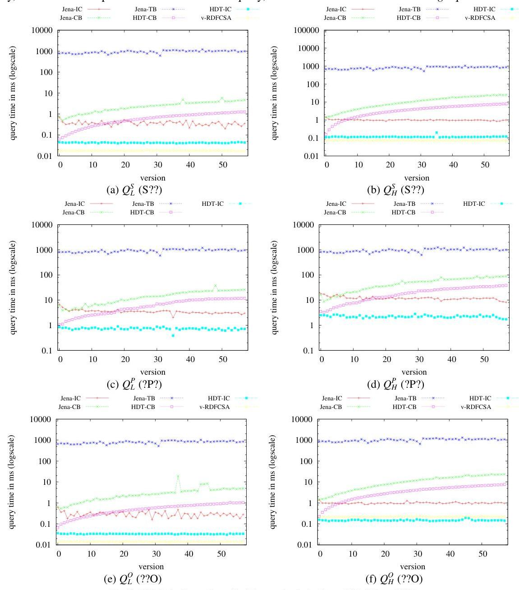

Fig. 8. BEAR-A: Query times for Mat queries in lookups (S??, ?P? and ??O).

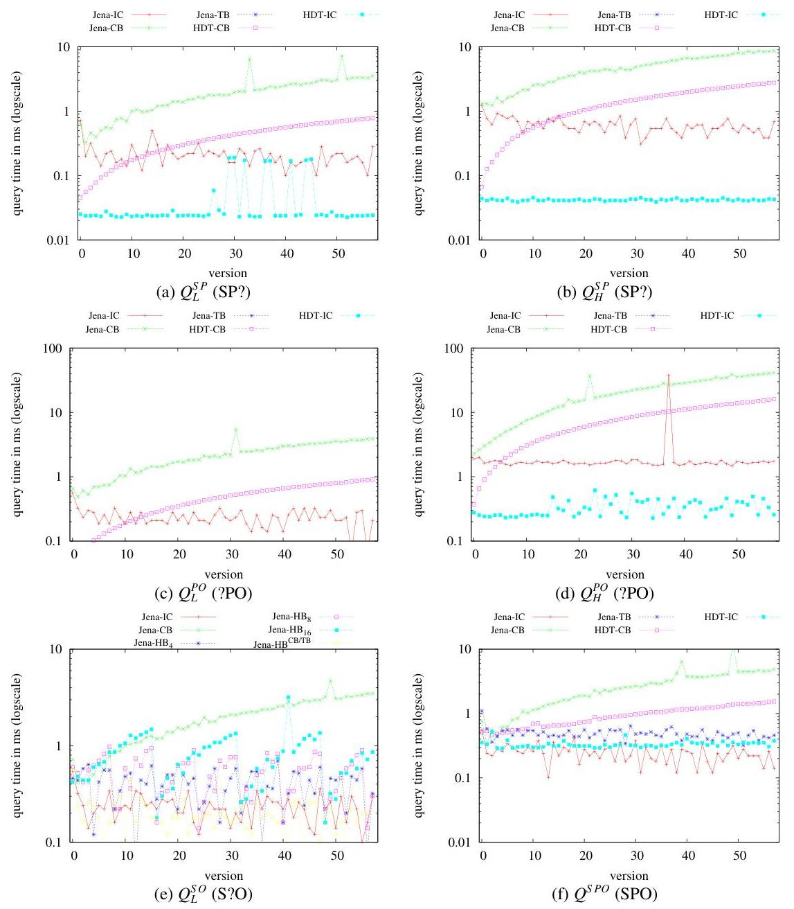

Fig. 9. BEAR-A: Query times for Mat queries for different triple patterns (SP?, ?PO, S?O and SPO).

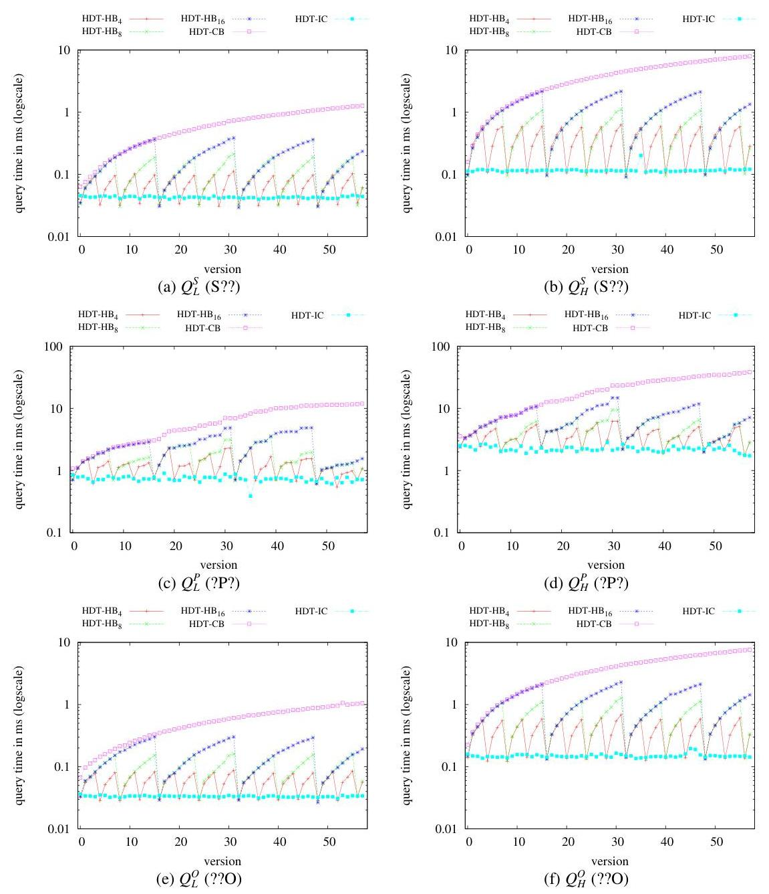

Fig. 10. BEAR-A: Query times for Mat queries in Hybrid approaches in HDT for lookups (S??, ?P? and ??O).

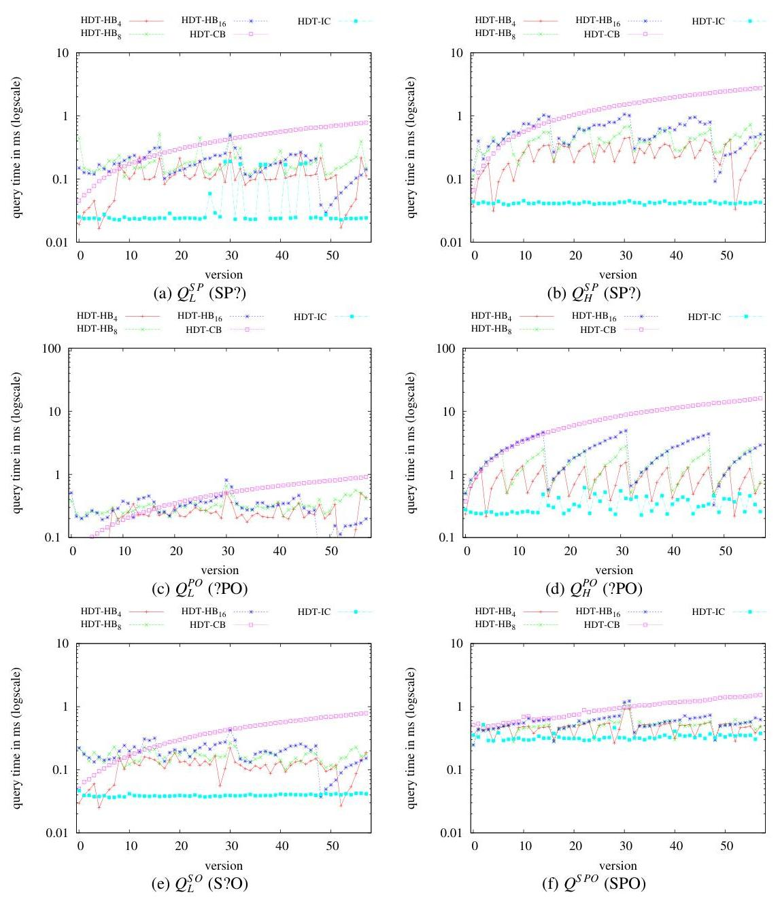

Fig. 11. BEAR-A: Query times for Mat queries in Hybrid approaches in HDT for different triple patterns (SP?, ?PO, S?O and SPO).

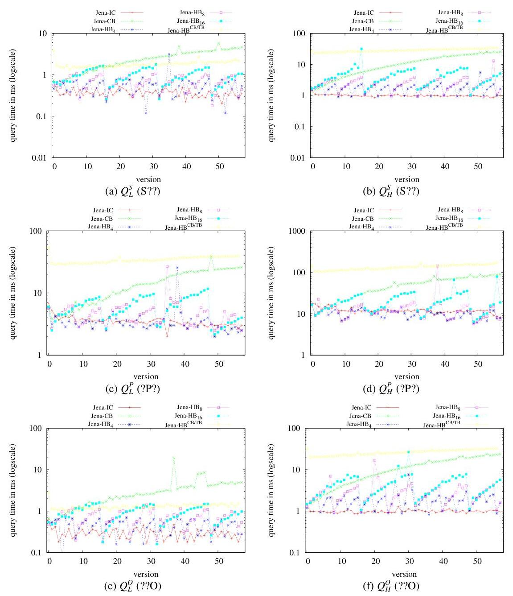

Fig. 12. BEAR-A: Query times for Mat queries in Hybrid approaches in Jena for lookups (S??, ?P? and ??O).

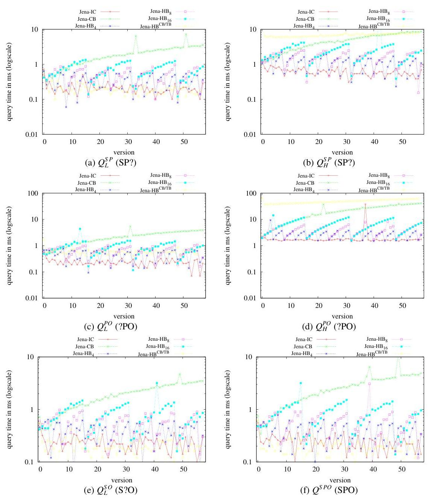

Fig. 13. BEAR-A: Query times for Mat queries in Hybrid approaches in Jena for different triple patterns (SP?, ?PO, S?O and SPO).

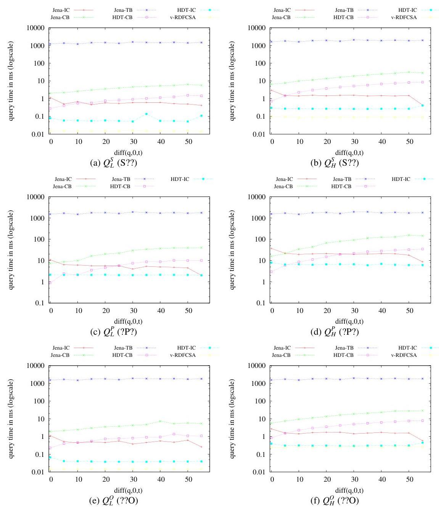

Fig. 14. BEAR-A: Query times for $D i f f$ queries with increasing intervals for lookups (S??, ?P? and ??O).

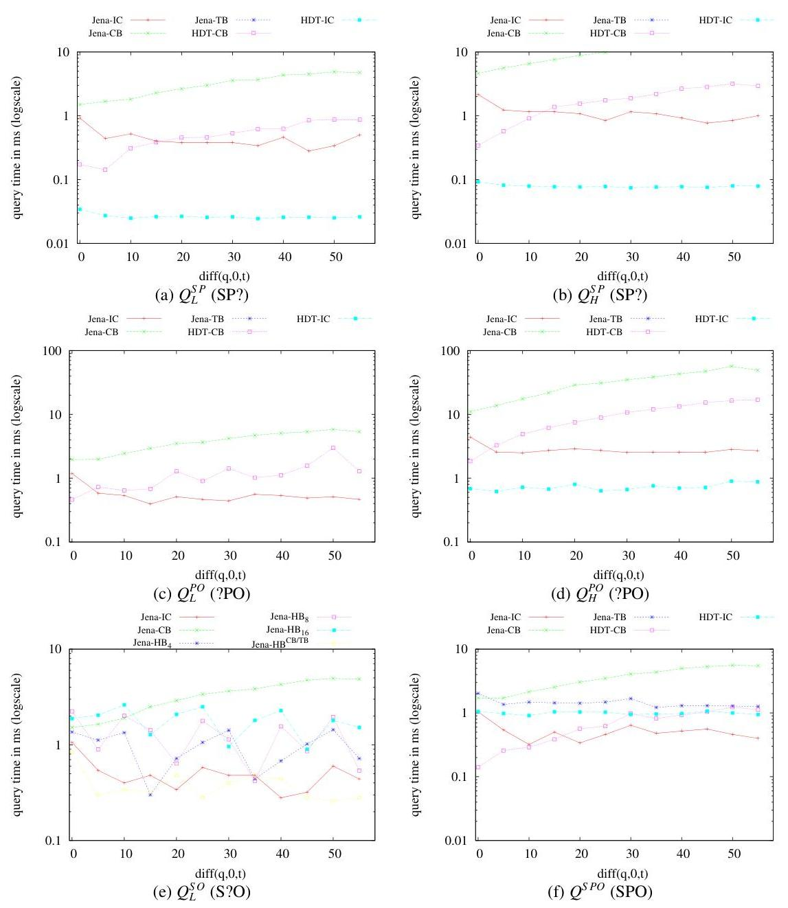

Fig. 15. BEAR-A: Query times for $D i f f$ queries with increasing intervals for different triple patterns (SP?, ?PO, S?O and SPO).

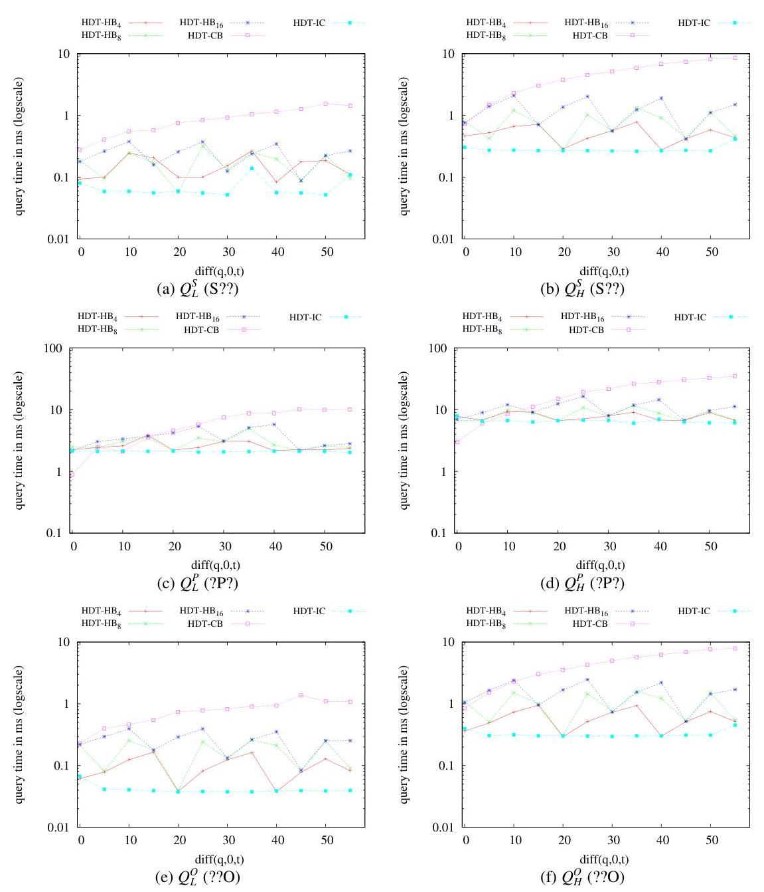

Fig. 16. BEAR-A: Query times for $D i f f$ queries with increasing intervals in Hybrid approaches in HDT for lookups (S??, ?P? and ??O).

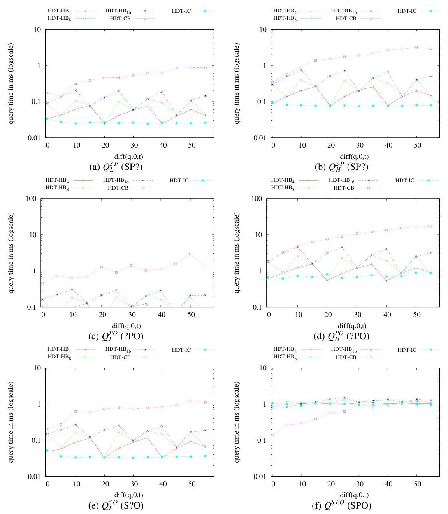

Fig. 17. BEAR-A: Query times for $D i f f$ queries with increasing intervals in Hybrid approaches in HDT for different triple patterns (SP?, ?PO, $\mathrm{S} ? \mathrm{O}$ and SPO).

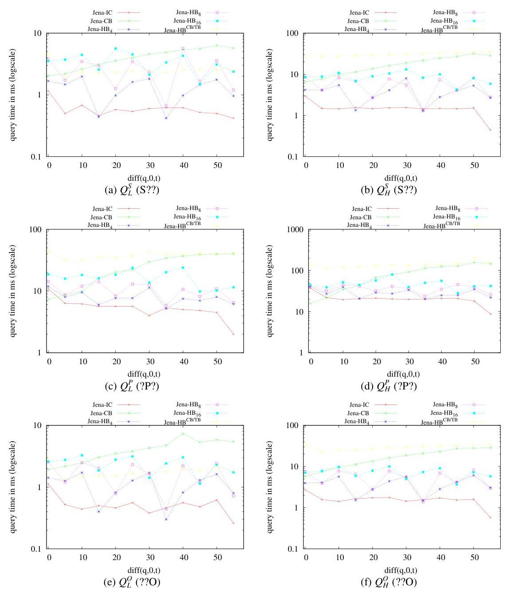

Fig. 18. BEAR-A: Query times for $D i f f$ queries with increasing intervals in Hybrid approaches in Jena for lookups (S??, ?P?, ??O).

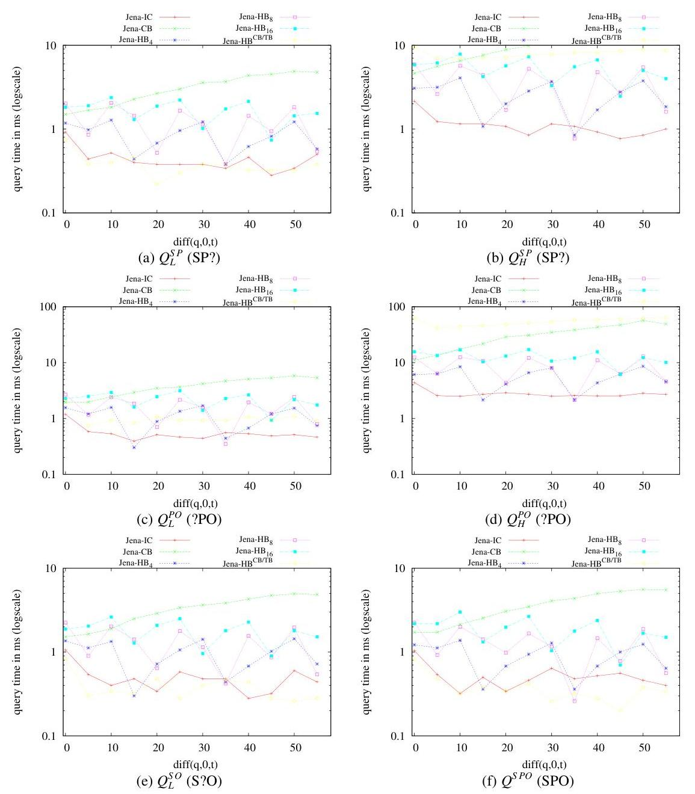

Fig. 19. BEAR-A: Query times for $D i f f$ queries with increasing intervals in Hybrid approaches in Jena for different tripe patterns (SP?, ?PO, S?O and SPO).

| Query set | JENA TDB |  |  |  |  |  |  | HDT |  |  |  |  | v-RDFCSA |
| :--: | :--: | :--: | :--: | :--: | :--: | :--: | :--: | :--: | :--: | :--: | :--: | :--: | :--: |
|  | IC | CB | TB | $\mathrm{HB}_{0}^{\mathrm{C} C E}$ | $\mathrm{HB}_{10}^{\mathrm{C} C E}$ | $\mathrm{HB}_{10}^{\mathrm{C} C E}$ | $\mathrm{HB}^{\mathrm{T} R C E}$ | IC | CB | $\mathrm{HB}_{0}^{\mathrm{C} C E}$ | $\mathrm{HB}_{10}^{\mathrm{C} C E}$ | $\mathrm{HB}_{10}^{\mathrm{C} C E}$ |  |
| $Q_{L}^{T}$ | 66 | 24 | 42732 | 24 | 31 | 32 | 7 | 1.54 | 1.91 | 2.30 | 2.47 | 2.64 | 0.22 |
| $Q_{H}^{T}$ | 101 | 72 | 56693 | 76 | 75 | 89 | 44 | 4.98 | 7.98 | 10.94 | 13.59 | 18.32 | 0.49 |
| $Q_{L}^{T}$ | 437 | 77 | 49411 | 115 | 130 | 115 | 79 | 42.88 | 13.79 | 30.97 | 29.03 | 31.71 | NA |
| $Q_{H}^{T}$ | 809 | 205 | 54246 | 383 | 411 | 302 | 210 | 116.96 | 46.62 | 101.05 | 88.41 | 101.55 | NA |
| $Q_{L}^{D}$ | 67 | 23 | 49424 | 23 | 23 | 45 | 6 | 1.44 | 2.36 | 2.96 | 2.85 | 2.91 | 0.15 |
| $Q_{H}^{D}$ | 99 | 67 | 58114 | 80 | 74 | 74 | 54 | 7.12 | 11.73 | 14.28 | 16.40 | 20.18 | 3.49 |

Table 10
BEAR-A: Average query time (in ms) for ver(Q) queries in lookups (S??, ?P? and ??O)

| Query set |  | JENA TDB |  |  |  |  |  | HDT |  |  |  |  |  |
| :--: | :--: | :--: | :--: | :--: | :--: | :--: | :--: | :--: | :--: | :--: | :--: | :--: | :--: |
|  | IC | CB | TB | $\mathrm{HB}_{0}^{\mathrm{C} C E}$ | $\mathrm{HB}_{10}^{\mathrm{C} C E}$ | $\mathrm{HB}_{10}^{\mathrm{C} C E}$ | $\mathrm{HB}^{\mathrm{T} R C E}$ | $\mathrm{HB}^{\mathrm{T} R C E}$ |  | CB | $\mathrm{HB}_{0}^{\mathrm{C} C E}$ | $\mathrm{HB}_{10}^{\mathrm{C} C E}$ | $\mathrm{HB}_{10}^{\mathrm{C} C E}$ |
| $Q_{L}^{T P}$ | 53 | 15 | 55283 | 15 | 15 | 16 | 1 | 0.83 | 1.02 | 1.07 | 1.15 | 1.13 |  |
| $Q_{H}^{T P}$ | 67 | 50 | 57720 | 45 | 50 | 50 | 17 | 1.75 | 3.88 | 4.48 | 4.69 | 5.59 |  |
| $Q_{L}^{\mathrm{PO}}$ | 57 | 21 | 56151 | 20 | 20 | 21 | 3 | 1.32 | 2.04 | 2.01 | 2.03 | 2.15 |  |
| $Q_{H}^{\mathrm{PO}}$ | 136 | 116 | 59831 | 113 | 107 | 121 | 92 | 11.58 | 20.91 | 24.82 | 29.74 | 38.39 |  |
| $Q_{L}^{\mathrm{PO}}$ | 55 | 16 | 45193 | 19 | 17 | 18 | 1 | 1.36 | 1.78 | 2.02 | 1.73 | 1.73 |  |
| $Q^{\text {TPO }}$ | 54 | 17 | 50393 | 16 | 17 | 17 | 1 | 18.35 | 3.37 | 11.14 | 9.17 | 8.00 |  |

Table 11
BEAR-A: Average query time (in ms) for ver(Q) queries in different tripe patterns (SP?, ?PO, S?O and SPO)

| Query set | JENA TDB |  |  |  |  |  |  | HDT |  |  |  |  |  |
| :--: | :--: | :--: | :--: | :--: | :--: | :--: | :--: | :--: | :--: | :--: | :--: | :--: | :--: |
|  | IC | CB | TB | $\mathrm{HB}_{0}^{\mathrm{C} C E}$ | $\mathrm{HB}_{10}^{\mathrm{C} C E}$ | $\mathrm{HB}_{10}^{\mathrm{C} C E}$ | $\mathrm{HB}^{\mathrm{T} R C E}$ | IC | CB | $\mathrm{HB}_{0}^{\mathrm{C} C E}$ | $\mathrm{HB}_{10}^{\mathrm{C} C E}$ | $\mathrm{HB}_{10}^{\mathrm{C} C E}$ |  |
| $Q_{L}^{T}$ | 37 | 32 | 59759 | 60 | 80 | 118 | 11 | 7.41 | 6.49 | 13.85 | 11.88 | 14.40 |  |
| $Q_{H}^{T}$ | 151 | 143 | 63543 | 212 | 307 | 730 | 49 | 24.15 | 6.93 | 41.33 | 29.66 | 22.80 |  |
| $Q_{L}^{\mathrm{P}}$ | 809 | 102 | 68335 | 503 | 634 | 881 | 88 | 22.73 | 5.36 | 160.72 | 80.77 | 50.54 |  |
| $Q_{H}^{\mathrm{P}}$ | 2114 | 479 | 82382 | 1902 | 2336 | 3145 | 275 | 3.99 | 3.99 | 552.39 | 240.56 | 145.68 |  |
| $Q_{H}^{\mathrm{O}}$ | 59 | 33 | 87018 | 48 | 69 | 104 | 7 | 11.50 | 14.18 | 19.92 | 16.07 | 19.37 |  |
| $Q_{H}^{\mathrm{O}}$ | 149 | 135 | 64042 | 210 | 346 | 557 | 83 | 25.81 | 18.58 | 56.01 | 37.84 | 37.76 |  |

Table 12
Average query time (in ms) for change(Q) queries in lookups (S??, ?P? and ??O)

| Query set | JENA TDB |  |  |  |  |  | HDT |  |  |  |  |  |
| :--: | :--: | :--: | :--: | :--: | :--: | :--: | :--: | :--: | :--: | :--: | :--: | :--: |
|  | IC | CB | TB | $\mathrm{HB}_{0}^{\mathrm{C} C E}$ | $\mathrm{HB}_{10}^{\mathrm{C} C E}$ | $\mathrm{HB}_{10}^{\mathrm{C} C E}$ | $\mathrm{HB}^{\mathrm{T} R C E}$ | IC | CB | $\mathrm{HB}_{0}^{\mathrm{C} C E}$ | $\mathrm{HB}_{10}^{\mathrm{C} C E}$ | $\mathrm{HB}_{10}^{\mathrm{C} C E}$ |
| $Q_{L}^{T P}$ | 55 | 70 | 68651 | 104 | 140 | 222 | 22 | 10.14 | 13.23 | 21.94 | 24.59 | 19.92 |
| $Q_{H}^{T P}$ | 19 | 18 | 164933 | 32 | 48 | 85 | 1 | 4.03 | 3.08 | 10.00 | 10.11 | 8.98 |
| $Q_{L}^{\mathrm{PO}}$ | 229 | 237 | 72853 | 319 | 520 | 892 | 176 | 36.54 | 30.09 | 92.61 | 67.83 | 52.04 |
| $Q_{H}^{\mathrm{PO}}$ | 24 | 25 | 100538 | 45 | 57 | 90 | 5 | 9.80 | 14.89 | 18.84 | 17.69 | 18.17 |
| $Q_{L}^{\mathrm{PO}}$ | 21 | 22 | 121483 | 38 | 52 | 79 | 1 | 5.41 | 13.65 | 14.46 | 15.67 | 13.80 |
| $Q_{H}^{\text {TPO }}$ | 22 | 29 | 49 | 43 | 68 | 90 | 1 | 15.25 | 23.06 | 17.07 | 37.23 | 28.22 |

Table 13
Average query time (in ms) for change(Q) queries in lookups (SP?, ?PO, S?O and SPO)

# B. BEAR-B Queries 

This appendix shows the performance results of BEAR-B (see Section 4.2 for a description of the corpus). We focus here on reporting BEAR-B-day and BEAR-B-hour results, whereas current systems were unable to efficiently query the 21,046 versions in BEAR-B-instant and a report can be found in the BEAR repository (https://aic.ai.wu.ac.at/qadlod/bear).

Figures 20-22 show the results for Mat queries with pure IC, CB and TB approaches, hybrid IC/CB approaches with HDT and hybrid IC/CB and TB/CB approaches in Jena, respectively. Figures 23-25 present Diff queries, and Figure 26 report join performance. Last, Table 14 reports the results for the Ver query and Table 15 shows the results for Change queries.
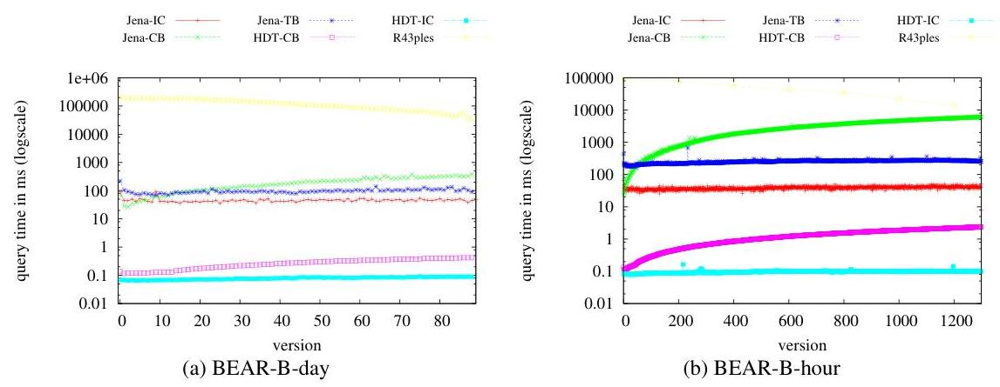

Fig. 20. BEAR-B: Query times for Mat queries.

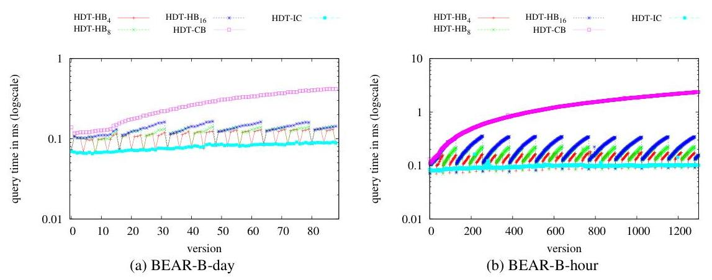

Fig. 21. BEAR-B: Query times for Mat queries in Hybrid approaches in HDT.
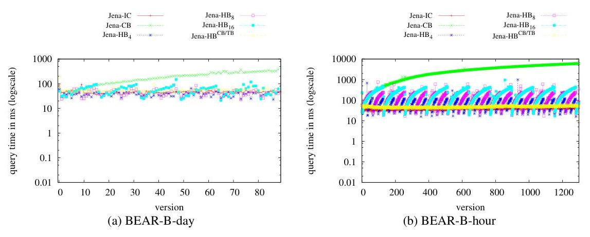

Fig. 22. BEAR-B: Query times for Mat queries in Hybrid approaches in Jena.
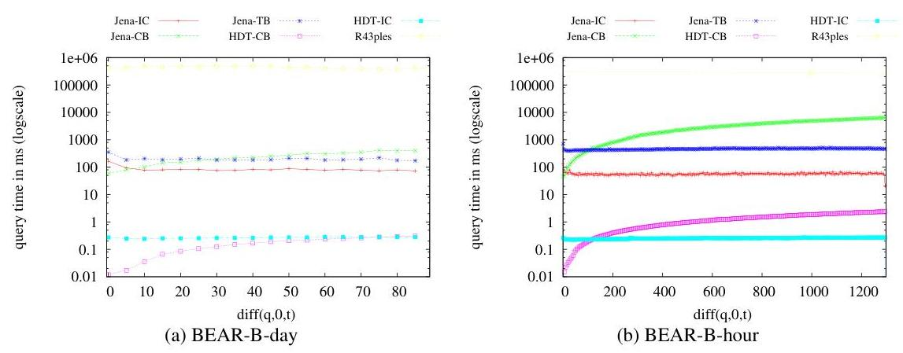

Fig. 23. BEAR-B: Query times for $D i f f$ queries with increasing intervals.

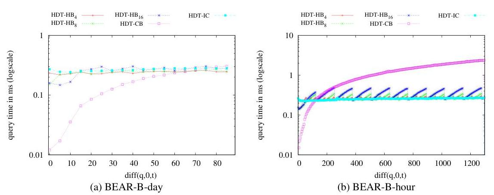

Fig. 24. BEAR-B: Query times for $D i f f$ queries with increasing intervals in Hybrid approaches in HDT.
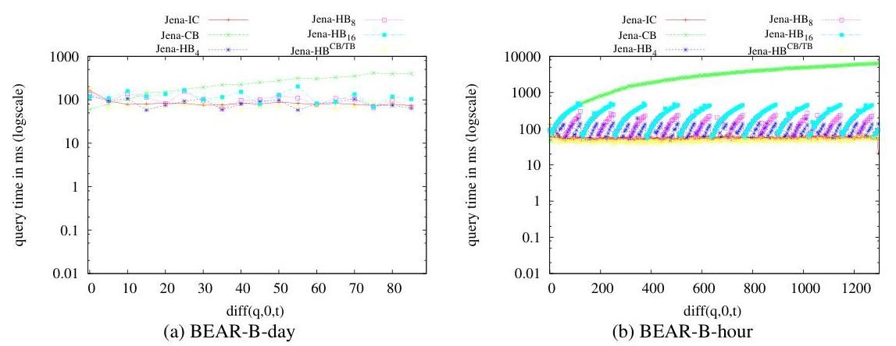

Fig. 25. BEAR-B: Query times for $D i f f$ queries with increasing intervals in Hybrid approaches in Jena.

| Dataset | Jena TDB |  |  |  |  |  | HDT |  |  |  |  |  |  |  |  | R43pLes |
| :--: | :--: | :--: | :--: | :--: | :--: | :--: | :--: | :--: | :--: | :--: | :--: | :--: | :--: | :--: | :--: | :--: |
|  | IC | CB | TB | $\begin{gathered} \text { HB }_{0}^{I C / C B} \\ \hline \end{gathered}$ | $\begin{gathered} \text { HB }_{0}^{I C / C B} \\ \hline \end{gathered}$ | HB | ${ }_{0}^{I C / C B}$ | HB ${ }^{T B / C B}$ | IC | CB | $\begin{gathered} \text { HB }_{0}^{I C / C B} \\ \hline \end{gathered}$ | $\begin{gathered} \text { HB }_{0}^{I C / C B} \\ \hline \end{gathered}$ | HB | $\begin{gathered} \text { HB }_{0}^{I C / C B} \\ \hline \end{gathered}$ | $\begin{gathered} \text { HB }_{0}^{I C / C B} \\ \hline \end{gathered}$ |
| BEAR-B-day | 83 | 19 | 1775 | 32 | 25 | 23 | 6 | 6.57 | 0.43 | 3.64 | 2.43 | 1.78 |  | 1211019 |
| BEAR-B-hour | 1189 | 120 | 6473 | 147 | 138 | 132 | 24 | 111.61 | 2.49 | 18.60 | 17.26 | 20.45 |  | $>21600000$ |

Table 14
BEAR-B: Average query time (in ms) for $\operatorname{ver}(\mathrm{Q})$ queries

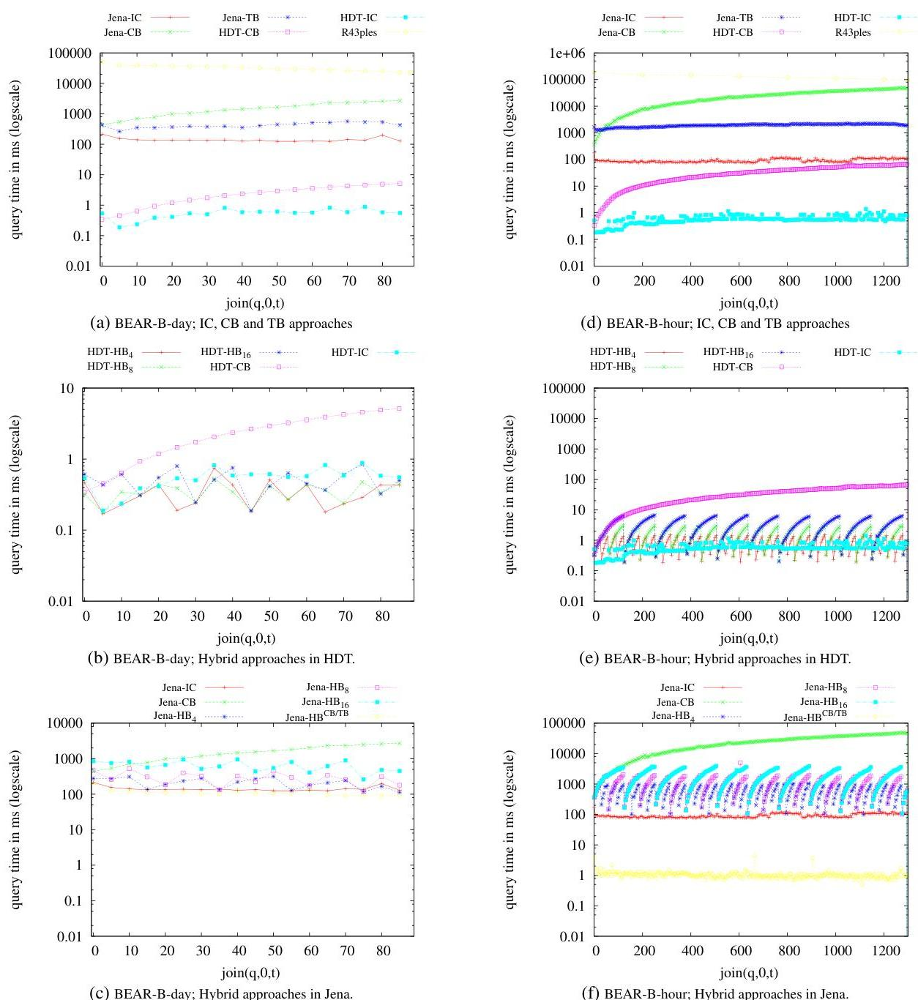

Fig. 26. Query times for join queries with increasing intervals.

| Query set | IENa TDB |  |  |  |  |  |  | HDT |  |  |  |  | RA3PLES |
| :--: | :--: | :--: | :--: | :--: | :--: | :--: | :--: | :--: | :--: | :--: | :--: | :--: | :--: |
|  | IC | CB | TB | $\begin{gathered} \text { HB }_{I}^{I C C B} \\ \text { HB }_{I}^{I C C B} \end{gathered}$ | $\begin{gathered} \text { HB }_{I}^{I C C B} \\ \text { HB }_{I}^{I C C B} \end{gathered}$ | $\begin{gathered} \text { HB }_{I}^{I C C B} \\ \text { HB }_{I}^{I C C B} \end{gathered}$ | $\begin{gathered} \text { HE }^{\text {I }}$ | CB | $\begin{gathered} \text { HB }_{I}^{I C C B} \\ \text { HB }_{I}^{I C C B} \end{gathered}$ | $\begin{gathered} \text { HB }_{I}^{I C C B} \\ \text { HB }_{I}^{I C C B} \end{gathered}$ | $\begin{gathered} \text { RE }^{\text {I }}{ }^{\text {I }}{ }^{\text {I }}$ |
| BEAR-B-day | 164 | 55 | 296 | 146 | 182 | 204 | 22 | 25.88 | 0.35 | 28.01 | 18.07 | 11.75 | 58 |
| BEAR-B-hour | 1690 | 196 | 12295 | 4569 | 7182 | 13546 | 88 | 1876.81 | 3.73 | 127.32 | 104.61 | 95.29 | 487 |

Table 15
Average query time (in ms) for change(Q) queries

# C. BEAR-C Queries 

This appendix lists the 10 selected queries for BEAR-C (see Section 4.3 for a description of the corpus). First, listing 7 shows an excerpt from the corpus (in RDF turtle ${ }^{25}$ ). Then, the queries are described in Listings 8-17.

Listing 7 Excerpt from BEAR-C: the European Open Data portal.

```
@prefix dcat: <http://www.w3.org/ns/dcat#>
@prefix ode: <http://open-data.europa.eu/en/data/dataset/> .
@prefix dc: <http://purl.org/dc/elements/1.1/> .
@prefix xsd: <http://www.w3.org/2001/xMLSchema#> .
@prefix rdf: <http://www.w3.org/1999/02/22-rdf-syntax-ns#> .
@prefix vcard: <http://www.w3.org/2006/vcard/ns#> .
<http://open-data.europa.eu/> dcat:dataset ode:0009a499-27a4-424e-8a43-a7cd8410121f .
ode:0009a499-27a4-424e-8a43-a7cd8410121f rdf:type dcat:Dataset;
    dc:issued "2015-10-16T12:42:44.565211" "xsd:dateTime ;
    dc:modified "2016-06-10T09:37:26.235832" "xsd:dateTime ;
    dc:title "Life expectancy at birth by sex and MOTS 2 region" ;
    dcat:contactPoint <http://example.org/bnode/10f0948c46635047048b461ce5e78a61f2cd2bae> ;
    dcat:distribution <http://open-data.europa.eu/en/data/dataset/0009a499-27a4-424e-8a43-
        a7cd8410121f/resource/f77f9f71-8c71-46d7-8bfd-43b60113b30d> .
    <http://open-data.europa.eu/en/data/dataset/0009a499-27a4-424e-8a43-a7cd8410121f/resource/f77f9f71-8
    c71-46d7-8bfd-43b60113b30d> dc:description "Download dataset in TSV format";
    dc:issued "2016-06-10T11:37:26.795354" "xsd:dateTime ;
    dc:license <http://ec.europa.eu/geninfo/legal_notices_en.htm> ;
    dcat:accessORL <http://ec.europa.eu/eurostat/estat-navtree-portlet-prod/BulkDownloadListing?
        file=data/tgs00101.tsv.gz> ;
    dcat:mediaType "application/zip" .
    <http://example.org/bnode/10f0848c46635047048b461ce5e78a61f2cd2bae> rdf:type vcard:Organization ;
    vcard:fn "Eurostat, the statistical office of the European Union" .
```

Listing 8: Q1: Retrieve portals and their files.

```
PREFIX dcat: <http://www.w3.org/ns/dcat#>
PREFIX rdf: <http://www.w3.org/1999/02/22-rdf-syntax
    -ns#>
{
?dataset rdf:type dcat:Dataset .
?dataset dcat:distribution ?distribution .
?distribution dcat:accessORL ?URL .
}
```

Listing 10: Q3: Get contact points of portals.

```
PREFIX dcat: <http://www.w3.org/ns/dcat#>
PREFIX dc: <http://purl.org/dc/elements/1.1/>
PREFIX vcard: <http://www.w3.org/2006/vcard/ns#>
PREFIX rdf: <http://www.w3.org/1999/02/22-rdf-syntax
    -ns#>
{
?dataset rdf:type dcat:Dataset .
?dataset dcat:contactPoint ?contact .
?contact vcard:fn ?name.
OPTIONAL{
    ?contact vcard:hasEmail ?email .
}
}
```

Listing 9: Q2: Retrieve the modified data of portals.

```
PREFIX dcat: <http://www.w3.org/ns/dcat#>
PREFIX dc: <http://purl.org/dc/elements/1.1/>
PREFIX rdf: <http://www.w3.org/1999/02/22-rdf-syntax
    -ns#>
{
    ?dataset rdf:type dcat:Dataset .
    ?dataset dc:modified ?modified_date .
}
```

Listing 11: Q4: Filter portals with a title including 'region' and their files with a particular license.

```
PREFIX dcat: <http://www.w3.org/ns/dcat#>
PREFIX dc: <http://purl.org/dc/elements/1.1/>
PREFIX eu: <http://ec.europa.eu/geninfo/>
PREFIX rdf: <http://www.w3.org/1999/02/22-rdf-syntax
    -ns#>
{
    ?dataset rdf:type dcat:Dataset .
    ?dataset dc:title ?title .
    ?dataset dcat:distribution ?distribution .
    ?distribution dcat:accessORL ?URL .
    ?distribution dc:license eu:legal_notices_en.htm .
    FILTER regex(?title, "region")
}
```

Listing 12: Q5: Filter files with "Austria" or "Germany".

```
PREFIX dcat: <http://www.w3.org/ns/dcat#>
PREFIX dc: <http://purl.org/dc/elements/1.1/>
PREFIX rdf: <http://www.w3.org/1999/02/22-rdf-syntax
    -ns#>
{
    ?dataset rdf:type dcat:Dataset .
    ?dataset dc:title ?title .
    ?dataset dcat:distribution ?distribution .
    ?distribution dcat:accessURL ?URL .
    ?distribution dc:description "Austria" .
    }
    ONLON
    {
        ?dataset rdf:type dcat:Dataset .
        ?dataset dc:title ?title .
        ?dataset dcat:distribution ?distribution .
        ?distribution dcat:accessURL ?URL .
        ?distribution dc:description "Germany" .
    }
}
```

Listing 14: Q7: Find files of all datasets older than 2015

```
PREFIX dcat: <http://www.w3.org/ns/dcat#>
PREFIX dc: <http://purl.org/dc/elements/1.1/>
PREFIX ssd: <http://www.w3.org/2001/XMLSchema#>
PREFIX rdf: <http://www.w3.org/1999/02/22-rdf-syntax
    -ns#>
{
    ?dataset rdf:type dcat:Dataset .
    ?dataset dc:title ?title .
    ?dataset dc:issued ?date .
    ?dataset dcat:distribution ?distribution .
    ?distribution dcat:accessURL ?URL .
    FILTER (?date>"2014-12-31T23:59:59"^"ssd:dateTime)
}
```

Listing 16: Q9: Get portals that distribute both CSVs and TSVs files.

```
### GET ALL with CSV and PDF
PREFIX dcat: <http://www.w3.org/ns/dcat#>
PREFIX dc: <http://purl.org/dc/elements/1.1/>
PREFIX rdf: <http://www.w3.org/1999/02/22-rdf-syntax
    -ns#>
{
    ?dataset rdf:type dcat:Dataset .
    ?dataset dc:title ?title .
    ?distrl dcat:distribution ?dataset .
    ?distrl dcat:accessURL ?URL1 .
    ?distrl dcat:mediaType "test/csv" .
    ?distrl dc:title ?titleFile1 .
    ?distrl dc:description ?description1 .
    ?distr2 dcat:distribution ?dataset .
    ?distr2 dcat:accessURL ?URL2
    ?distr2 dcat:mediaType "test/tab-separated-values"
    .
    ?distr2 dc:title ?titleFile2 .
    ?distr2 dc:description ?description2 .
}
```

Listing 13: Q6: Find datasets with the same issued and modified date.

```
PREFIX dcat: <http://www.w3.org/ns/dcat#>
PREFIX dc: <http://purl.org/dc/elements/1.1/>
PREFIX rdf: <http://www.w3.org/1999/02/22-rdf-syntax
    -ns#>
{
    ?dataset rdf:type dcat:Dataset .
    ?dataset dc:title ?title .
    ?dataset dc:issued ?date .
    ?dataset dc:modified ?date .
}
```

Listing 15: Q8: Get all CSVs files.

```
PREFIX dcat: <http://www.w3.org/ns/dcat#>
PREFIX dc: <http://purl.org/dc/elements/1.1/>
PREFIX rdf: <http://www.w3.org/1999/02/22-rdf-syntax
    -ns#>
{
    ?dataset rdf:type dcat:Dataset .
    ?dataset dc:title ?title .
    ?dataset dcat:distribution ?distribution .
    ?distribution dcat:accessURL ?URL .
    ?distribution dcat:mediaType "test/csv" .
    ?distribution dc:title ?filetitle .
    ?distribution dc:description ?description .
}
```

Listing 17: Q10: Retrieve limited information of portals and files.

```
PREFIX dcat: <http://www.w3.org/ns/dcat#>
PREFIX dc: <http://purl.org/dc/elements/1.1/>
PREFIX rdf: <http://www.w3.org/1999/02/22-rdf-syntax
    -ns#>
{
    ?dataset rdf:type dcat:Dataset .
    ?dataset dc:title ?title .
    ?dataset dcat:distribution ?distribution .
    ?distribution dcat:accessURL ?URL .
    ?distribution dcat:mediaType ?mediaType .
    ?distribution dc:title ?filetitle .
    ?distribution dc:description ?description .
}
ORDER BY ?filetitle
LIMIT 100 OFFSET 100
```