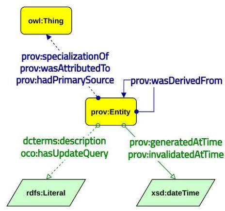
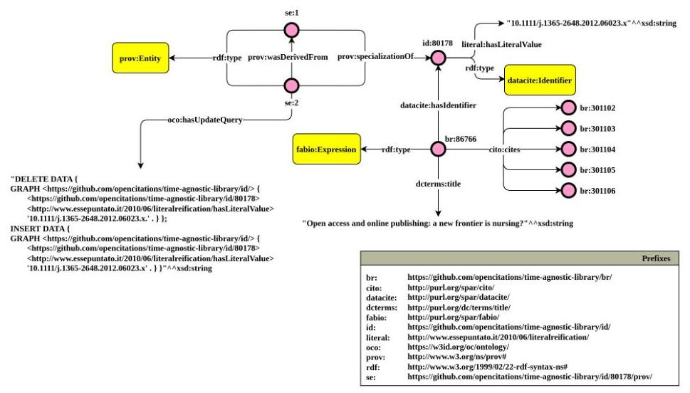
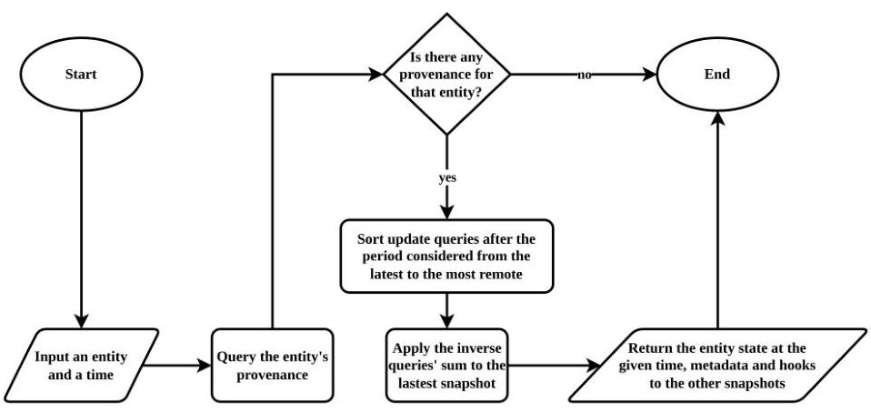
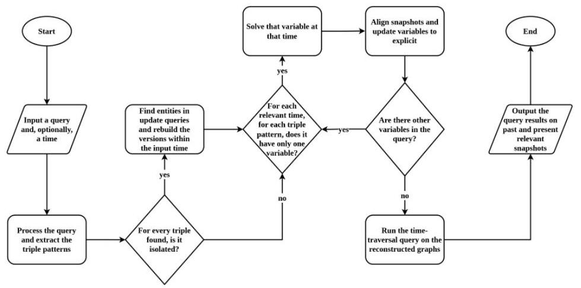
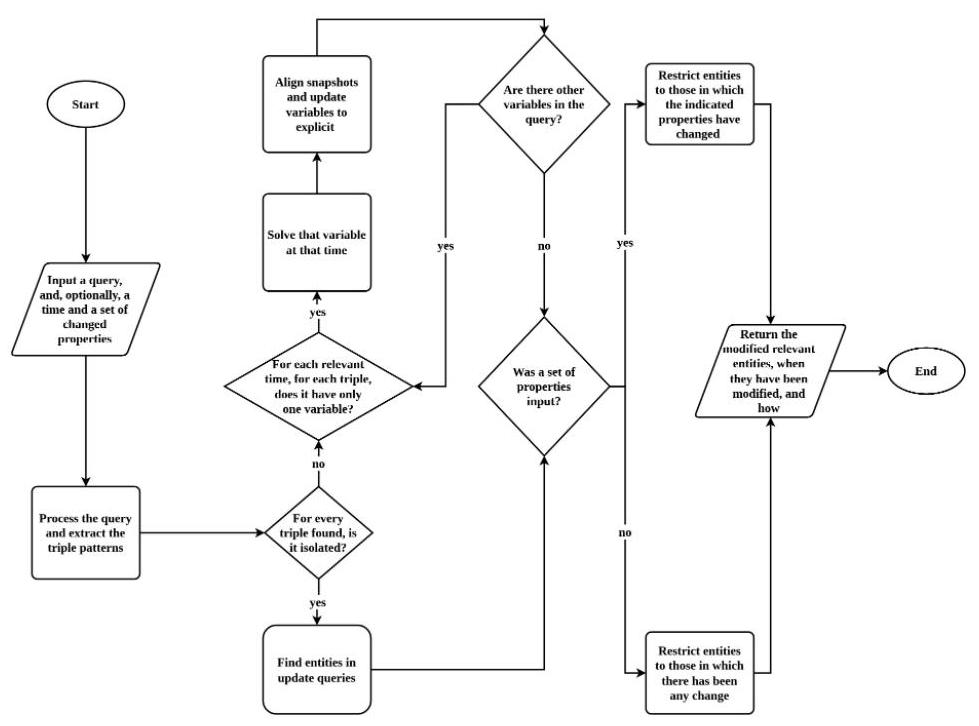
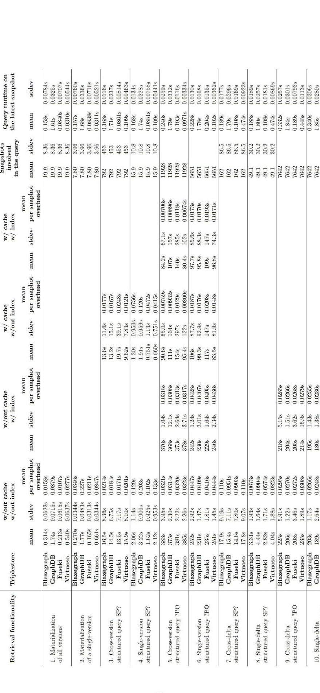

# Performing live time-traversal queries via SPARQL on RDF datasets 

Arcangelo Massari ${ }^{\star 1}$ and Silvio Peroni ${ }^{\dagger 1,2}$<br>${ }^{1}$ Research Centre for Open Scholarly Metadata, Department of Classical Philology and Italian Studies, University of Bologna, Bologna, Italy<br>${ }^{2}$ Digital Humanities Advanced Research Centre (/DH.arc), Department of Classical Philology and Italian Studies, University of Bologna, Bologna, Italy


#### Abstract

This article introduces a methodology to perform live time-traversal SPARQL queries on RDF datasets and software based on this methodology that offers a solution to manage the provenance and change-tracking of entities described using RDF. These are crucial factors in ensuring verifiability and trust. Nevertheless, some of the most prominent knowledge bases - including DBpedia, Wikidata, Yago, and the Dynamic Linked Data Observatory - do not support time-agnostic queries, i.e., queries across different snapshots together with provenance information. The OpenCitations Data Model (OCDM) describes one possible way to track provenance and entities' changes in RDF datasets, and it allows restoring an entity to a specific status in time (i.e., a snapshot) by applying SPARQL update queries. The methodology and library presented in this article are based on the rationale introduced in the OCDM. We also developed benchmarks proving that such a procedure is efficient for specific queries and less efficient for others. To the best of our knowledge, our library is the only one to support all the time-related retrieval functionalities live, i.e., enabling real-time searches and updates. Moreover, since OCDM complies with standard RDF, queries are expressed via standard SPARQL.


Keywords - semantic web, query processing, trust

## 1 Introduction

Data reliability is based on provenance: who produced information, when, and the primary source. Such provenance information is essential because the truth value of an assertion on the Web is never absolute, as claimed by Wikipedia, which on its policy on the subject states: "the threshold for inclusion in Wikipedia is verifiability, not

[^0]
[^0]:    *arcangelo.massari@unibo.it
    $\dagger$ silvio.peroni@unibo.it

truth" (Garfinkel, 2008). The Semantic Web reinforces this aspect since each application processing information must evaluate trustworthiness by probing the statements' context (i.e., the provenance) (Koivunen \& Miller, 2001).

Moreover, data changes over time, for either the natural evolution of concepts or the correction of mistakes. Indeed, the latest version of knowledge may not be the most accurate. Such phenomena are particularly tangible in the Web of Data, as highlighted in a study by the Dynamic Linked Data Observatory, which noted the modification of about $38 \%$ of the nearly 90,000 RDF documents monitored for 29 weeks and the permanent disappearance of 5\% (Käfer et al., 2013).

Notwithstanding these premises, the most extensive RDF datasets to date - DBPedia, Wikidata, Yago, and the Dynamic Linked Data Observatory - either do not use RDF to track changes or do not provide provenance information at the entity level. (Dooley \& Božić, 2019; Orlandi \& Passant, 2011; Project, 2021; Umbrich et al., 2010). Therefore, they don't allow SPARQL time-traversal queries on previous statuses of their entities together with provenance information. For instance, Wikidata allows SPARQL queries on entities temporally annotated via its proprietary RDF extension but does not allow queries on change-tracking data.

The main reason behind this phenomenon is that the founding technologies of the Semantic Web - namely SPARQL, OWL, and RDF - did not initially provide an effective mechanism to annotate statements with metadata information. This lacking led to the introduction of numerous metadata representation models, none of which succeeded in establishing itself over the others and becoming a widely accepted standard to track both provenance and changes to RDF entities (Berners-Lee, 2005; Board, 2020; Caplan, 2017; Carroll et al., 2005; Ciccarese et al., 2008; Damiani et al., 2019; da Silva et al., 2006; Dividino et al., 2009; Flouris et al., 2009; Hartig \& Thompson, 2019; Hoffart et al., 2013; Lebo et al., 2013; Moreau et al., 2011; Nguyen et al., 2014; Pediaditis et al., 2009; Sahoo et al., 2010; Sahoo \& Sheth, 2009; Suchanek et al., 2019; Zimmermann et al., 2012).

In the past, some software was developed to perform time-traversal queries on RDF datasets, enabling the reconstruction of the status of a particular entity at a given time. However, as far as we know, all existing solutions need to preprocess and index RDF data to work efficiently (Cerdeira-Pena et al., 2016; Im et al., 2012; Neumann \& Weikum, 2010; Pellissier Tanon \& Suchanek, 2019; Taelman et al., 2019). This requirement is impractical for linked open datasets that constantly receive many updates, such as Wikidata. For example, "Ostrich requires $\sim 22$ hours to ingest revision 9 of DBpedia (2.43M added and 2.46M deleted triples)" (Pelgrin et al., 2021). Conversely, software operating on the fly either does not support all query types (Noy \& Musen, 2002), or supports them non-generically by imposing a custom database (Graube et al., 2016) or a specific triplestore (Arndt et al., 2019; Sande et al., 2013).

This work introduces a methodology and a Python library enabling all the timerelated retrieval functionalities identified by Fernández et al. (2016) live, i.e., allowing real-time queries and updates without preprocessing the data. Moreover, data can be stored on any RDF-compliant storage system (e.g., RDF-serialized textual files and triplestores) when the provenance and data changes are tracked according to the OpenCitations Data Model (Daquino et al., 2020).

The rest of the paper is organized as follows. Section 2 reviews the literature on metadata representation models, retrieval functionalities, and archiving policies for dynamic linked data. Section 3 showcases the methodology underlying the time-agnostichibrary implementation, and Section 4 discusses the final product from a quantitative point of view, reporting the benchmarks results on execution times and memory.

# 2 Related works 

This section reviews related metadata representation models (Section 2.1) before delving into query typologies, query languages (Section 2.2), and existing methodologies to performing such queries (Section 2.3).

### 2.1 Representing dynamic linked data

The landscape of strategies to formally represent provenance in RDF is vast and fragmented (Sikos \& Philp, 2020).

To date, the only W3C standard syntax for annotating triples' provenance is RDF reification (Manola \& Miller, 2004) and it is the only one to be back-compatible with all RDF-based systems. However, there are several deprecation proposals for this syntax (Beckett, 2010), due to its poor scalability.

Different approaches have been proposed since 2005, and four categories of solutions can be identified:

- Encapsulating provenance in RDF triples: n-ary relations (W3C, 2006), PaCE (Sahoo et al., 2010) and singleton properties (Nguyen et al., 2014)
- Associating provenance to the triple through RDF quadruples: named graphs (Carroll et al., 2005), RDF/S graphsets (Pediaditis et al., 2009), RDF triple coloring (Flouris et al., 2009), and nanopublications (Groth et al., 2010).
- Extending the RDF data model: Notation 3 Logic (Berners-Lee, 2005), RDF+ (Dividino et al., 2009),
SPOTL(X) (Hoffart et al., 2013), annotated RDF (aRDF) (Udrea et al., 2010; Zimmermann et al., 2012), and RDF* (Hartig \& Thompson, 2019).
- Using ontologies: Proof Markup Language (da Silva et al., 2006), SWAN Ontology (Ciccarese et al., 2008), Provenir Ontology (Sahoo \& Sheth, 2009), Provenance Ontology (Gil et al., 2010), Open Provenance Model (Moreau et al., 2011), PREMIS (Caplan, 2017), Dublin Core Metadata Terms (Board, 2020), and the OpenCitations Data Model (Daquino et al., 2020).
For a complete analysis and comparison, refer to Sikos \& Philp (2020). In this context it is important to stress that most of these solutions do not comply with RDF 1.1 (i.e., RDF/S graphsets, N3Logic, aRDF, RDF+, SPOTL(X), and RDF*), are domain-specific (i.e., Provenir, SWAN, and PREMIS ontologies), rely on blank nodes (n-ary relations), or suffer from scalability issues (singleton properties, PaCE).

Despite being incompatible with RDF 1.1, it is worth mentioning that a W3C working group has recently published the first draft to make RDF* a standard (Gschwend \& Lassila, 2022).

To date, named graphs (Carroll et al., 2005) and the Provenance Ontology (Moreau \& Missier, 2013) are the most adopted approaches to attach provenance metadata to RDF triples. On the one hand, Named Graphs are widespread because they are compliant with RDF 1.1 and can be queried with SPARQL 1.1; they are scalable, and have several serialization formats (i.e., TriX, TriG, and N-Quads). On the other, the Provenance Ontology was published by the Provenance Working Group as a W3C Recommendation in 2013, meeting all the requirements for provenance on the Web and collecting existing ontologies into a single general model.

The OpenCitations Data Model (Daquino et al., 2020) represent provenance and track changes in a way that complies with RDF 1.1 and relies on well-known and widely adopted standards, PROV-O, named graphs, and Dublin Core, as will be detailed in Section 3.

# 2.2 Querying dynamic linked data 

Fernández, Polleres, and Umbrich (2016) provided two classifications on time agnostic queries, a low-level one relating to "query atoms" and a high-level one about "retrieval needs". In this article, we use the high-level classification, which is more explicit about the queries to reconstruct a full version of an entity, an entire delta, and the query on multiples/all deltas, without the need to derive them by composition between multiple queries atoms. Before detailing such queries, it is required to define what an entity, a time-aware dataset, and a version are.
Definition 1 (Entity). An entity $\mathcal{E}$ is the set of RDF triples ( $s, p, o$ ) having the same subject $s$.
Definition 2 (Time-aware dataset). A version annotated entity is an entity $\mathcal{E}$ annotated with a label $i$ representing the version in which this entity holds, denoted by the notation $\mathcal{E}_{i}$, where $i \in \mathcal{N}$. A time-aware dataset $\mathcal{A}$ is a set of version-annotated entities.

Definition 3 (Version). A version of a time-aware dataset $\mathcal{A}$ at snapshot $i$ is the RDF graph $\mathcal{A}_{i}=\left\{\mathcal{E} \mid \mathcal{E}_{i} \in \mathcal{A}\right\}$.

In the query definitions, the evaluation of a SPARQL query $Q$ on a graph $\mathcal{G}$ produces a bag of solution mappings $[\left[Q\right]]_{\mathcal{G}}$.

Version materialization (VM) retrieves the full version of a specific entity. Formally: $V M(\mathcal{E}, i)=\mathcal{E}_{i}$. For example, "Get the 2014 snapshot of the entity representing David Shotton".

Single-version structured query (SV) retrieves the results of a SPARQL query targeted at a specific version. Formally: $S V\left(Q, V_{i}\right)=[\left[Q\right]]_{V_{i}}$. For example, "Which David Shotton's papers were featured in the dataset in 2014?".

Cross-version structured query (CV) - also called time-traversal query retrieves the results of a SPARQL query targeted at multiple versions. Formally: $C V\left(Q, V_{i}, V_{j}\right)=S V\left(Q, V_{i}\right) \ltimes S V\left(Q, V_{j}\right)$. For example, "Which David Shotton's papers were featured in the dataset in 2013 and in 2014?".

Delta materialization (DM) retrieves the differences of a specific entity between two consecutive versions. Formally: $D M\left(\mathcal{E}, V_{i}\right)=(\Delta+, \Delta-)$. With $\Delta+=\mathcal{E}_{i} \backslash \mathcal{E}_{j}$, $\Delta-=\mathcal{E}_{j} \backslash \mathcal{E}_{i}$ and $i, j \in \mathcal{N}, i>j, \nexists k \in \mathcal{N}: j<k<i$. For example, "What data changed about the entity representing David Shotton in 2014?".

Single-delta structured query (SD) retrieves the change-sets of a SPARQL query's results between one consecutive couple of versions. Formally: $S D\left(Q, V_{i}, V_{j}\right)=$ $(\Delta+, \Delta-)$. With $\Delta+=\left[\left[Q\right]\right]_{V_{i}} \backslash[\left[Q\right]]_{V_{j}}, \Delta-=[\left[Q\right]]_{V_{j}} \backslash[\left[Q\right]]_{V_{i}}$ and $i, j \in \mathcal{N}, i>j, \nexists k \in$ $\mathcal{N}: j<k<i$. For example, "Which David Shotton's papers were featured in the dataset in 2014 but not in 2013?".

Cross-delta structured query (CD) retrieves the change-sets of a SPARQL query's results between more than one consecutive couple of versions. Formally: $C D\left(Q, V_{i}, V_{j}, V_{m}\right)=S D\left(Q, V_{i}, V_{j}\right) \ltimes S D\left(Q, V_{j}, V_{m}\right)$. For example, "When were articles by David Shotton added to or removed from the collection?".

Extensions of SPARQL exist to support queries on time-aware RDF datasets, that either require using non-standard languages to map data - such as $\tau-S P A R Q L$ (Tappolet \& Bernstein, 2009), T-SPARQL (Grandi, 2010), and AnQL (Zimmermann et al., 2012) - or only works on a purpose-built database, i.e. $S P A R Q L^{T}$ on the RDF-TX system (Zaniolo et al., 2018). This article proposes a methodology to support all query types on any triplestore in standard SPARQL.

In this direction, SPARQ-LTL (Fionda et al., 2016) proposes a relevant approach by extending SPARQL but describing an algorithm for rewriting queries in standard SPARQL, provided that all triples are annotated with revision numbers and the revisions are accessible as named graphs. However, to the best of our knowledge, this strategy has no implementations.

# 2.3 Storing dynamic linked open data 

This section will review existing storage and querying methodologies, focusing on supported queries, real-time operation, and generality. We consider generic a model that complies with standard RDF and can be queried via standard SPARQL on any RDF-compatible storage system.

Various archiving policies have been elaborated to store and query the evolution of RDF datasets, namely independent copies, change-based, timestamp-based, and fragment-based policies (Pelgrin et al., 2021).

Independent copies consist of storing each version separately. It is the most straightforward model to implement and allows performing VM, SV, and CV easily. However, this approach needs a massive amount of space for storing and time for processing. Furthermore, given the different statements' versions, further diff mechanisms are required to identify what changed. Nevertheless, to date, this is the archiving policy adopted by most systems and knowledge bases, such as DBPedia (Lehmann et al., 2015), Wikidata (Dooley \& Božić, 2019; Erxleben et al., 2014; "Wikidata:Database download", 2021), and YAGO (Project, 2021).

The first version control systems for RDF was SemVersion (Völkel et al., 2005), specially tailored for ontologies. It saves each version of an ontology in a separate snapshot and differences are calculated on the fly. SemVersion supports VM, SV, DM, and SD but not via SPARQL, because SPARQL became a W3C Recommendation in 2008 and SemVersion has not been updated since 2005.

The change-based policy was introduced to solve scalability problems caused by the independent copies approach. It consists of saving only the deltas between one version and the other. For this reason, DM is costless. The drawback is that additional computational costs for delta propagation are required to support version-focused queries.

The first proposal of this approach relied on a RDBMS to store the original dataset and the deltas between two consecutive versions (Im et al., 2012). To improve performance, deltas are pre-processed and duplicated, or unnecessary modifications are deleted. There is no support for SPARQL and queries must be formulated in SQL.

A concrete implementation of a change-based policy is R\&Wbase, a version control system inspired by Git but designed for RDF (Sande et al., 2013). Additions and deletions are stored in separate named graphs, and all queries are supported. However, this model is not fully semantic, since it requires hash tables to map revisions with change-sets. In addition, it is not triplestore-agnostic, as it supports only Fuseki and Virtuoso.

R43ples is inspired by R\&WBase and perfects it by adopting a totally semantic model (Graube et al., 2016). It is called Revision Management Ontology and records change-sets and the related provenance metadata in separate graphs using PROVO and some new properties (e.g., rmo:deltaAdded and rmo:deltaRemoved). R43ples acts as a proxy between the data triplestore and the provenance triplestore. However, R43ples cannot be considered a generic solution, as it extends SPARQL with some keywords to simplify the queries (e.g., REVISION, TAG, MERGE), and the current implementation mandates using Jena TDB as the provenance triplestore.

The timestamp-based policy annotates each triple with its transaction time, that is, the timestamp of the version in which that statement was in the dataset.
x-RDF-3X is a database for RDF designed to manage high-frequency online updates, versioning, time-traversal queries, and transactions (Neumann \& Weikum, 2010). The triples are never deleted but are annotated with two fields: the insertion and deletion timestamp, where the last one has zero value for currently living versions. Afterward, updates are saved in a separate workspace and merged into various indexes at occasional savepoints. x-RDF-3X supports VM and SV queries.
v-RDFCSA uses a similar strategy but excels in reducing space requirements, com-

pressing both the RDF archive and the timestamps attached to the triples (CerdeiraPena et al., 2016). It has basic query capabilities (VM, SV, DM, and SD on single triple patterns), and, similarly to HDT (J. D. Fernández et al., 2013), SPARQL updates are not supported.

Dydra (Anderson, 2019) is also a TB storage system, which indexes quadruples and associates their creation and addition times to form quintuples. It supports all query types but extending SPARQL with the REVISION keyword.

The fragment-based approach avoids reconstructing versions via deltas by saving only fragments of what changed. Different granularity levels are possible, depending on the requirements (a graph, a subgraph, or an entity).

Quit Store (Arndt et al., 2019) inherits from R\&Wbase and R43ples the Git-based distributed version control management approach. Modified fragments are saved in named graphs, and metadata are modeled according to PROV-O. The data model complies with RDF 1.1, and all query types are supported in plain SPARQL 1.1. However, the current implementation suffers from high memory requirements, as all queries are run on an in-memory quad-store.

Finally, there are hybrid storage policies that combine the changed-based approach with the timestamp-based approach. For example, OSTRICH is a triplestore that retains the first version of a dataset and subsequent deltas, as introduced in (Im et al., 2012). However, it merges change-sets based on timestamps to reduce redundancies between versions, adopting a change-based and timestamp-based approach simultaneously (Taelman et al., 2019). OSTRICH has native support for all types of queries.

TailR (Meinhardt et al., 2015) also preserves the first version and succeeding diffs but reduces the computational effort to reconstruct versions by also saving some intermediate snapshots, adopting an IC/CB approach, and thus increasing space requirements. Queries are not made via SPARQL but via the Memento protocol, i.e., HTTP content-negotiation via the Accept-Datetime header (Jones et al., 2021).

As Section 3 will detail, the OpenCitations Data Model (Heibi et al., 2019) adopts a hybrid CB/TB approach and represents provenance and changes complying with RDF. At the same time, this paper introduces time-agnostic-library, which enables all types of queries using plain SPARQL on files or any triplestores live.

Table 1: Comparative between time-agnostic-library and preexisting software to perform time-agnostic queries on RDF datasets

| Methodology | Storage paradigm | Queries | Live* | Generic** |
| :--: | :--: | :--: | :--: | :--: |
| SmuVersion (Völkel et al., 2005) | IC | VM, SV, DM, SD | $+$ | . $^{\text {a }}$ |
| v-RDF-3X (Neumann \& Wolkour, 2010) | T3I | VM, SV |  | . $^{\text {a }}$ |
| RBDMS (Ita et al., 2012) | C3I | AS | - | . $^{\text {a }}$ |
| R\&WBase (Suede et al., 2013) | C3I | AS | $+$ | . $^{\text {a }}$ |
| B42ples (Granibe et al., 2016) | C3I | AS | $+$ | . $^{\text {a }}$ |
| TailR (Meinhardt et al., 2015) | IC/CH | AS | $+$ | . $^{\text {a }}$ |
| v-RDFCSA (Cerdeira-Pena et al., 2016) | T3I | VM, SV, DM, SD | - | . $^{\text {a }}$ |
| RDF-TX (Zanlelo et al., 2018) | T3I | AS | - | . $^{\text {a }}$ |
| OSTRICH (Tashman et al., 2019) | IC/CH/TB | AS | - | . $^{\text {a }}$ |
| Dydra (Anderson, 2019) | T3I | AS | - | . $^{\text {a }}$ |
| Quit Store (Ariati et al., 2019) | F3I | AS | $+$ | . $^{\text {a }}$ |
| OCDM and time-agnostic-library (Hofni et al., 2019) | $\mathrm{CH} / \mathrm{TB}$ | AS | $+$ | $+$ |

* By "live" we mean that updates and queries can be executed in real time, without requiring pre-processing
** By "generic" we mean that provenance and change-tracking are modeled complying with RDF and can be queried via standard SPARQL on any RDF-compatible storage system
a. It extends RDF
b. It extends SPARQL
c. It requires hash tables
d. It does not use SPARQL to perform queries
e. It requires a custom or specific database


# 3 Methodology 

As discussed in section 2, Semantic Web technologies did not initially allow recording or querying change-tracking provenance. For this reason, it is necessary to adopt an external provenance model. In the context of this work, the OpenCitations Data Model (OCDM) was employed (Daquino et al., 2020), summarized in Fig. 1.

According to the OCDM, a new snapshot is defined every time an entity is created or modified, and it is stored within a (provenance) named graph. The snapshots are of type prov:Entity and are connected to the entity described through prov:specializationOf. In addition, each snapshot records the validity dates (prov:generatedAtTime, prov:invalidatedAtTime), the agents responsible for creation/modification of entities' data (prov:wasAttributedTo), the primary sources (prov:hasPrimarySource), a link to the previous snapshot in time (prov:wasDerivedFrom), and a human readable description (dcterms:description).

Furthermore, OCDM extends the Provenance Ontology by introducing a new property called occ:hasUpdateQuery, a mechanism to record additions and deletions from an RDF graph with a SPARQL INSERT and SPARQL DELETE query string. This system makes it easier to:

- recover the current statements of an entity, as they are those available in the present dataset;
- restore an entity to a specific snapshot $s_{i}$, by applying the reverse operations of all update queries from the most recent snapshot $s_{n}$ to $s_{i+1}$.

SPARQL update queries representing deltas must contain only absolute URIs, literals, and blank nodes, while prefixes and variables are not permitted.



Figure 1: Provenance in the OpenCitations Data Model, represented using the graphical framework Graffoo


Figure 2: Usage example of the OpenCitations Data Model, shown via the graphical framework Graffoo

As shown in the Graffoo diagram (Falco et al., 2014) in Fig. 2 and in Listing 1, the entity <id/80178>, representing (Watson et al., 2012), is associated with the bibliographic resource <br/86766>, whose title is Open access and online publishing: a new frontier in nursing?. Moreover, <br/86766> cites five other resources, namely <br/301102>,<br/301103>, <br/301104>, <br/301105>, and <br/301106>. The identifier <id/80178> of <br/86766> was initially registered with a wrong DOI, i.e. "10.1111/j.1365-2648.2012.06023.x." instead of "10.1111/j.1365-2648.2012.06023.x", where the error is in the trailing period. The agent identified by the ORCID 0000-0002-8420-0696 corrected such a mistake on October $19^{\text {th }}, 2021$, at 19:55:55. Therefore, the snapshot <id/80178/prov/se/2> was generated, associated with <id/80178>, and deriving from the previous snapshot <id/80178/prov/se/1>.

```
@base <https://github.com/opencitations/time-agnostic-library/>.
@prefix cito: <http://purl.org/spar/cito/>.
@prefix datacite: <http://purl.org/spar/datacite/>.
@prefix dcterns: <http://purl.org/dc/terms/>.
@prefix literal: <http://www.ensepuntato.it/2010/06/literalreification/>.
@prefix sco: <https://w3id.org/sc/ontology/>.
@prefix prov: <http://www.w3.org/us/prov#>.
@prefix xsd: <http://www.w3.org/2001/XMLSchema#>.
<br/86766> a <http://purl.org/spar/fabio/Expression>;
    dcterns:title "Open access and online publishing: a new frontier in
    ~ nocing?"""xsd:string;
    cito:cites <br/301102>, <br/301103>, <br/301104>, <br/301105>, <br/301106>;
    datacite:hasIdentifier <id/80178>.
<id/80178> a datacite:Identifier;
    datacite:usesIdentifierScheme datacite:doi;
    literal:hasLiteralValue "10.1111/j.1365-2648.2012.06023.x""xsd:string.
<id/80178/prov/ee/2> a prov:Entity;
    sco:hasUpdateQuery "
        DICETE DATA {
        DREPN <https://github.com/opencitations/time-agnostic-library/id/> {
            <https://github.com/opencitations/time-agnostic-library/id/80178>
            <http://www.ensepuntato.it/2010/06/literalreification/hasLiteralValue>
            -10.1111/j.1365-2648.2012.06023.x. . } };
            DICENT DATA {
        DREPN <https://github.com/opencitations/time-agnostic-library/id/> {
            <https://github.com/opencitations/time-agnostic-library/id/80178>
            <http://www.ensepuntato.it/2010/06/literalreification/hasLiteralValue>
            -10.1111/j.1365-2648.2012.06023.x' . } }""xsd:string.
dcterns:description "The entity
    ~ https://github.com/opencitations/time-agnostic-library/id/80178' has been
    ~ notified."""xsd:string;
prov:generatedAtTime "2021-10-19T19:55:55"""xsd:dateTime;
prov:specializationOf <id/80178>;
prov:wasAttributedTo <https://orcid.org/0000-0002-8420-0696>;
prov:wasDerivedFrom <id/80178/prov/ee/l>;
<id/80178/prov/ee/l> a prov:Entity;
dcterns:description "The entity
    ~ https://github.com/opencitations/time-agnostic-library/id/80178' has been
    ~ created."""xsd:string;
prov:generatedAtTime "2021-10-10T23:44:45"""xsd:dateTime;
prov:hasPrimarySource <https://api.crossref.org/works/10.1007/s11192-019-03265-y>;
prov:invalidatedAtTime "2021-10-19T19:55:55"""xsd:dateTime;
prov:specializationOf <id/80178>;
prov:wasAttributedTo <https://orcid.org/0000-0002-8420-0696>.
```

Listing 1: Usage example of the OpenCitations Data Model, translated in RDF Turtle syntax

The taxonomy by Fernández, Polleres, and Umbrich (J. Fernández et al., 2016) introduced in section 2.2 is used to illustrate which approaches were adopted to achieve each type of query. Therefore, a distinction is made between version materialization, delta materialization, single and cross-version structured query, single and cross-delta structured query.

# 3.1 Version and delta materialization 

Obtaining a version materialization means retrieving the full version of a specific entity. Thus, the starting information is a resource URI and a time. Then, it is necessary to acquire the provenance information available for that entity, querying the dataset on which it is stored. In particular, the crucial data regards the existing snapshots, their generation time, and update queries expressing changes through SPARQL update query strings.

From a performance point of view, the main problem is how to get the status of a resource at a given time without reconstructing its whole history, but only the portion needed to get the result. Suppose $t_{n}$ is the present state and having all the SPARQL update queries. The status of an entity at the time $t_{n-k}$ can be obtained by adding

the inverse queries in the correct order from $n$ to $n-k+1$ and applying the queries sum to the entity's present graph.

For example, consider the graph of the entity <id/80178> (Fig. 2). At present, this identifier has a literal value of
"10.1111/j.1365 2648.2012.06023.x". We want to determine if this value was modified recently, reconstructing the entity at time $t_{n-1}$. The string associated with the property oco:hasUpdateQuery at time $t_{n}$ is shown in Fig. 2 and Listing 1.

Therefore, to reconstruct the literal value of <id/80178> at time $t_{n-1}$, it is sufficient to apply the same update query to the current graph by replacing DELETE with INSERT and INSERT with DELETE: what was deleted must be inserted, and what was inserted must be deleted to rewind the entity's time. It appears that <id/80178> had a different literal value at time $t_{n-1}$, namely "10.1111/j.1365-2648.2012.06023.x.". If the resource had more than two snapshots and the time of interest had been $t_{n-2}$, it would have been necessary to execute the same operation with the sum of the update queries associated with $t_{n}$ and $t_{n-1}$ in this order.

In addition to data, metadata related to a given change can be derived, asking for supplementary information to the provenance dataset, such as the responsible agent and the primary source. In this way, it is possible to understand who made a specific change and the information's origin. Finally, hooks to metadata related to non-reconstructed states can be returned to find out what other snapshots exist and possibly rebuild them.

The flowchart in Fig. 3 summarizes the version materialization methodology.


Figure 3: Flowchart illustrating the methodology to materialize an entity version at a given period

The process described so far is efficient in materializing a specific entity's version. However, if the goal is to obtain the history of a given resource, adopting the procedure described in Fig. 3 would mean executing, for each snapshot, all the update queries of subsequent snapshots, repeating the same update query over and over again. Since every resource graph needs to be output, it is more convenient to run the reverse update query related to each snapshot on the following snapshot graph, which was previously computed and stored.

Conversely, obtaining the materialization of a delta means returning the change between two versions. No operations are introduced in our methodology to address this operation because it is not needed since the OCDM already requires deltas to be explicitly stored as SPARQL update queries strings by adopting a change-based

policy. Therefore, the diff is the starting point and is immediately available, without the need of processing provenance change tracking data to derive it. However, if more than a mere delta is required, and there is the demand to perform a single or crossdelta structured query, it is helpful to have approaches to speed up this operation, as illustrated in section 3.3.

# 3.2 Single and cross-version structured query 

Running a structured query on versions means resolving a SPARQL query on a specific entity's snapshot, if it is a single-version query, or on multiple dataset's versions, in case of a cross-version query. In both cases, a strategy must be devised to achieve the result efficiently. According to the OCDM, only deltas are stored; therefore, the dataset's past conditions must be reconstructed to query those states. However, restoring as many versions as snapshots would generate massive amounts of data, consuming time and storage. The proposed solution is to reconstruct only the past resources significant for the user's query.

Hence, given a query, the goal is to explicit all the variables, materialize every version of each entity found, and align the respective graphs temporally to execute the original query on each. To this end, the first step is to process the SPARQL query string and extract the triple patterns. Each identified triple may be joined or isolated.

Definition 4 (Joined and isolated triple pattern). A triple pattern is joined if a path exists between its subject variable and a subject IRI in the query.

Assume there are pairwise disjoint infinite sets $I, V$, and $L$ (IRIs, Variables, and Literals, respectively), and assume $\operatorname{Path}\left(n, n_{1}\right)$ returns True if there is a route through a graph between the graph nodes $n$ and $n_{1}$. Joined $(s, p, o) \Leftrightarrow \exists\left(s_{1}, p_{1}, o_{1}\right)$ : $\operatorname{Path}\left(s, s_{1}\right), s_{1} \in I$, with $(s, p, o) \in(I \cup V) \times(I \cup V) \times(I \cup L \cup V)$.

Viceversa, a triple pattern is said to be isolated if such path not exists.
If a triple pattern in the input query is joined, it is possible to solve its variables using a previously reconstructed entity graph. Consider the example in Listing 2.

```
PREFIR literal: <http://www.ecespuntato.it/2010/06/literalreification/>
PREFIR citto: <http://purl.org/spar/cito/>
PREFIR datacite: <http://purl.org/spar/datacite/>
SELECT DISTINCT ?br ?id ?value
WHERE {
    <https://github.com/genocitations/time-agnostic-library/br/86766> citto:cites ?br.
    ?br datacite:hasIdentifier ?id.
    ?id literal:hasLiteralValue ?value.
}
```

Listing 2: Example of a SPARQL query containing only joined triple patterns

Once all versions of <br/86766> have been materialized, every possible value of the variable ?br is known. At that point, all the possible values that ?id had can be derived from all the URIs of ?br. Also, the variable ?value can be resolved similarly. It is worth noting that a variable can have different values not only in different versions but also in the same version. For instance, the bibliographical resource <br/86766> cites more than just another bibliographical resource (as shown in Fig. 2). Hence, ?br takes multiple values in all of its snapshots, determining the same for ?id and ?value.

On the other hand, a triple pattern is isolated if it is wholly disconnected from the other patterns in the query, and its subject is a variable. The query is more generic if there are isolated triples; therefore, identifying the relevant entities is more demanding. However, if at least one URI is specified in the query, it is still possible to narrow the field so that only the strictly necessary entities are restored and not the whole dataset. Since deltas are saved as SPARQL strings, a textual search on all available deltas can

be executed to find those containing the known URIs. The difference between a delta triple including all the isolated triple URIs and the isolated triple itself is equal to the relevant entities to rebuild. Listing 3 shows a time-traversal query to find all identifiers whose literal value has ever contained a trailing dot. Inside, there is the isolated triple pattern ?id literal:hasLiteralValue ?literal, where only the predicate is known, and the subject is not explicable by other triples within the query.

```
PREFIX literal: <http://www.essepuntato.it/2010/06/literalreification/>
SELECT ?literal
WHERE {
    ?id literal:hasLiteralValue ?literal.
    FILTER REGEX(?literal, "\.\$")
}
```

Listing 3: Example of a SPARQL query containing an isolated triple pattern

Identifying all the possible values of ?id and ?literal at any time means discovering which nodes have ever been connected by the predicate literal:hasLiteralValue. This information is enclosed in the values of oco:hasUpdateQuery within the provenance entities' snapshots. First, the update queries including the predicate literal:hasLiteralValue must be isolated. Then, they have to be parsed in order to process the triples inside. All subjects and objects linked by literal:hasLiteralValue are reconstructed to answer the user's timeagnostic query.

It is worth mentioning that a user query can contain both joined and isolated triples. In this case, the disconnected triples are processed by carrying out textual searches on the diffs. In contrast, the connected ones are solved by recursively explicating the variables inside them, as we saw.

After detecting the relevant resources concerning the user's query, the next step depends on whether it is a single-version or a cross-version query. In the first case, for better efficiency, it is not necessary to reconstruct the whole history of every entity, but only the portion included in the input time. On the contrary, for cross-version queries, all the relevant versions of each resource must be restored. In both cases, the method adopted is the version materialization described in section 3.1.

However, the initial search cannot be answered even after all the relevant data records are obtained. Restored snapshots must be aligned to get a complete picture of events. In particular, since the property oco:hasUpdateQuery only records changes, if an entity was modified at time $t_{n}$, but not at $t_{n+1}$, that entity will appear in the $t_{n}$-related delta but not in the $t_{n+1}$ one. The $t_{n+1}$ graph would not include that resource, although it should be present. As a solution, entities present at time $t_{n}$ but absent in the following snapshot must be copied to the $t_{n+1}$-related graph because they were not modified. Finally, entities' graphs are merged based on snapshots so that contemporary information is part of the same graph.

After the pre-processing described so far, performing the time-traversal query becomes a trivial task. It is sufficient to execute it on all reconstructed graphs, each associated with a snapshot relevant to that query and containing the strictly necessary information to satisfy the user's request.

The flowchart in Fig. 4 summarizes the single-version and cross-version query methodology.



Figure 4: Flowchart illustrating the methodology to perform single-time and cross-time structured queries on versions

# 3.3 Single and cross-delta structured query 

Performing a structured query on deltas means focusing on change instead of the overall status of a resource. On the one hand, if the interest is limited to a specific change instance, it is called a single-delta structured query. On the other hand, if the structured query is run on the whole dataset's changes history, it is named a cross delta structured query.

Theoretically, employing the OCDM, it is possible to conduct searches on deltas without needing a dedicated library. For example, the query in Listing 4 can be used to find those identifiers whose strings have been modified. However, a similar SPARQL string requires the user to have a deep knowledge of the data model. Therefore, it is valuable to introduce a method to simplify and generalize the operation, hiding the complexity of the underlying provenance pattern.

```
PREFIX datacite: <http://purl.org/spar/datacite/>
PREFIX oco: <https://w3id.org/cc/ontology/>
PREFIX prov: <http://www.w3.org/ns/prov#>
SELECT DISTINCT ?id
WHERE {
    ?se prov:specializationOf ?id; oco:hasUpdateQuery ?updateQuery.
    ?id a datacite:Identifier.
    FILTER CONTAINS (
        ?updateQuery,
        ... "http://www.essepuntato.it/2010/06/literalreification/hasLiteralValue"
    }
}
```

Listing 4: Example of a direct query on deltas

From Listing 4, it is possible to derive two requirements: the user shall identify the entities he is interested in through a SPARQL query and specify the properties to study the change. In addition, to allow both single-delta and cross-delta structured queries, it is necessary to provide the possibility of entering a time.

Consequently, the first step is to discover the entities that respond to the user's query. One might think that it is enough to search them on the data collection and store the resources obtained. However, only the URIs currently contained in the

dataset would be acquired, excluding the deleted ones. A strategy similar to that described for time-traversal queries must be implemented to satisfy the user's research across time. The query has to be pre-processed, extracting the triple patterns and recursively explicating the variables for the non-isolated ones. To this end, the past graphs of the (gradually) identified resources must be reconstructed, and the procedure is identical to the version query's one shown in Fig. 4. Likewise, if the user has input a time, only versions within that period are materialized; otherwise, all states are rebuilt. However, the difference is in the purpose because there is no need to return previous versions in this context. Rebuilding past graphs is a shortcut to explicate the query variables and identify those relevant resources in the past but not in the present dataset state. Thereby, as far as isolated triples patterns are concerned, the procedure is more streamlined. Once their URIs have been found within the update queries and the relevant entities have been stored, there is no reason to get their past conditions since they are isolated.

After all relevant entities are found, suppose a set of properties is input. In that case, the previously collected resources must be filtered, only keeping those that changed the values in the properties' set. This information can be obtained from the provenance data. On the contrary, if no predicate was indicated, it is necessary to restrict the field to those entities that have received any modification. Finally, the relevant modified entities are returned concerning the specified query, properties, and time, when they changed and how.

The flowchart in Fig. 5 summarizes the single-delta and cross-delta structured query methodology.


Figure 5: Flowchart illustrating the methodology to perform single-time and cross-time structured queries on deltas

# 3.4 Implementation 

We concretely implemented this methodology in a Python package, time-agnosticlibrary, distributed as open-source software on GitHub and Zenodo under the ISC license, archived on Software Heritage for long-term preservation, and downloadable with pip (Massari, 2022b). It makes three main classes available to the user: AgnosticEntity, VersionQuery, and DeltaQuery, for materializations, version queries, and delta queries. All three operations can be performed over the entire history available or by specifying a time interval via a tuple in the form (START, END). In this way, each of the six retrieval functionalities considered in the taxonomy by Fernández et al. can be accomplished (J. Fernández et al., 2015).

The package was tested on Blazegraph, GraphDB, Apache Jena Fuseki, and OpenLink Virtuoso, and it is fully compatible with these triplestores. In addition, time-agnostic-library provides configuration parameters to take advantage of the full-text indexing systems integrated into each of the mentioned databases to achieve instant text searches.

Moreover, the library enables one to specify the URL of a triplestore to use as a cache. The benefits of using this cache mechanism are illustrated as follows:

1. All past reconstructed graphs are saved on triplestore and never on RAM. Then, the impact of the process on the RAM is highly reduced.
2. Time-traversal queries are executed on the cache triplestore and not on graphs saved in RAM. Therefore, they are faster, as most triplestores implement optimization strategies to run queries efficiently. For example, Blazegraph uses B+Tree as a data structure, which provides search operations in logarithmic amortized time (SYSTAP, 2013).
3. If a query is launched a second time, the already recovered entities' history is not reconstructed but derived from the cache.

However, the cache has three disadvantages: first, it takes up space; secondly, the current implementation does not quicken the relevant entities' discovery, and the variables must be solved each time. Third, the first execution slows down the query, as the information must be loaded into the cache triplestore.

Test-Driven Development (TDD) (Beck, 2003) was adopted as a software development process, and a total of 155 tests were developed, with $100 \%$ coverage. Finally, the entire test procedure was automated to ensure reproducibility, including downloading and extracting the necessary databases and starting them. For detailed documentation on the operation and use of time-agnostic-library and the cache system, see (Massari, 2022a).

## 4 Evaluation and discussion

This section illustrates the quantitative evaluation we performed on time-agnosticlibrary through benchmarks on execution times and memory used by the various functionalities.

Before benchmarking, it was necessary to generate a dataset compliant with the OpenCitations Data Model rich in provenance information. As for the dataset content, the metadata of all the works published by the journal Scientometrics was mapped, having derived that information entirely from Crossref via its REST API (Hendricks et al., 2020). It contains 4,960,087 data triples and 19,348,027 provenance triples, which correspond to $1,134,545$ entities and $2,696,689$ snapshots. The code to generate and modify such collections is available on GitHub (Massari, 2021). Moreover, the benchmark procedure is fully reproducible and automated by running a single shell file (Massari, 2022c).

Benchmarks are performed on a variety of triplestores, i.e., Blazegraph, GraphDB Free Edition, Apache Jena Fuseki, and OpenLink Virtuoso, and all data is available on Zenodo (Massari, 2022d).

All the experiments were conducted using a computer with the following hardware specifications:

- CPU: Intel Core i9 12900K
- RAM: 128 GB DDR4 3200 MHz CL14
- Storage: 1 TB SSD Nvme PCIe 4.0

The benchmarks involve ten use cases: the materialization of one or all versions, single-version, single-delta, cross-version, and cross-delta structured queries containing three joined triple patterns and, finally, the same types of searches with one isolated triple pattern, as can be seen in Listing 5. Regarding queries with joined triple patterns, they refer to 20 randomly selected entities among those relevant to such queries. These entities have a variable number of provenance snapshots, ranging from a minimum of 2 to a maximum of 35 . They have 20 snapshots on average with a standard deviation of 8 .

```
# Query on known subjects
PREFIX literal: <http://www.essepuntato.it/2010/06/literalreification/>
PREFIX cito: <http://purl.org/spar/cito/>
PREFIX datacite: <http://purl.org/spar/datacite/>
SELECT DISTINCT ?br ?id ?value
WHERE {
    <entity> cito:cites ?br.
    ?br datacite:hasIdentifier ?id.
    OPTIONAL {?id literal:hasLiteralValue ?value.}
}
# Query on unknown subjects
PREFIX datacite: <http://purl.org/spar/datacite/>
SELECT DISTINCT ?s
WHERE {
    ?s datacite:usesIdentifierScheme datacite:orcid.
}
```

Listing 5: Benchmarked queries with known and unknown subjects. In the first query, $<$ entity $>$ is a placeholder for 20 different entities

Each benchmark on the execution time and RAM was performed ten times for each entity and each query type ( 200 executions for queries on explicit entities, 10 for the others), while the average and standard deviations were stored.

All the considered triplestores cache query results making the subsequent execution nearly instant. To solve this problem at its root, we killed each triplestore and relaunched it before each query since this cache is volatile and released when the database is closed.

Our cache system and each triplestore textual index were evaluated together and separately to measure their contribution to enhancing the performances. These additional features were not assessed for all the retrieval functionalities but exclusively for those that benefit from them. More precisely, the cache is employed only by those functions that involve reconstructing past graphs. On the other hand, only processes that require searching for strings within update queries take advantage of the textual indexes.

One might wonder why we used a custom benchmark and not BEAR - the main, if not the only, benchmark for time-aware datasets (J. Fernández et al., 2016). The reason is that BEAR does not allow experimenting with our methodology's three most relevant contributions: the possibility of performing time-traversal queries via SPARQL live. In fact, it does not support cross-version (or time-traversal) and crossdelta queries, does not use SPARQL but AnQL, and does not consider the cost of indexing the data before launching the query for those systems that do not operate in real-time.

As a baseline against which to compare results, we used the query runtime on the latest version regarding the queries on versions. This information, together with the number of snapshots involved in each query, reveals the per-snapshot overhead, i.e., the result of dividing the total runtime by the number of revisions involved in the query execution.

The number of snapshots involved was calculated differently depending on the query type. Regarding version materialization, the number of snapshots is equal to the number of snapshots of that entity. Conversely, for materializations of particular versions, the number of snapshots equals the number of snapshots between the present and the version to be materialized. The same holds for cross-version and single-version queries: the snapshots' number is equal to the sum of all present and past entities' snapshots involved in the query or just the ones included between the present and the desired period.

The perspective is reversed for queries on deltas. For those, the baseline is provided by a query on the snapshots of the entities currently in the dataset. Therefore, the overhead is given by the total number of entities involved in the query, particularly those no longer present in the dataset that needs to be identified algorithmically.

Table 2 shows - in seconds - the mean and standard deviation of the time spent to complete the various operations on Blazegraph, GraphDB Free Edition, Fuseki, and Virtuoso, with and without the cache and the textual index. The values are reported with three significant figures.

By looking at the results, it can be observed that time-agnostic-library expresses the best performances for queries on known subjects. Materializing all versions took an average of 0.213 s seconds on Fuseki, while a specific snapshot 0.165 s seconds, with an average per-snapshot overhead of 0,0107 s and 0,0211 s. Conversely, on average on Fuseki, the SPARQL query on all versions took 13.5 s (with 792 snapshots involved on average), on versions within a given period 1.62 s seconds ( 15.9 updates on average), on all deltas 14.6 s seconds (with 162 entities involved), and on deltas within a limited interval 2.82 s seconds (for 49.2 entities).

However, such speeds are only possible if the subject is known. If it is unknown, all present and past entities relevant to explicated predicates and objects must be considered, requiring much more time. For cross-version and single-version queries, it was necessary to identify and process 11,928 snapshots, taking 381 s and 285 s on average on Fuseki, while for cross-delta and single-delta queries 7642 entities solved the input query, requiring 235 s and 188 s on average to answer the question.

Indeed, the cache system and the textual index were implemented to reduce these timeframes as much as possible. The index alone had a marginal impact by reducing the execution of all queries up to 10 seconds, while the cache had a more significant effect, cutting alone more than half of all runtimes. Finally, combining the textual index and the cache made the results predictably the fastest in the series.

However, it is essential to highlight a drawback resulting from the cache's adoption: it improves the times only from the second execution of a given query onwards. The first time, it worsens them, involving additional write operations on the cache triplestore, as can be observed by the high standard deviation. Nevertheless, the cache always has advantages in terms of RAM, as explained below.

Table 3 shows the average RAM used by the various functionalities measured



in Megabyte with three significant figures, first without and then with the cache. All operations required less than a gigabyte. The minimum was about 33 MB for materializing single versions. Conversely, the peak was about 700 MB regarding the time-traversal query with an unknown subject. Instead, the same function performed over a limited interval required up to a fourth of the memory on Blazegraph. It can be inferred that if the available RAM is insufficient, defining a period of interest helps to reduce dramatically the resources needed to answer the research.

A valid alternative to decrease RAM consumption is to use the cache system, which improves all benchmarks and cuts in a half the memory needed for time-traversal queries with isolated triple patterns. Furthermore, if the restored graphs are millions, depending on the available RAM, caching them becomes the only viable option to complete the query and avoid a crash. Additionally, even if the PC resources were sufficient, the time necessary to answer the user's query on all the past states of the dataset stored in RAM would increase exponentially with the entities involved. At the same time, a triplestore implements optimizations that allow completing this final step in a scalable way. Though, it should be noted that the cache occupies disk space. At the end of all benchmarks, the cache contains 45 dataset versions in which 10,291 entities were reconstructed, totalling 691,799 quadruples. The weight varies depending on the triplestore and is 209.7 MB for Blazegraph, 128.3 MB for GraphDB, 405.8 MB for Fuseki, and 82,1 MB for Virtuoso.

Table 3: Mean RAM used by the various functionalities measured in Megabyte, first without and then with the cache. The data are reported with three significant figures

| Retrieval functionality | Triplestore | w/out cache w/out index mean |  | w/ cache w/out index mean |  |
| :--: | :--: | :--: | :--: | :--: | :--: |
|  |  | 43.0 MB | 7.29 MB |  |  |
| 1. Materialization of all versions | Blazegraph | 42.9 MB | 7.23 MB |  |  |
|  | GraphDB | 43.1 MB | 7.21 MB |  |  |
|  | Fuseki | 43.1 MB | 7.23 MB |  |  |
|  | Virtuoso | 43.1 MB | 7.23 MB |  |  |
| 2. Materialization of a single-version | Blazegraph | 33.2 MB | 0.546 MB |  |  |
|  | GraphDB | 33.2 MB | 0.543 MB |  |  |
|  | Fuseki | 33.4 MB | 0.536 MB |  |  |
|  | Virtuoso | 33.4 MB | 0.570 MB |  |  |
| 3. Cross-version structured query | Blazegraph | 244 MB | 129 MB | 153 MB | 79.1 MB |
| SP? | GraphDB | 245 MB | 126 MB | 154 MB | 79.1 MB |
|  | Fuseki | 244 MB | 127 MB | 155 MB | 78.1 MB |
|  | Virtuoso | 248 MB | 127 MB | 101 MB | 71.8 MB |
| 4. Single-version structured query SP? | Blazegraph | 45.9 MB | 6.54 MB | 35.4 MB | 1.78 MB |
|  | GraphDB | 46.4 MB | 6.70 MB | 35.4 MB | 1.78 MB |
|  | Fuseki | 46.3 MB | 6.64 MB | 35.4 MB | 1.76 MB |
|  | Virtuoso | 46.5 MB | 6.76 MB | 36.7 MB | 4.46 MB |
| 5. Cross-version structured query ?PO | Blazegraph | 707 MB | 100 MB | 300 MB | 129 MB |
|  | GraphDB | 677 MB | 44.8 MB | 304 MB | 127 MB |
|  | Fuseki | 665 MB | 7.99 MB | 303 MB | 127 MB |
|  | Virtuoso | 662 MB | 6.08 MB | 299 MB | 117 MB |
| 6. Single-version structured query ?PO | Blazegraph | 181 MB | 1.35 MB | 147 MB | 14.9 MB |
|  | GraphDB | 186 MB | 1.83 MB | 148 MB | 15.3 MB |
|  | Fuseki | 185 MB | 3.31 MB | 149 MB | 15.8 MB |
|  | Virtuoso | 185 MB | 0.440 MB | 161 MB | 22.3 MB |
| 7. Cross-delta structured query SP? | Blazegraph | 247 MB | 129 MB |  |  |
|  | GraphDB | 239 MB | 128 MB |  |  |
|  | Fuseki | 244 MB | 128 MB |  |  |
|  | Virtuoso | 247 MB | 128 MB |  |  |
| 8. Single-delta structured query SP? | Blazegraph | 49.1 MB | 7.23 MB |  |  |
|  | GraphDB | 49.5 MB | 7.33 MB |  |  |
|  | Fuseki | 49.4 MB | 7.31 MB |  |  |
|  | Virtuoso | 49.8 MB | 7.40 MB |  |  |
| 9. Cross-delta structured query ?PO | Blazegraph | 73.3 MB | 0.261 MB |  |  |
|  | GraphDB | 74.3 MB | 0.206 MB |  |  |
|  | Fuseki | 74.3 MB | 0.144 MB |  |  |
|  | Virtuoso | 74.2 MB | 0.224 MB |  |  |
| 10. Single-delta structured query ?PO | Blazegraph | 71.7 MB | 0.301 MB |  |  |
|  | GraphDB | 72.9 MB | 0.250 MB |  |  |
|  | Fuseki | 72.9 MB | 0.322 MB |  |  |
|  | Virtuoso | 72.8 MB | 0.232 MB |  |  |

# 5 Conclusion 

This article introduced a methodology to conduct live time-traversal queries on RDF datasets and software developed in Python implementing it. We adopted the OpenCitations Data Model to handle provenance and change tracking, which introduces a document-inspired system that stores the delta between two versions of an entity, saving the diff in a separate named graph as a SPARQL update string associated with the property ocо:hasUpdateQuery.

Then, by analyzing existing solutions to run time-traversal queries on RDF datasets

with the taxonomy by Fernández et al. (J. Fernández et al., 2016), three requirements were established: first, all retrieval functionalities needed to be enabled; second, they had to be completed live; third, queries had to be expressed in standard SPARQL.

As far as we know, time-agnostic-library is, to date, the only one that allows performing all the time-related retrieval functionalities live via SPARQL. In addition, this software can be used for any dataset that tracks changes and provenance as described in the OCDM.

Future works include supporting all property paths in time-agnostic-library. Currently, the software only allows the inverse property path to be used. In addition, we plan to improve and extend the library's code to increase the performance of all the operations it enables, particularly in running structured queries involving isolated triple patterns.

Finally, we aim to use time-agnostic-library to address specific needs derived from OpenCitations' use cases. These include a system to enable users to understand how and why an entity was modified in time and involve domain experts in the curatorship of data while keeping track of the changes and their responsible agents.

# 6 Acknowledgements 

This work has been partially funded by the European Union's Horizon 2020 research and innovation program under grant agreement No 101017452 (OpenAIRE-Nexus Project). We want to thank the responsible editor of the previous version of this article (available at https://doi.org/10.48550/arXiv.2210.02534 and submitted initially to the Semantic Web Journal), Katja Hose, Ruben Taelman, and all the other anonymous reviewers of that version for their tremendous contribution to the improvement of this article. Their open reviews are available at https://www.semantic-web-journal. net/content/performing-live-time-traversal-queries-rdf-datasets. Our rebuttal letter to their comments, which we have addressed in the present version, is available at https://doi.org/10.5281/zenodo.7162279. We want to thank Fabio Vitali for the constructive feedback, and Simone Persiani, for the valuable guidance throughout the use of the Python library oc_ocdm. We also thank Silvia Di Pietro for the language editing and proofreading.

## References

Anderson, J. (2019). RDF graph stores as convergent datatypes. Companion Proceedings of The 2019 World Wide Web Conference, 940-942. https: //doi.org/10.1145/3308560.3316517
Arndt, N., Naumann, P., Radtke, N., Martin, M., \& Marx, E. (2019). Decentralized collaborative knowledge management using git. Journal of Web Semantics, 54, 29-47. https://doi.org/https://doi.org/10.1016/j. websem.2018.08.002
Beck, K. (2003). Test-driven development: By example. Addison-Wesley.
Beckett, D. (2010). RDF Syntaxes 2.0. Retrieved July 22, 2021, from https: //www.w3.org/2009/12/rdf-ws/papers/ws11
Berners-Lee, T. (2005). Notation 3 Logic. Retrieved July 23, 2021, from https: //www.w3.org/DesignIssues/N3Logic
Board, D. U. (2020). DCMI Metadata Terms. Retrieved July 16, 2021, from http://dublincore.org/specifications/dublin-core/dcmi-terms/2020-0120 /

Caplan, P. (2017). Understanding PREMIS: An overview of the PREMIS Data Dictionary for Preservation Metadata. https://www.loc.gov/standards/ premis/understanding-premis-rev2017.pdf
Carroll, J. J., Bizer, C., Hayes, P., \& Stickler, P. (2005). Named graphs, provenance and trust. Proceedings of the 14th international conference on World Wide Web - WWW '05, 613. https://doi.org/10.1145/1060745. 1060835
Cerdeira-Pena, A., Farina, A., Fernandez, J. D., \& Martinez-Prieto, M. A. (2016). Self-Indexing RDF Archives. 2016 Data Compression Conference (DCC), 526-535. https://doi.org/10.1109/DCC.2016.40
Ciccarese, P., Wu, E., Wong, G., Ocana, M., Kinoshita, J., Ruttenberg, A., \& Clark, T. (2008). The SWAN biomedical discourse ontology. Journal of Biomedical Informatics, 41(5), 739-751. https://doi.org/10.1016/j.jbi. 2008.04.010

Damiani, E., Oliboni, B., Quintarelli, E., \& Tanca, L. (2019). A graph-based meta-model for heterogeneous data management. Knowledge and Information Systems, 61(1), 107-136. https://doi.org/10.1007/s10115-018-1305-8
Daquino, M., Peroni, S., \& Shotton, D. (2020). The OpenCitations Data Model [Artwork Size: 836876 Bytes Publisher: figshare], 836876 Bytes. https: //doi.org/10.6084/M9.FIGSHARE.3443876.V7
da Silva, P. P., McGuinness, D. L., \& Fikes, R. (2006). A proof markup language for Semantic Web services. Information Systems, 31(4-5), 381395. https://doi.org/10.1016/j.is.2005.02.003

Dividino, R., Sizov, S., Staab, S., \& Schueler, B. (2009). Querying for provenance, trust, uncertainty and other meta knowledge in RDF. Journal of Web Semantics, 7(3), 204-219. https://doi.org/10.1016/j.websem. 2009.07.004

Dooley, P., \& Božić, B. (2019). Towards Linked Data for Wikidata Revisions and Twitter Trending Hashtags. Proceedings of the 21st International Conference on Information Integration and Web-based Applications $\mathcal{G}$ Services, 166-175. https://doi.org/10.1145/3366030.3366048
Erxleben, F., Günther, M., Krötzsch, M., Mendez, J., \& Vrandečić, D. (2014). Introducing Wikidata to the Linked Data Web. The Semantic Web ISWC 2014 (pp. 50-65). Springer International Publishing.
Falco, R., Gangemi, A., Peroni, S., Shotton, D., \& Vitali, F. (2014). Modelling OWL Ontologies with Graffoo [Series Title: Lecture Notes in Computer Science]. In V. Presutti, E. Blomqvist, R. Troncy, H. Sack, I. Papadakis, \& A. Tordai (Eds.), The Semantic Web: ESWC 2014 Satellite Events (pp. 320-325). Springer International Publishing. https://doi.org/10. 1007/978-3-319-11955-7 11955-7 42
Fernández, J. D., Martínez-Prieto, M. A., Gutiérrez, C., Polleres, A., \& Arias, M. (2013). Binary RDF representation for publication and exchange (HDT). Journal of Web Semantics, 19, 22-41. https://doi.org/https: //doi.org/10.1016/j.websem.2013.01.002
Fernández, J., Polleres, A., \& Umbrich, J. (2015). Towards Efficient Archiving of Dynamic Linked. DIACRON@ESWC (pp. 34-49). Computer Science.
Fernández, J., Umbrich, J., Polleres, A., \& Knuth, M. (2016). Evaluating Query and Storage Strategies for RDF Archives. Proceedings of the 12th International Conference on Semantic Systems.

Fionda, V., Chekol, M. W., \& Pirrò, G. (2016). Gize: A time warp in the web of data. SEMWEB.
Flouris, G., Fundulaki, I., Pediaditis, P., Theoharis, Y., \& Christophides, V. (2009). Coloring RDF Triples to Capture Provenance [Series Title: Lecture Notes in Computer Science]. In D. Hutchison, T. Kanade, J. Kittler, J. M. Kleinberg, F. Mattern, J. C. Mitchell, M. Naor, O. Nierstrasz, C. Pandu Rangan, B. Steffen, M. Sudan, D. Terzopoulos, D. Tygar, M. Y. Vardi, G. Weikum, A. Bernstein, D. R. Karger, T. Heath, L. Feigenbaum, ... K. Thirunarayan (Eds.), The Semantic Web - ISWC 2009 (pp. 196-212). Springer Berlin Heidelberg. https://doi.org/10. 1007/978-3-642-04930-9 $\ 13$
Garfinkel, S. (2008). Wikipedia and the Meaning of Truth. MIT Technology Review. https://stephencodrington.com/Blogs/Hong\%5C_Kong\%5C_ Blog / Entries / 2009 / 4 / 11\%5C_What \%5C_is \% 5C_Truth \% 5C_files / Wikipedia\%5C\%20and\%5C\%20the\%5C\%20Meaning\%5C\%20of\%5C\% 20Truth.pdf
Gil, Y., Cheney, J., Groth, P., Hartig, O., Miles, S., Moreau, L., \& Silva, P. (2010). Provenance XG Final Report [Type: W3C.]. http://www.w3. org/2005/Incubator/prov/XGR-prov-20101214/
Grandi, F. (2010). T-sparql: A tsql2-like temporal query language for rdf. ADBIS (local proceedings), 21-30.
Graube, M., Hensel, S., \& Urbas, L. (2016). Open semantic revision control with r43ples: Extending sparql to access revisions of named graphs. Proceedings of the 12th International Conference on Semantic Systems, $49-56$.
Groth, P., Gibson, A., \& Velterop, J. (2010). The anatomy of a nanopublication. Information Services 8 Use, 30(1-2), 51-56. https://doi.org/10.3233/ ISU-2010-0613
Gschwend, A., \& Lassila, O. (2022). PROPOSED RDF-star working group charter. Retrieved August 14, 2022, from https://w3c.github.io/rdf-star-wg-charter/
Hartig, O., \& Thompson, B. (2019). Foundations of an Alternative Approach to Reification in RDF [arXiv: 1406.3399]. arXiv:1406.3399 [cs]. Retrieved October 7, 2021, from http://arxiv.org/abs/1406.3399
Heibi, I., Peroni, S., \& Shotton, D. (2019). Software review: COCI, the OpenCitations Index of Crossref open DOI-to-DOI citations. Scientometrics, 121(2), 1213-1228. https://doi.org/10.1007/s11192-019-03217-6
Hendricks, G., Tkaczyk, D., Lin, J., \& Feeney, P. (2020). Crossref: The sustainable source of community-owned scholarly metadata. Quantitative Science Studies, 1(1), 414-427. https://doi.org/10.1162/qss $\ 120122$
Hoffart, J., Suchanek, F. M., Berberich, K., \& Weikum, G. (2013). YAGO2: A spatially and temporally enhanced knowledge base from Wikipedia. Artificial Intelligence, 194, 28-61. https://doi.org/10.1016/j.artint. 2012.06.001

Im, D.-H., Lee, S.-W., \& Kim, H.-J. (2012). A Version Management Framework for RDF Triple Stores. International Journal of Software Engineering and Knowledge Engineering, 22(01), 85-106. https://doi.org/10.1142/ S0218194012500040
Jones, S. M., Klein, M., Sompel, H. V. d., Nelson, M. L., \& Weigle, M. C. (2021). Interoperability for accessing versions of web resources with the

memento protocol. In D. Gomes, E. Demidova, J. Winters, \& T. Risse (Eds.), The past web: Exploring web archives (pp. 101-126). Springer International Publishing. https://doi.org/10.1007/978-3-030-63291-5_9
Käfer, T., Abdelrahman, A., Umbrich, J., O'Byrne, P., \& Hogan, A. (2013). Observing Linked Data Dynamics [Series Title: Lecture Notes in Computer Science]. In D. Hutchison, T. Kanade, J. Kittler, J. M. Kleinberg, F. Mattern, J. C. Mitchell, M. Naor, O. Nierstrasz, C. Pandu Rangan, B. Steffen, M. Sudan, D. Terzopoulos, D. Tygar, M. Y. Vardi, G. Weikum, P. Cimiano, O. Corcho, V. Presutti, L. Hollink, \& S. Rudolph (Eds.), The Semantic Web: Semantics and Big Data (pp. 213-227). Springer Berlin Heidelberg. https://doi.org/10.1007/978-3-642-38288-8\.15
Koivunen, M.-R., \& Miller, E. (2001). Semantic Web Activity [Edition: W3C Volume: 11 02]. https://www.w3.org/2001/12/semweb-fin/w3csw
Lebo, T., Sahoo, S., \& McGuinness, D. (2013). PROV-O: The PROV Ontology [Place: PROV-O Volume: 04 30]. Retrieved July 16, 2021, from http: //www.w3.org/TR/2013/REC-prov-o-20130430/
Lehmann, J., Isele, R., Jakob, M., Jentzsch, A., Kontokostas, D., Mendes, P. N., Hellmann, S., Morsey, M., van Kleef, P., Auer, S., \& Bizer, C. (2015). DBpedia - A large-scale, multilingual knowledge base extracted from Wikipedia. Semantic Web, 6(2), 167-195. https://doi.org/10.3233/SW140134
Manola, F., \& Miller, E. (2004). RDF Primer. Retrieved July 22, 2021, from http://www.w3.org/TR/2004/REC-rdf-primer-20040210/
Massari, A. (2021). Time_agnostic. https://archive.softwareheritage.org/swh:1: snp:a4870cfd8555201cc8de64193cbb283758873660
Massari, A. (2022a). Documentation of time-agnostic-library software. https: //doi.org/10.5281/zenodo. 7046272
Massari, A. (2022b). Time-agnostic-library. https://archive. softwareheritage. org/swh:1:snp:3dbf73452c2e3ed0b96c3de75a27a973c262b0ff
Massari, A. (2022c). Time-agnostic-library: Benchmarks on execution times and memory [Version Number: 3.0.0 Type: software]. https://doi.org/10. 5281/ZENODO. 5549648
Massari, A. (2022d). Time-agnostic-library: Test datasets (Version 1.1.0). Zenodo. https://doi.org/10.5281/zenodo. 6399069
Meinhardt, P., Knuth, M., \& Sack, H. (2015). Tailr: A platform for preserving history on the web of data. Proceedings of the 11th International Conference on Semantic Systems, 57-64. https://doi.org/10.1145/2814864. 2814875
Moreau, L., Clifford, B., Freire, J., Futrelle, J., Gil, Y., Groth, P., Kwasnikowska, N., Miles, S., Missier, P., Myers, J., Plale, B., Simmhan, Y., Stephan, E., \& den Bussche, J. V. (2011). The Open Provenance Model core specification (v1.1). Future Generation Computer Systems, 27(6), 743756. https://doi.org/10.1016/j.future.2010.07.005

Moreau, L., \& Missier, P. (Eds.). (2013, April 30). PROV-DM: The PROV data model. Retrieved July 16, 2021, from http://www.w3.org/TR/2013/ REC-prov-dm-20130430/
Neumann, T., \& Weikum, G. (2010). X-RDF-3X: Fast Querying, High Update Rates, and Consistency for RDF Databases. Proceedings of the VLDB Endowment, 3, 256-263.

Nguyen, V., Bodenreider, O., \& Sheth, A. (2014). Don't like RDF reification?: Making statements about statements using singleton property. Proceedings of the 23rd international conference on World wide web - WWW '14, 759-770. https://doi.org/10.1145/2566486.2567973
Noy, N., \& Musen, M. (2002). Promptdiff: A Fixed-Point Algorithm for Comparing Ontology Versions. Proc. of IAAI, 744-750.
Orlandi, F., \& Passant, A. (2011). Modelling provenance of DBpedia resources using Wikipedia contributions. Journal of Web Semantics, 9(2), 149164. https://doi.org/10.1016/j.websem.2011.03.002

Pediaditis, P., Flouris, G., Fundulaki, I., \& Christophides, V. (2009). On Explicit Provenance Management in RDF/S Graphs. First Workshop on the Theory and Practice of Provenance. USENIX. https://www.usenix.org/ legacy/event/tapp09/tech/full\%5C_papers/pediaditis/pediaditis.pdf
Pelgrin, O., Galárraga, L., \& Hose, K. (2021). Towards fully-fledged archiving for RDF datasets (A.-C. Ngonga Ngomo, M. Saleem, R. Verborgh, M. Saleem, R. Verborgh, M. I. Ali, \& O. Hartig, Eds.). Semantic Web Journal, 12(6), 903-925. https://doi.org/10.3233/SW-210434
Pellissier Tanon, T., \& Suchanek, F. (2019). Querying the Edit History of Wikidata [Series Title: Lecture Notes in Computer Science]. In P. Hitzler, S. Kirrane, O. Hartig, V. de Boer, M.-E. Vidal, M. Maleshkova, S. Schlobach, K. Hammar, N. Lasierra, S. Stadtmüller, K. Hose, \& R. Verborgh (Eds.), The Semantic Web: ESWC 2019 Satellite Events (pp. 161-166). Springer International Publishing. https://doi.org/10. 1007/978-3-030-32327-1 $\_32$
Project, Y. (2021). Download data, code, and logo of Yago projects. Retrieved September 24, 2021, from https://yago-knowledge.org/downloads
Sahoo, S. S., Bodenreider, O., Hitzler, P., Sheth, A., \& Thirunarayan, K. (2010). Provenance Context Entity (PaCE): Scalable Provenance Tracking for Scientific RDF Data [Series Title: Lecture Notes in Computer Science]. In D. Hutchison, T. Kanade, J. Kittler, J. M. Kleinberg, F. Mattern, J. C. Mitchell, M. Naor, O. Nierstrasz, C. Pandu Rangan, B. Steffen, M. Sudan, D. Terzopoulos, D. Tygar, M. Y. Vardi, G. Weikum, M. Gertz, \& B. Ludäscher (Eds.), Scientific and Statistical Database Management (pp. 461-470). Springer Berlin Heidelberg. https://doi.org/10.1007/ $978-3-642-13818-8 \backslash .32$
Sahoo, S. S., \& Sheth, A. P. (2009). Provenir Ontology: Towards a Framework for eScience Provenance Management. https:// corescholar.libraries. wright.edu/knoesis/80
Sande, M., Colpaert, P., Verborgh, R., Coppens, S., Mannens, E., \& Walle, R. (2013). R\&Wbase: Git for triples. Proceedings of the 6th Workshop on Linked Data on the Web. 996. CEUR Workshop Proceedings.
Sikos, L. F., \& Philp, D. (2020). Provenance-Aware Knowledge Representation: A Survey of Data Models and Contextualized Knowledge Graphs. Data Science and Engineering, 5(3), 293-316. https://doi.org/10.1007/ s41019-020-00118-0
Suchanek, F. M., Lajus, J., Boschin, A., \& Weikum, G. (2019). Knowledge Representation and Rule Mining in Entity-Centric Knowledge Bases [Series Title: Lecture Notes in Computer Science]. In M. Krötzsch \& D. Stepanova (Eds.), Reasoning Web. Explainable Artificial Intelligence

(pp. 110-152). Springer International Publishing. https://doi.org/10. 1007/978-3-030-31423-1 $\backslash .4$
SYSTAP, L. (2013). The bigdata@ RDF Database. https://blazegraph.com/ docs/bigdata_architecture_whitepaper.pdf
Taelman, R., Vander Sande, M., Van Herwegen, J., Mannens, E., \& Verborgh, R. (2019). Triple storage for random-access versioned querying of rdf archives. Journal of Web Semantics, 54, 4-28. https://doi.org/https: //doi.org/10.1016/j.websem.2018.08.001
Tappolet, J., \& Bernstein, A. (2009). Applied temporal RDF: Efficient temporal querying of RDF data with SPARQL [Series Title: Lecture Notes in Computer Science]. In L. Aroyo, P. Traverso, F. Ciravegna, P. Cimiano, T. Heath, E. Hyvönen, R. Mizoguchi, E. Oren, M. Sabou, \& E. Simperl (Eds.), The semantic web: Research and applications (pp. 308-322). Springer Berlin Heidelberg. https://doi.org/10.1007/978-3-642-021213_25
Udrea, O., Recupero, D. R., \& Subrahmanian, V. S. (2010). Annotated RDF. ACM Transactions on Computational Logic, 11(2), 1-41. https://doi. org/10.1145/1656242.1656245
Umbrich, J., Hausenblas, M., Hogan, A., Polleres, A., \& Decker, S. (2010). Towards Dataset Dynamics: Change Frequency of Linked Open Data Sources. In C. Bizer, T. Heath, T. Berners-Lee, \& M. Hausenblas (Eds.), Proceedings of the WWW2010 Workshop on Linked Data on the Web. CEUR Workshop Proceedings. http://ceur-ws.org/Vol-628/ldow2010\% 5C_paper12.pdf
Völkel, M., Winkler, W., Sure, Y., Kruk, S., \& Synak, M. (2005). SemVersion: A Versioning System for RDF and Ontologies. Proc. of ESWC.
W3C. (2006). Defining N-ary Relations on the Semantic Web. Retrieved July 22, 2021, from http://www.w3 .org/TR/2006/NOTE-swbp-n-aryRelations-20060412/
Watson, R., Cleary, M., Jackson, D., \& Hunt, G. E. (2012). Open access and online publishing: A new frontier in nursing?: Editorial. Journal of Advanced Nursing, 68(9), 1905-1908. https://doi.org/10.1111/j.13652648.2012.06023.x

Wikidata:Database download. (2021). Retrieved October 7, 2021, from https: //www.wikidata.org/wiki/Wikidata:Database\%5C_download
Zaniolo, C., Gao, S., Atzori, M., Chen, M., \& Gu, J. (2018). User-friendly temporal queries on historical knowledge bases. Information and Computation, 259, 444-459. https://doi.org/10.1016/j.ic.2017.08.012
Zimmermann, A., Lopes, N., Polleres, A., \& Straccia, U. (2012). A general framework for representing, reasoning and querying with annotated Semantic Web data. Journal of Web Semantics, 11, 72-95. https://doi. org/10.1016/j.websem.2011.08.006